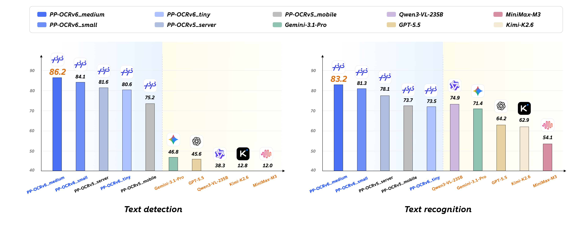

# light-ocr

[](https://github.com/arcships/light-ocr/actions/workflows/core.yml)
[](LICENSE)
[](https://isocpp.org/)
[](bindings/node/README.md)
[](https://www.npmjs.com/package/@arcships/light-ocr)

[English](README.md) | 简体中文


**为原生应用和 Node.js 应用准备的离线 OCR，由 PP-OCRv6 Small 驱动。**

`light-ocr` 在应用自己的进程内，把图片转换为按阅读顺序排列的文字、置信度和四边形位置。它不需要把图片上传到云端，也不需要额外运行 Python 服务。原生 Core 接受解码后的像素；`main` 上的 Node.js 适配器还可以直接接收内存中的 JPEG 和 PNG bytes。

这个项目面向希望把 OCR 做成真正本地能力的产品：随时调用、默认保护隐私，也能自然嵌入现有的图像处理流程。

> **npm 已可用：**`@arcships/light-ocr@0.3.0` 自带默认 PP-OCRv6 Small 模型和全部 Tier 1 平台的预编译原生运行时，并支持可选 tiled 检测、Node.js 内存 JPEG/PNG 直接输入和 descriptor 驱动的硬件加速。详见[包支持](#包支持)。

> **`0.3.0` 加速：**macOS arm64 加入 Direct Core ML；Linux x64/Vulkan 与 Windows x64/D3D12 加入官方 Native WebGPU Plugin EP。已记录的真机结果分别为 Apple M4 Max **2.30×–2.85×**、NVIDIA RTX 5060 Ti **聚合 P50 5.70×**、AMD Radeon 780M **聚合 P50 2.44×**。WebGPU 发布 FP32 执行 profile，Apple 使用独立资格验证的 FP16 路径；macOS x64 保持 CPU provider。

## 适合哪些场景

| 应用场景 | light-ocr 能提供什么 |
| --- | --- |
| **桌面端与本地优先应用** | 从截图、框选区域、剪贴板图片、笔记和导入页面中提取文字，不上传用户内容。 |
| **私有文档流程** | 在应用完成渲染或解码后，识别扫描表单、票据、标签和内部文档中的文字。 |
| **图片、相机与媒体工具** | 在现有像素流程中加入全文搜索、复制文字、画面标注、内容索引或无障碍能力。 |
| **本地部署与边缘软件** | 在自助终端、设备、边缘节点或受控网络中运行一致的 OCR 模型，摆脱云服务依赖。 |
| **原生与 Node.js 服务** | 把 OCR 直接嵌入应用，不再单独部署和维护 Python 进程或 OCR daemon。 |

当前模型主要面向常规文字检测和 CJK/拉丁字符混排识别。Node.js 适配器可以解码内存中的 JPEG/PNG；原生 Core 仍只接受解码后的像素。PDF 渲染、其他图片格式、文档版面分析、表格、公式和翻译仍由宿主应用负责。

## 为什么要做 light-ocr

云 OCR 使用方便，但也带来了图片上传、网络可用性、持续成本和新的隐私边界。操作系统 OCR API 不依赖网络，但各个平台的能力与行为并不一致。PaddleOCR 提供了优秀的模型，不过常见的 Python 部署方式并不总适合桌面软件、原生产品和 Node.js 应用。

`light-ocr` 希望补上这块空白：围绕官方 PP-OCRv6 Small 模型，提供一套可复用的原生核心。应用继续掌控任务调度、数据存储和用户体验；light-ocr 在保留原生 raw-pixel 边界的同时，把图片稳定地转换为结构化 OCR 结果。

## light-ocr 的优势

- **默认本地运行。**识别过程不会访问网络，也不会启动子进程。
- **适合真实应用流程。**直接接收 `GRAY8`、`RGB8`、`BGR8` 和 `RGBA8` 像素；Node.js 适配器也能解码已经在内存中的 JPEG 和 PNG。
- **两种明确的大图策略。**bounded/960 仍是速度和内存优先的默认模式；可选 tiled 检测为小字和密集的 2048 像素文档保留更多细节，并始终逐个处理 detection tile。
- **按需启用原生 Apple 加速。**在 macOS arm64 上，`0.3.0` 可以用 Core ML 执行 FP16 detection/recognition，同时保持公共 OCR 结果契约不变。
- **已完成真机资格验证的 Native WebGPU 加速。**`0.3.0` 会打包官方 WebGPU Plugin EP 及其精确的 Linux/Vulkan 或 Windows/D3D12 运行时闭包，支持哈希校验的离线 staging；两台记录设备均通过 164/164 Gate。
- **模型固定且可复现。**自包含的 PP-OCRv6 Small bundle 会经过完整性验证，目标是随应用一起安装，而不是首次运行时再下载。
- **跨平台结果一致。**macOS、Linux 和 Windows 使用同一套模型与结果契约。
- **适合异步宿主。**Node-API 适配器不会占用 JavaScript 主线程，并提供有界队列、取消和明确的生命周期控制。
- **开放、可检查。**项目采用 Apache-2.0 协议，并在 CI 中验证真实模型行为、大图内存、生命周期安全和输出对齐。

## 为什么选择 PP-OCRv6 Small



npm package 使用 **PP-OCRv6 Small**。在 PaddleOCR 的内部多场景基准中，它取得了 **84.1 的检测 Hmean** 和 **81.3 的识别加权准确率**，同时保持适合本地应用的模型规模。图表和准确率来自 [PP-OCRv6 官方评测](https://github.com/PaddlePaddle/PaddleOCR/blob/211989f046cc1878460f9e65574690c00a127a1a/docs/version3.x/algorithm/PP-OCRv6/PP-OCRv6.md)；这是上游质量结果，不是本项目测得的耗时。

## 返回结果是什么样的

对于每一行检测到的文字，light-ocr 都会返回识别文本、置信度，以及它在原图中的位置：

```json
{
  "lines": [
    {
      "text": "HELLO 123",
      "confidence": 0.99,
      "box": [
        {"x": 106, "y": 54},
        {"x": 554, "y": 54},
        {"x": 554, "y": 135},
        {"x": 106, "y": 135}
      ]
    }
  ]
}
```

位置使用四边形而不是普通矩形，因此可以保留旋转文字和透视文字的几何信息。

## 实测速度


### `0.3.0` 加速总览

| Provider 与记录设备 | 公共精度 | 端到端实测加速 | 质量证据 |
| --- | --- | ---: | --- |
| Apple/Core ML — Apple M4 Max | FP16 | `HELLO 123` **2.30×**；XFUND **2.85×** | 14 fixtures 通过锁定的 CPU parity 阈值 |
| Native WebGPU/Vulkan — NVIDIA RTX 5060 Ti | FP32 | **聚合 P50 5.70×**；单 fixture 3.47×–9.30× | 14/14 与 CPU FP32 字节级一致；164/164 Gate |
| Native WebGPU/D3D12 — AMD Radeon 780M | FP32 | **聚合 P50 2.44×**；单 fixture 1.28×–2.98× | 14/14 与 CPU FP32 字节级一致；164/164 Gate |

WebGPU 聚合值按锁定的 14-fixture corpus 计算：`CPU fixture P50 之和 / WebGPU fixture P50 之和`。这些数字是在表中指定设备上的同机对照，不是对所有 GPU 和驱动的统一承诺。

### CPU 基线

对于上面这张 `800×180` BGR 图片，light-ocr 识别结果为 `HELLO 123`，置信度 `0.9893`。原生 C++ Release benchmark 运行在 Apple M4 Max（16 核 CPU、128 GB 内存）、macOS 26.5.1、ONNX Runtime CPU 环境，intra-op 与 inter-op thread 均为 1，并使用默认 bounded/960 策略和 recognition batch size 1。

| 指标 | 实测结果 |
| --- | ---: |
| 预热后端到端中位数 | **75.678 ms/张**（约 13.2 张/秒） |
| 预热后端到端 P95 | **79.788 ms/张** |
| 检测 + 识别纯推理中位数 | **74.125 ms/张** |
| 模型 bundle 加载，仅一次 | 167.906 ms |
| Engine 初始化，仅一次 | 30.511 ms |

测试先预热 5 次，再测量 30 次。这是一张小尺寸、合成的单行图片；实际延迟会随硬件、图片尺寸、文字密度和文本行数变化。benchmark 契约及与固定 Python oracle 的对照见[实施状态](docs/implementation-status.md#本机最终验证快照)。

### Apple Core ML 加速

`0.3.0` provider Gate 在一台 Apple M4 Max（16 核 CPU、128 GB 内存，macOS 26.5.1）上，对比了显式启用的 FP16 Core ML 路径和 `cpu_fast` profile。CPU profile 最多使用 12 个 intra-op threads；每个 workload 先预热 5 次，再进行 3 组独立的 30 次测量。CPU time 降幅表示宿主进程占用变化，不是能耗数据。

| 锁定 workload | CPU 预热 P50 | Apple 预热 P50 | 端到端加速 | OCR 进程 CPU time 降幅 |
| --- | ---: | ---: | ---: | ---: |
| 合成 `HELLO 123`，800×180 | 19.774 ms | **8.599 ms** | **2.300×** | **95.91%** |
| XFUND 密集表单，113 行文字 | 943.627 ms | **331.011 ms** | **2.851×** | **97.67%** |

加速输出同时通过全部 14 个锁定质量 fixtures：相对 CPU oracle 的字符相似度为 99.6484%，detection recall 为 100%，匹配框平均 IoU 为 99.5508%，匹配结果平均置信度差为 0.004349，critical failure 为 0。这些是相对 CPU 输出的 parity 指标，不是独立 ground-truth 准确率；FP16 输出也并非逐字节一致。

正式 warm 性能测量的 peak RSS 为 692.14 MiB，自包含 Apple 模型 payload 增加 25.42 MiB。独立的同 engine 100 个密集页生命周期测试 peak RSS 为 888.11 MiB，结束时比预热后基线低 27.47 MiB，该次测试未出现持续增长。首次使用会离线编译，并按需加载 recognition functions：固定 `HELLO 123` 启动 canary 的 compiled-cache miss 为 7.219 s，hit 为 1.275/1.278 s；113 行表单的首次整页 miss 为 53.846 s，hit 为 12.677/12.677 s。运行时不会下载 provider、编译器或模型。

真实设备性能数据只来自这一台 M4 Max。证据契约把它归入 `Apple M4` device family 并据此设置 `deviceValidated`，不代表每一种 M4 SKU 都做过独立测量。M1–M3 和后续 Apple Silicon 可以尝试同一 ANE/GPU 路径并报告 `deviceValidated: false`，但不继承性能承诺。`0.3.0` macOS x64 package 的 Core ML OCR 未通过发布 smoke parity，因此保持 CPU-only。完整方法、模型放置、质量阈值、缓存与生命周期结果见 [Apple 加速技术方案](docs/apple-device-acceleration.md)。

### Native WebGPU 加速

Linux 报告使用 NVIDIA RTX 5060 Ti 与 Dawn/Vulkan。14 个 fixture 的 CPU P50 总和为 5,475.623 ms，WebGPU FP32 P50 总和为 961.042 ms，得到 **5.698× 聚合加速**；每个 fixture 都更快，范围为 3.474×–9.299×。

Windows 报告使用 AMD Radeon 780M 与 Dawn/D3D12。CPU P50 总和为 6,500.853 ms，WebGPU FP32 P50 总和为 2,669.160 ms，得到 **2.436× 聚合加速**；每个 fixture 都更快，范围为 1.277×–2.982×。其 warmup-aware repeated lifecycle 结束时比预热后基线低 22.9 MiB。

两份报告均通过 164/164 Gate，覆盖 Auto、native C++、真实 placement、FP32 OCR 字节级对齐、cold start、内存、生命周期和 strict fail-closed。当前模型需要 `Concat`、`Gather`、`Slice` 三类有界 CPU partition；设置 `cpuPartition: "forbid"` 会拒绝创建 engine，不会静默改变 placement。WebGPU FP16 不属于 `0.3.0` 公共执行 profile，也不发布 FP16 性能数字。完整证据见 [Linux 加速技术方案](docs/linux-device-acceleration.md)与 [Windows 加速技术方案](docs/windows-device-acceleration.md)。

## 开始使用

### Node.js

Node.js 22 和 24 支持 macOS arm64/x64、Linux x64 glibc 与 Windows x64：

```bash
npm install @arcships/light-ocr
```

安装会自动取得当前平台的原生运行时和固定版本的 PP-OCRv6 Small 模型；首次运行不会再下载模型，`postinstall` 也不会现场编译原生代码。0.3.0 同时支持下面的 `recognizeEncoded()` 和 raw-pixel `recognize()`。

```ts
import { createEngine } from "@arcships/light-ocr";
import { readFile } from "node:fs/promises";

const engine = await createEngine();
const result = await engine.recognizeEncoded(
  await readFile("image.jpg"),
);

// 如果宿主已有图片解码流程，仍可直接传入 raw pixels。
const rawResult = await engine.recognize({
  data: pixels,
  width,
  height,
  stride,
  pixelFormat: "rgba8",
});

console.log(result.lines);
console.log(rawResult.lines);
await engine.close();
```

已发布 package 通过平台 runtime descriptor 执行 Auto 选择；显式 Apple 与 WebGPU 都是严格的单 provider 请求。在 macOS arm64 上可以直接请求 Apple：

```ts
const engine = await createEngine({
  execution: {
    provider: "apple",
    precision: "fp16",
    cpuPartition: "allow",
    sessionFallback: "error",
  },
});

console.log(engine.info.execution.sessions.detection.deviceValidated);
```

Linux x64 与 Windows x64 的 WebGPU profile 为：

```ts
const engine = await createEngine({
  execution: {
    provider: "webgpu",
    precision: "fp32",
    cpuPartition: "allow",
    sessionFallback: "error",
  },
});
```

`cpuPartition: "allow"` 与 strict GPU-only profile 适用于 Apple Silicon 上的 Apple provider；`0.3.0` macOS x64 package 只暴露 CPU。显式 provider 失败不会转入 CPU，只有 Auto 可以沿 descriptor 锁定的创建候选继续。不传 `execution` 的 `createEngine()` 现在使用 Auto。

完整 API、取消、队列限制和生命周期行为见 [Node.js 指南](bindings/node/README.md)。

### C++ Core

构建需要 Python 3（仅用于 bootstrap 工具）、CMake 和支持 C++17 的编译器。依赖与模型输入均已锁定；构建后的运行时不依赖 Python。

```bash
python3 tools/bootstrap_dependencies.py --cache-dir .cache/dependencies
python3 tools/bootstrap_models.py --cache-dir .cache/models

cmake --preset release \
  -DLIGHT_OCR_DEPENDENCY_CACHE_DIR="$PWD/.cache/dependencies"
cmake --build --preset release --parallel
ctest --preset release
```

各平台的准备方式见[构建与发布](docs/build-and-release.md)，接入方式见 [C++ API](docs/native-api.md)。

## 包支持

| 分发方式 | 当前状态 | 平台 |
| --- | --- | --- |
| C++ Core 源码 | 可用 | macOS arm64/x64、Linux x64 glibc、Windows x64 |
| Node-API 适配器源码 | 可用 | Node.js 22 和 24 |
| [`@arcships/light-ocr`](https://www.npmjs.com/package/@arcships/light-ocr) | 已发布 `0.3.0` | 全部 Tier 1 平台的 Node.js 22/24 |
| [`@arcships/light-ocr-model-ppocrv6-small`](https://www.npmjs.com/package/@arcships/light-ocr-model-ppocrv6-small) | 已发布 `0.3.0` | 与平台无关的必需模型依赖 |
| 各平台 native npm packages | 已发布 `0.3.0` | macOS arm64/x64、Linux x64 glibc、Windows x64 |

npm 分发会安装一个统一入口、一个必需的模型包，以及与当前系统匹配的 native 包。包内容、版本策略和发布门槛见 [npm package 设计](docs/npm-packaging.md)；`0.3.0` 的不可变哈希和验证证据见[发布记录](docs/releases/npm-0.3.0.md)。

macOS arm64 Direct Core ML 加速已经随 `0.3.0` 发布，并复用现有六包安装结构，没有新增 provider package 或运行时下载；macOS x64 保持 CPU-only。

`0.3.0` 已在 Linux x64 与 Windows x64 发布 Native WebGPU。显式 WebGPU 接受 `auto/fp32`，Auto 同样选择 FP32；三个必要 CPU partition 算子会被显式报告并限制范围。两份真机报告均已通过 164/164 Gate，其报告与产物的不可变哈希已绑定进 production lock。

## 项目状态

`light-ocr` 仍在积极开发。`0.3.0` 包含确定性的 `tiled-v1` 大图模式、Node.js 内存 JPEG/PNG 解码、descriptor-driven Auto、macOS arm64 Direct Core ML，以及 Linux x64/Windows x64 FP32 Native WebGPU 执行；C++ Core 的 raw-pixel 边界保持不变。

作为 pre-1.0 项目，公共 API 和 package 布局仍可能调整；项目目前不承诺跨版本稳定的 C++ ABI。

Core CI 当前覆盖：

- macOS arm64
- macOS x64
- Linux x64 glibc
- Windows x64

CI 还会执行 sanitizer、fuzz smoke、离线运行、输出对齐、质量和内存门槛。性能资格审查使用独立、显式触发的 workflow，不属于普通 CI 或发布预检。已验证结果和当前缺口见[实施状态](docs/implementation-status.md)。

## 文档

- [更新日志](CHANGELOG.md)
- [C++ API](docs/native-api.md)
- [Node.js 适配器](bindings/node/README.md)
- [构建与发布](docs/build-and-release.md)
- [模型 bundle](docs/model-bundle.md)
- [准确率与输出对齐](docs/parity-testing.md)
- [大图内存表现](docs/memory-optimization.md)
- [架构](docs/architecture.md)
- [实施状态](docs/implementation-status.md)

## 参与社区

欢迎提交 issue 和 pull request。如果你正在评估 light-ocr 是否适合自己的产品，可以[创建 issue](https://github.com/arcships/light-ocr/issues)，告诉我们目标平台、图片来源、语言组合和大致负载。真实应用场景会直接影响 package 优先级和后续模型支持。

报告问题时，请尽量提供平台、输入尺寸、像素格式、模型 bundle ID 和最小复现。除非你确认可以公开，否则不要上传包含隐私信息的原始图片。

## 开源协议

light-ocr 使用 [Apache License 2.0](LICENSE)。第三方依赖和模型 notice 会随对应的发布制品一起提供。
