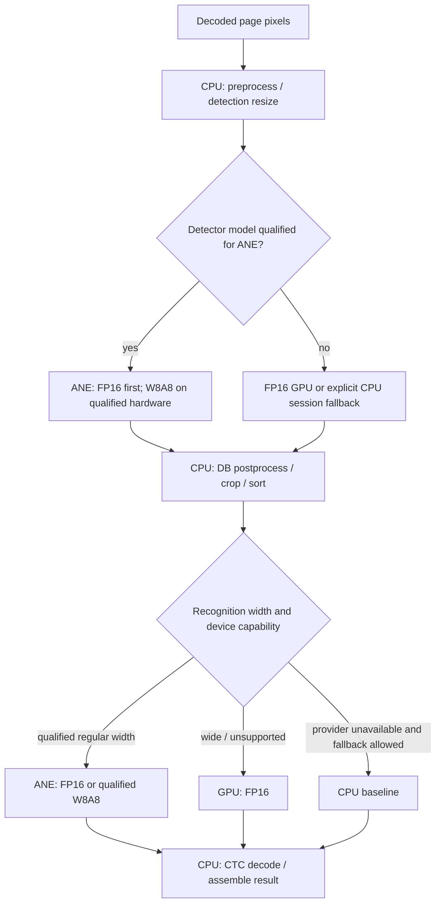

# Apple Device 加速技术方案

状态：Draft；用于方案讨论，不代表已经批准实现或发布

更新时间：2026-07-15

范围：以 macOS Apple Silicon 为当前交付目标；iPhone/iPad 只保留架构兼容性，不在当前 Tier 1 平台承诺内

关联 Roadmap：[Perf-0–Perf-4](roadmap.md#7-perf-0perf-4--性能与宿主加速线)

## 1. 结论

Apple Device 的首选加速架构不是“把一个 INT8 模型交给 Core ML 自动调度”，而是按模型、shape 和精度显式路由：

分发继续遵守同一个 OS 无关入口：用户只安装 `@arcships/light-ocr`，facade 自动取得对应 Darwin native package；Core ML bridge、ORT 或 direct runtime、模型派生物和 cache contract 必须随 release set 自带，不能要求用户另装 provider/runtime，也不能在 install/postinstall 或首次运行时下载。

- **ANE 承担常规 shape 的主要推理。** FP16 是第一阶段；W8A8 只在支持原生 INT8 的新硬件上作为第二阶段优化。
- **GPU 使用 FP16。** 它处理当前无法完整放入 ANE 的超宽 recognition shape，也可作为老设备和未通过 ANE Gate 的兼容路径。
- **CPU 保持稳定基线。** CPU 继续执行图片/PDF decode、preprocess、DB postprocess、crop、CTC decode 和结果组装，也承担显式允许的整 session fallback。
- **不能静默回退。** 请求的 backend、实际模型变体、shape bucket、compute unit 和 fallback 原因必须可观察。

当前推荐的产品路径是先完成 **FP16 ANE + FP16 GPU 的混合模式**，证明端到端收益和 CPU 释放；W8A8 ANE 只有在代表性校准或 QAT、完整质量门禁和整份文档 benchmark 通过后才进入候选。



## 2. 目标与非目标

### 2.1 目标

按优先级排序：

1. **保持一个 OS 无关安装入口。** 用户只依赖 `@arcships/light-ocr`；Apple runtime/provider/model 全部由匹配的 native release payload 自带。
2. **释放 CPU 给用户前台负载。** Apple 加速模式的首要价值不是单纯追求最低 wall time，而是避免 OCR 长时间占满 CPU。
3. **降低真实文档延迟。** 以完整 15 页 PDF 的总耗时和 OCR-only 耗时为主要产品指标，不以单算子 microbenchmark 代替。
4. **维持 OCR 质量和结果契约。** box、文本、置信度、阅读顺序、错误和资源限制不得因为 backend 改变而失去可解释性。
5. **保持离线、可复现和可诊断。** 模型及编译产物版本固定，不在安装或首次运行时下载模型或 provider。
6. **限制冷启动、内存和包体积。** 不直接采用多份静态 session 导致约 1 GiB RSS 的实验性结构。

### 2.2 非目标

- 不把 ANE 描述成所有 Apple 设备都可用、都具有相同 INT8 收益。
- 不把 W8 权重量化描述成原生 INT8 计算。
- 不承诺 GPU 能从 W8A8 获得延迟收益。
- 不因 CoreML session 创建成功就宣称 graph 已在 GPU 或 ANE 执行。
- 不在第一阶段把 preprocess、postprocess 或 PDF renderer 改写为 Metal kernel。
- 不用无界 page/crop 并发换取 benchmark 数字。
- 不改变其他平台的 CPU 默认路径和当前发布行为。

## 3. 已确认事实、实测证据与待验证假设

本文把三类信息分开：

- **上游事实：** Apple、ONNX Runtime 或 PaddleOCR 官方文档明确说明的能力。
- **本机实测：** 当前 PP-OCRv6 Small 和指定 M4 Max 上已经运行得到的结果。
- **待验证假设：** 尚未通过完整 corpus、正式 harness 或第二台目标设备复核的设计判断。

### 3.1 上游事实

1. Apple 建议只在模型完整或大部分运行于 Neural Engine 时采用 activation quantization；CPU 和部分 GPU 路径可能因为运行时解压而变慢。
2. A17 Pro、M4 及更新硬件的 Neural Engine 提供更高吞吐的 INT8×INT8 路径，W8A8 的明确延迟收益指向 ANE。
3. GPU 的低比特优化方向与 ANE 不同。Apple 对 Mac GPU 特别推荐的是 weight-only INT4 per-block 等内存带宽优化，不是把 W8A8 当作通用 GPU 加速方案。
4. Core ML 的 enumerated shapes 最多可声明 128 个 shape；有限 shape 通常比无界动态 shape 更容易获得可预测的编译与执行表现。
5. ONNX Runtime CoreML EP 支持 compute unit、静态 shape 要求、specialization、profiling 和 model cache，但 EP 注册不等于所有节点都在预期硬件执行。

官方依据：

- [Apple Core ML quantization performance](https://apple.github.io/coremltools/docs-guides/source/opt-quantization-perf.html)
- [Apple Core ML optimization overview](https://apple.github.io/coremltools/docs-guides/source/opt-overview.html)
- [Apple Core ML optimization workflow](https://apple.github.io/coremltools/docs-guides/source/opt-workflow.html)
- [Core ML flexible input shapes](https://apple.github.io/coremltools/docs-guides/source/flexible-inputs.html)
- [ONNX Runtime CoreML Execution Provider](https://onnxruntime.ai/docs/execution-providers/CoreML-ExecutionProvider.html)

### 3.2 当前本机实测

设备为 Apple M4 Max。完整文档 workload 是同一份 15 页参考 PDF，SHA-256 为 `d9be780fe4674e16ca78a09e1513dff0665ac02cbbbbc56f80381d8f0f5e12c4`，200 DPI 渲染为 1700×2200 页面。以下数据是 spike 证据，不是发布性能承诺。

#### CPU 与 FP16 GPU

| 模式 | 测量范围 | 结果 | 解释 |
| --- | --- | ---: | --- |
| ORT CPU，1 intra-op thread | 15 页预渲染图片，OCR-only | 约 70.55 s | 低并发 CPU 基线 |
| ORT CPU，12 intra-op threads | 15 页预渲染图片，OCR-only | 约 15.35 s | CPU-fast 基线；约 151 CPU-s |
| Direct CoreML FP16 GPU | 15 页 PDF，warm end-to-end median | 约 13.50 s | 含 PDF render |
| Direct CoreML FP16 GPU | 同上，PDF render median | 约 7.37 s | renderer 仍在 CPU/子进程 |
| Direct CoreML FP16 GPU | 同上，OCR pipeline median | 约 6.13 s | 其中模型 inference 约 4.71 s |

FP16 GPU warm OCR 期间父进程平均约占用 0.6 个 CPU core；整条 PDF pipeline 连同 renderer 平均约 0.8 个 CPU core。正式 probe 中六份静态模型同时驻留时 RSS 约为 1.0–1.07 GiB，这说明硬件 offload 有效，但当前实验性模型/session 组织不能直接成为产品结构。

在相同渲染和 crop 输入上的 CPU/FP16 GPU recognition 对比中，字符相似度为 99.661%，精确相同行为 1182/1279（92.42%）。Detector 得到 CPU 1286、GPU 1279 个 box；GPU box 全部可以匹配，平均 IoU 约 0.9989，CPU 多出的 7 个候选大部分为空白或噪声，但包含一个有意义的 `data2`。因此 FP16 也必须经过正式质量 Gate，不能只检查“看起来基本一致”。

#### 静态 shape 的 GPU/ANE microbenchmark

| 模型 | FP16 GPU | W8A8 GPU | FP16 ANE | W8A8 ANE |
| --- | ---: | ---: | ---: | ---: |
| Detector 960×768 | 7.710 ms | 6.568 ms | 8.767 ms | **5.390 ms** |
| Recognizer width=320 | 2.164 ms | 2.784 ms | 0.895 ms | **0.841 ms** |

当前 compute plan 显示上述静态模型的操作完整落在所请求的 MLGPU 或 MLNeuralEngine。由此可以确认：

- 当前模型不是算法上无法使用 ANE；早期动态模型“没有 ANE placement”的结论已经被静态模型探针推翻。
- Detector 的 W8A8 ANE 相对 FP16 ANE 快约 1.63×，延迟降低约 38%。
- width=320 recognition 的 W8A8 ANE 相对 FP16 ANE 只快约 6%。
- width=320 recognition 的 W8A8 GPU 相对 FP16 GPU 慢约 29%。
- 当前 M4 Max probe 中，recognition width 320、1024、1600 可以完整进入 ANE；2168、3200 不能据此承诺 ANE，暂按 FP16 GPU 路径设计。这个 1600 边界是当前模型、转换方式、OS/runtime 和设备的实测边界，不是 Core ML 的通用常量。

W8 weight-only 模型把实验模型总大小从约 55.95 MiB 降到 29.14 MiB，但 15 页 warm OCR 从 FP16 GPU 的约 6.13 s 增至约 9.34 s，RSS 没有明显下降。该结果只能说明权重压缩效果，不能作为原生 INT8 benchmark。

W8A8 的已有 quality smoke 只使用 3 页 detector 校准图和 10 个 recognition crop，样本不足；出现 detector bitmap 漂移以及 `内容→內容`、标点丢失等 recognition 变化。因此当前 W8A8 模型**没有通过质量 Gate**，也没有资格产生正式 15 页性能结论。

### 3.3 当前待验证假设

- FP16 ANE + FP16 GPU 混合路径应当比纯 FP16 GPU 更适合交互式产品，因为多数短文本 recognition 在 ANE 上明显更快，同时继续释放 CPU。
- W8A8 的整份文档收益可能小于 detector microbenchmark 显示的 1.63×：15 页只有 15 次 detector，而 width=320 recognition 的 W8A8 增益只有约 6%。
- 多个独立静态模型不是唯一实现；enumerated shape MLProgram 可能减少 session 数、冷启动和 RSS，但必须实际验证每个 shape 的 placement。
- Direct CoreML 目前比动态 ONNX Runtime CoreML EP 更容易控制 shape、精度和 compute plan，但尚需与新版本 ORT 的静态/混合执行能力做一次同条件决策实验。

## 4. 设备与精度矩阵

| 设备类别 | ANE | 首选模式 | W8A8 策略 | 兼容/回退 |
| --- | --- | --- | --- | --- |
| M4 系列及项目独立验证过的后续 Mac | 有；M4 具备 Apple 明确说明的 INT8×INT8 加速 | FP16 ANE + FP16 GPU | 质量与收益通过后，可对 ANE 子模型启用 | FP16 GPU；显式 CPU session fallback |
| M1–M3 Mac | 有 | 先资格审查 FP16 ANE/GPU | 不承诺 W8A8 加速；必须逐代实测 | FP16 GPU 或 CPU |
| Intel Mac | 无 | CPU baseline；CoreML FP16 GPU 仅在独立 Gate 后可选 | 不适用 ANE W8A8 | CPU |
| A17 Pro/M4 系列及项目独立验证过的后续 iPhone/iPad | 有；A17 Pro/M4 具备 Apple 明确说明的 INT8×INT8 加速 | 架构上与 Mac 相同 | 未来平台工作，当前不发布 | 平台自有 CPU/GPU 策略 |
| 更老 iPhone/iPad | 有或无，能力不同 | 当前不在项目支持矩阵 | 不承诺 | 当前不发布 |

“硬件存在”与“模型完整运行在该硬件”是两件事。每个发布设备族仍需要 model × shape × precision 的 compute-plan 和端到端证据。

## 5. 推荐运行时架构

### 5.1 保持一套 OCR pipeline

检测前后处理、几何、crop、recognition preprocess、CTC decode 和公共结果继续由现有 C++ Core 实现。Apple backend 只替换 `src/inference/` 后面的模型执行层，禁止复制一套 Apple 专用 OCR 算法。

建议的内部边界是：

```text
DetectionSession
  run(float tensor, exact shape) -> float probability map

RecognitionSession
  run(float tensor, exact shape) -> float logits
```

backend 负责选择 Core ML 模型变体、检查 shape、执行和复制结果；Core 继续拥有输入验证、资源限制、后处理和结果契约。

### 5.2 每个 stage 独立路由

Detector 和 recognizer 不要求使用同一种 precision 或 compute unit：

| Stage | 第一阶段 | 第二阶段候选 | 不支持时 |
| --- | --- | --- | --- |
| Detector | FP16 ANE | W8A8 ANE | FP16 GPU；再按策略决定是否 CPU |
| Recognition，ANE-qualified width | FP16 ANE | W8A8 ANE 或保留 FP16 ANE | FP16 GPU；再按策略决定是否 CPU |
| Recognition，超宽/ANE-unqualified width | FP16 GPU | 仍为 FP16 GPU | 显式 CPU fallback 或稳定失败 |

是否对 recognition 启用 W8A8 必须按实际累计收益决定，不能因为 detector W8A8 有收益就统一量化两个模型。

### 5.3 Direct CoreML 与 ORT CoreML EP

当前建议把 **Direct CoreML MLProgram** 作为 Apple backend 的参考方案，把 ORT CoreML EP 保留为必须对照的候选：

| 维度 | Direct CoreML | ORT CoreML EP |
| --- | --- | --- |
| 已有证据 | 静态 FP16 模型已完整进入 GPU/ANE；可直接生成 W8A8 | 当前动态 ONNX probe 主要落在 MLCPU；新版本静态能力待复核 |
| shape 控制 | 可使用 fixed/enumerated shapes | 受 ONNX shape、EP partition 和 specialization 共同影响 |
| 量化 | 直接使用 Core ML PTQ/QAT 工具链 | QDQ/量化算子是否形成目标 Core ML kernel 必须验证 |
| 代码与依赖 | 需要 Apple 专用 native backend | 更接近现有 ORT backend |
| 诊断 | Core ML compute plan 可直接检查 | 还需要同时检查 ORT partition 与 Core ML placement |

决策规则：如果 ORT 能在相同模型、shape、精度和设备上证明完整 placement，并达到 Direct CoreML 端到端性能、质量、RSS 与冷启动的可接受范围，可以优先 ORT 以减少维护面；否则采用 Direct CoreML。不能仅因“代码改动更少”接受隐藏的 MLCPU/CPU 执行。

## 6. Shape 专门化设计

### 6.1 原则

- 不直接把当前动态模型交给 Core ML 后期待 ANE 自动优化。
- 不为了适配静态模型而静默改变现有 resize、padding 或坐标恢复语义。
- shape bucketing 造成的任何额外 padding、resize 或输出裁剪都必须进入 parity/quality corpus。
- 设备能力和实测 placement 决定路由，不把 `width <= 1600` 写成跨设备硬编码真理。

### 6.2 Detector

当前 bounded 路径生成 32 倍数、最长边不超过 960 的动态 H×W。第一阶段可评估两种方案：

1. **Enumerated exact shapes：** 优先覆盖最长边为 960 的 portrait/landscape shape，以及真实 workload 高频 shape；不改变像素内容和坐标语义。
2. **受控 padding buckets：** 把输入 pad 到有限 shape，并在 postprocess 前裁掉 padding 区域。该方案模型数更少，但属于行为变化，只有质量 Gate 通过后才能采用。

对于未被枚举的 detector shape，第一阶段应明确转到 FP16 GPU 或 CPU session；不得临时创建无限数量模型或静默采用未经验证的 padding。

### 6.3 Recognition

实验性五档 bucket 为 320、1024、1600、2168、3200，适合快速证明 backend 可行性，但 padding 浪费和六份静态模型的 RSS 不适合作为最终设计。

生产候选是把 recognition width 向上取整到 32 的倍数，并拆成两个模型族：

- **ANE 模型族：** 320–当前设备资格审查上限；优先使用一个 enumerated-shape MLProgram。
- **GPU 模型族：** 超过 ANE 上限至 3200；使用 FP16 enumerated-shape MLProgram。

320–3200 每 32 一个宽度一共 91 个 shape，理论上不超过 Core ML 的 128 enumerated-shape 上限；是否拆成两个模型、每个 shape 是否完整落在目标 compute unit、编译/加载成本是否可接受，必须由实际 compute plan 和 benchmark 决定。

## 7. 量化设计

### 7.1 精度语义

| 名称 | 模型存储 | 运行计算 | 本方案定位 |
| --- | --- | --- | --- |
| FP16 | 16-bit 权重 | 浮点 | ANE/GPU 第一阶段基线 |
| W8 weight-only | INT8 权重 | 运行时仍以浮点为主 | 主要用于包体积实验，不称为 INT8 加速 |
| W8A8 | INT8 权重 + INT8 激活 | 新硬件 ANE 可使用 INT8×INT8 | 第二阶段 ANE 性能候选 |

GPU 路径保持 FP16。若未来研究 GPU 压缩，应独立评估 Apple 推荐的 INT4 per-block weight-only 路线，不能沿用 W8A8 ANE 的性能预期。

### 7.2 W8A8 训练与校准

W8A8 先做代表性 PTQ；如果不能通过质量 Gate，则进入 QAT，而不是继续扩大不充分校准样本上的性能测试。

校准集至少需要覆盖：

- detector 的 portrait、landscape、常规图、tiled、大字、小字、稀疏和密集页面；
- recognition 的全部 width 区间，以及简体中文、繁体中文、英文、数字、标点、混排、低对比度和旋转 crop；
- 真实用户 workload 与现有 locked corpus，避免只使用单一 PDF；
- 每个量化模型至少达到 Apple 工作流建议量级的代表性样本，并在量化前锁定样本与评价指标。

如果 QAT 仍有质量问题，应做 layer sensitivity 分析，允许首尾卷积、输出 projection、归一化或其他敏感层保留 FP16。混合精度是允许的，但实际 ANE placement 和收益必须重新验证。

PaddleOCR 上游已有 Conv2D/Linear 的 W8A8 QAT 路线，现成文档主要面向较早 PP-OCR 模型和 Paddle Lite ARM 部署，可作为训练方法参考，不能作为 PP-OCRv6 CoreML/ANE 的发布证据：[PaddleOCR quantization](https://github.com/PaddlePaddle/PaddleOCR/blob/main/deploy/slim/quantization/README_en.md)。

## 8. 调度、并发与 CPU 预算

Apple interactive profile 继续保持每个 engine 单 active call，不用多个 OCR 请求同时争抢 ANE/GPU。第一阶段的并发只允许发生在有界 pipeline 层：

- PDF renderer 可以预取下一页，但队列必须有固定上限；
- 当前页 OCR 与下一页 render 是否重叠，以总 CPU 预算和内存 Gate 决定；
- recognition 默认 batch 1；扩大 batch 或同时提交多个 crop 需要独立 latency/throughput 证据；
- 多 engine 并行属于 throughput profile，不是 interactive profile 默认值。

这样做的原因是本方案首先保护用户前台 CPU 和设备响应，而不是把 ANE/GPU 跑满作为唯一目标。

## 9. 模型产物、加载与内存

Apple provider release set 需要独立、版本锁定的模型派生物，不修改默认 ONNX CPU bundle。Core ML 模型与 native runtime 是否位于同一个 npm package，由 D111 决定：

```text
Apple provider release set
├── capability manifest
├── detector FP16 MLProgram
├── recognition FP16 ANE MLProgram
├── recognition FP16 GPU MLProgram
├── optional qualified W8A8 ANE variants
├── conversion provenance / hashes / licenses
└── native CoreML-enabled runtime
```

产物规则：

- Core ML 模型必须能追溯到固定的 PP-OCRv6 Small 权重、转换脚本版本和完整参数。
- W8A8 是独立 model ID，不能覆盖 FP16 bundle。
- 优先一个 enumerated-shape 模型而不是多个独立静态 session；以 RSS、cold start 和 placement 结果决定最终数量。
- 宽 GPU 模型和 W8A8 变体按需 lazy load；未使用的模型不得常驻。
- 评估随包携带预编译产物和首次本地离线编译缓存两种路径；缓存必须按模型 hash、OS/runtime 和设备能力失效。
- 不在安装或首次运行时联网下载编译器、provider 或模型。

当前约 1.0–1.07 GiB RSS 是实验结构数据，不是可接受默认预算。正式内存 ceiling 必须在 D111/Provider Gate 前锁定。

## 10. 公共策略与可观测性

最终公共 API 沿用 Roadmap 的 provider/profile 思路，不直接暴露 Core ML 任意 option 字典。Apple provider 至少需要表达：

- 请求的是 CPU、Apple interactive，还是严格资格审查模式；
- precision 是 FP16、W8A8 还是经过版本化规则选择的 auto；
- session 初始化失败时是否允许回退 CPU；
- graph/shape 无法完整落在目标 compute unit 时，是稳定失败还是使用已声明的 FP16 GPU 路由。

`EngineInfo` 或等价诊断至少报告：

| 字段 | 示例含义 |
| --- | --- |
| requestedProvider/profile | 用户请求的 Apple interactive 模式 |
| device family / OS | M4 Max、macOS 版本 |
| detector model ID | FP16 或 W8A8 派生物及 hash |
| recognition model IDs | ANE/GPU 两个模型族及 hash |
| requested / actual compute unit | ANE、GPU、CPU |
| precision | FP16、W8 weight-only、W8A8 |
| shape policy | exact、enumerated、bucket 版本 |
| session fallback | 是否发生以及稳定原因码 |
| qualification ID | 对应的设备/模型/benchmark 报告版本 |

普通运行时不必为每次调用生成昂贵 compute plan，但发布资格审查工具必须能证明每个预注册 model × shape × precision 的实际 placement。产品文案只能描述已经通过资格审查的执行路径。

## 11. 最简 Benchmark Contract

用户侧最重要的 scoreboard 保持简单：

| 模式 | 15 页总耗时 | PDF render | OCR-only | OCR CPU-s / 平均 CPU core | Peak RSS | 质量 |
| --- | ---: | ---: | ---: | ---: | ---: | --- |
| CPU low-impact | 待统一 harness | 单列 | 约 70.55 s（旧预渲染基线） | 待统一 harness | 待测 | CPU oracle |
| CPU fast | 待统一 harness | 单列 | 约 15.35 s（旧预渲染基线） | 约 151 CPU-s | 待测 | CPU oracle |
| FP16 GPU | 约 13.50 s | 约 7.37 s | 约 6.13 s | OCR 平均约 0.6 core | 约 1.0–1.07 GiB | spike 未过正式 Gate |
| FP16 ANE + FP16 GPU | 待测 | 单列 | 待测 | 待测 | 待测 | 待测 |
| W8A8 ANE + FP16 GPU | 暂不测试完整 PDF | 单列 | quality Gate 后再测 | 待测 | 待测 | 当前 smoke 不通过 |

旧 CPU 和当前 CoreML 数据来自不同 harness，不能用上表直接形成正式相对结论。进入实现前先统一同一 PDF、renderer、DPI、page image、模型输入和输出比较。

正式报告仍需保留 cold start、warm P50/P95、模型 load/compile、stage timing、设备/OS/runtime、模型 hash 和失败/fallback 信息，但产品讨论首先看上表六列。

### 11.1 Gate

Apple provider 继承 Roadmap Provider Gate，并增加交互式 CPU 目标：

- 至少两个预注册 workload 达到 Roadmap 的端到端 speedup/throughput 门槛；
- 相对 CPU-fast，OCR process CPU-s 至少下降 80%；
- 无未声明的 ORT CPU、MLCPU 或整 session fallback；
- 公共 contract 100% 通过；FP16/W8A8 的质量容差在查看最终 benchmark 前锁定；
- reference PDF 不允许出现预注册的关键文本漏检；
- cold start、RSS、包增量和缓存行为通过预注册 ceiling；
- 至少在两台目标设备上复核，其中 W8A8 必须覆盖计划宣称支持的硬件代际。

## 12. 分阶段落地

### Phase A — 固化证据和决策

- 统一 CPU/CoreML 的 15 页 PDF benchmark harness。
- 固定测试 corpus、质量指标和最简 scoreboard。
- 对照 Direct CoreML 与新版 ORT CoreML EP 的静态/enumerated shape placement。
- 决定 detector shape 策略、recognition shape 集和 Apple provider 最低 OS/设备矩阵。

退出条件：形成 D111 Apple 子决策；不改默认 CPU 行为。

### Phase B — FP16 Apple interactive preview

- Detector、常规 recognition 优先 FP16 ANE。
- ANE-unqualified recognition shape 使用 FP16 GPU。
- 加入 lazy load、缓存、严格 placement 诊断和显式 fallback。
- 通过完整文档、质量、CPU、RSS 和 cold-start Gate。

退出条件：证明混合路径比 FP16 GPU 和 CPU-fast 更适合用户前台共存。

### Phase C — W8A8 ANE qualification

- 建立代表性 calibration corpus，先 PTQ 后按需要 QAT。
- Detector 和 recognizer 分别决定是否量化。
- 只在 Apple 明确支持并由项目复核的设备族启用。
- 质量先过 Gate，再运行完整性能 benchmark。

退出条件：端到端收益足以覆盖额外模型、训练、测试和分发成本；否则保持 FP16 ANE。

### Phase D — 稳定自包含分发

- 将通过 Gate 的 Apple runtime/provider、模型派生物、SBOM、licenses、provenance 和签名纳入由主 facade 自动取得的 Darwin native release set，不新增用户安装入口。
- 固化 device/OS/model compatibility manifest 和故障语义。
- 在未安装任何额外 provider/runtime 的干净目标机上，通过两个目标设备、正式 corpus、禁网安装和 release qualification。

退出条件：用户仅安装 `@arcships/light-ocr` 即可运行；从 `engine.info()` 和 qualification report 可以证明实际执行路径，且稳定 CPU fallback 保持可用。

## 13. 仍需讨论的决策

1. Direct CoreML 是否成为正式 Apple backend，还是新版 ORT CoreML EP 已能达到同等 placement 与资源表现？
2. 第一版最低设备是所有 Apple Silicon，还是只对 M4+ 发布 W8A8、对 M1–M3 仅发布 FP16？
3. Detector 使用 enumerated exact shapes、padding buckets，还是保留 GPU 兼容路径处理非高频 shape？
4. Recognition 采用每 32 一个 enumerated width，还是更少的 bucket 换取更低编译/加载成本？
5. W8A8 只量化 detector，还是 recognition 在更宽 shape 上也能获得足够累计收益？
6. 模型随包携带预编译产物，还是首次运行离线编译并缓存？
7. Apple interactive 的 RSS、cold start、包体积和质量硬阈值是多少？这些阈值必须在完整结果出来前锁定。

## 14. 关联工作

- [#3 Qualify true CoreML GPU execution with bounded/static OCR shapes](https://github.com/arcships/light-ocr/issues/3)：包含早期 GPU/static-shape 证据；其中“当前无 ANE”已被本文记录的后续静态 ANE probe 推翻。
- [#4 Add execution profiles and observable accelerator fallback](https://github.com/arcships/light-ocr/issues/4)：执行策略、诊断和 fallback 契约。
- [#6 Hardware acceleration roadmap and qualification matrix](https://github.com/arcships/light-ocr/issues/6)：跨平台加速总 tracking。
- [#7 Validate ORT hybrid execution path](https://github.com/arcships/light-ocr/issues/7)：Direct CoreML 与新版 ORT 路线的对照入口。

本文通过讨论后，接受的设计决策应进入 [decisions.md](decisions.md)；未通过 Gate 的 spike 数据保留在 issue/qualification report，不写成产品承诺。
