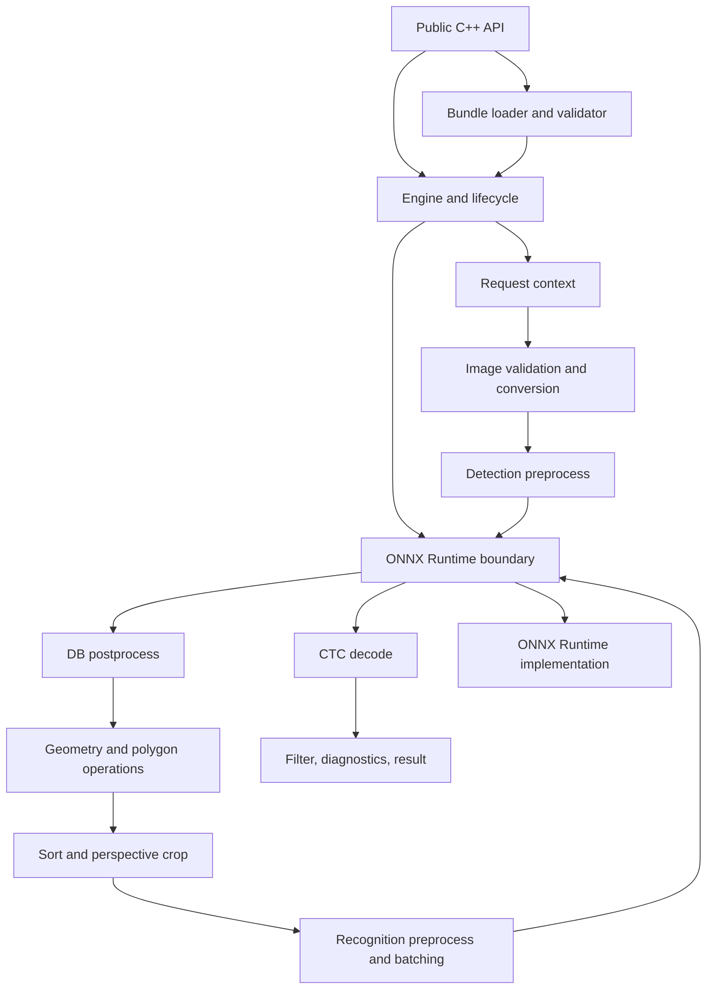
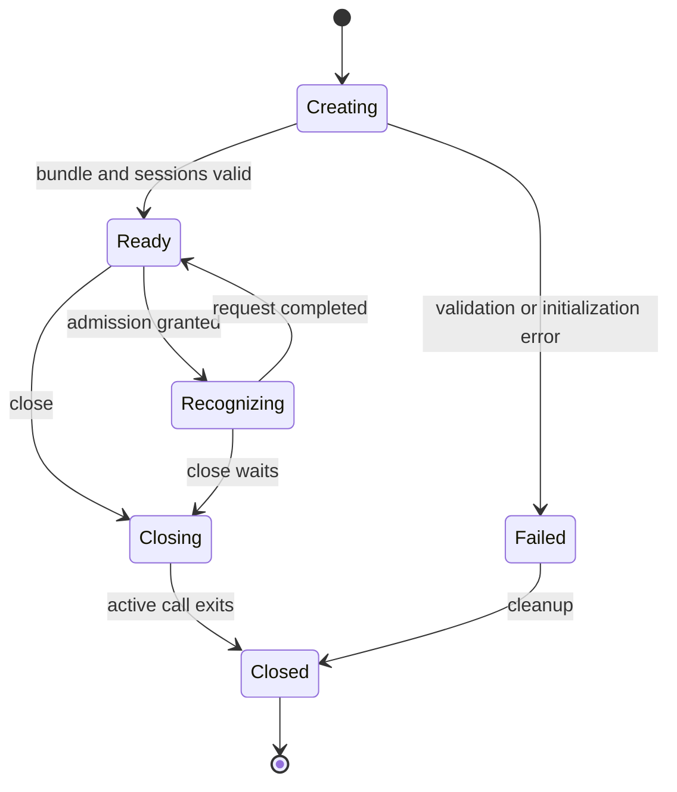

# light-ocr Core Architecture

Status: Implemented for Core 0.1.0  
Authority: module boundaries, data flow, state ownership, concurrency, and dependency boundaries  
Requirements: [requirements.md](requirements.md)

## 1. Architectural objective

The Core milestone implements one deterministic synchronous OCR engine. It accepts a validated pixel view, executes PP-OCRv6 small detection and recognition, and returns structured results without depending on host frameworks.

The architecture optimizes for:

- Observable parity with the pinned Python oracle.
- Isolation of model configuration from algorithms.
- Safe operation inside another process.
- Independent testing of every pipeline stage.
- Future adapters without OCR duplication.

It does not optimize for a stable binary ABI or asynchronous scheduling.

## 2. Component map



## 3. Modules

### 3.1 Public contracts

Location: `include/light_ocr/`

Owns value types, error codes, engine creation, recognition, engine information, and lifecycle semantics. Public headers contain no ONNX Runtime, OpenCV, YAML, JSON, or polygon-library types.

### 3.2 Bundle loader

Location: `src/model/`

Responsibilities:

- Parse `manifest.json`.
- Verify schema and compatibility.
- Verify payload SHA-256 values.
- Parse normalized JSON configuration.
- Validate model/config identity and declared tensor contracts.
- Produce immutable `BundleSpec` and shared model-byte ownership.

Production code reads only normalized JSON. Original `inference.yml` is retained for provenance and parity tooling; it is not interpreted during recognition.

### 3.3 Engine

Location: `src/core/`

The engine owns:

- Immutable effective configuration.
- Detection and recognition sessions.
- Backend options and thread configuration.
- Admission state.
- An immutable `EngineInfo` snapshot.

The engine does not own caller image memory or host scheduling.

### 3.4 Image and preprocessing

Location: `src/preprocess/`

Responsibilities:

- Checked validation of dimensions, stride, and byte length.
- Conversion from GRAY8, RGB8, BGR8, or RGBA8 to the configured channel order.
- Detection resize and normalization.
- Recognition resize, normalization, padding, crop sorting, and batching.

Conversion and normalization are separate functions so tensor input can be compared independently with oracle golden data.

### 3.5 Inference backend

Location: `src/inference/`

The internal `OnnxSession` boundary accepts a float vector and shape, validates storage size with checked arithmetic, invokes ONNX Runtime CPU Execution Provider, and copies a validated float tensor result into Core-owned storage. No backend type appears in a public header.

The interface owns no OCR algorithm. Session input and output names are discovered at creation, then checked against the bundle contract.

### 3.6 Detection postprocessing

Location: `src/detection/`

Responsibilities:

- Threshold probability maps.
- Find contours.
- Score candidate boxes.
- Unclip polygons.
- Compute minimum quadrilaterals.
- Filter small or unsafe results.
- Restore coordinates.

Every intermediate representation has a test-only serialization form.

### 3.7 Geometry and crop

Location: `src/geometry/`

Responsibilities:

- Canonical clockwise point ordering.
- Strictly convex, finite quadrilateral validation before crop and public result assembly.
- Safe coordinate clamping.
- Polygon validation.
- Reading-order sorting.
- Perspective transform.
- Border replication.
- Tall-line rotation.

OpenCV and polygon clipping are implementation dependencies behind this module.

### 3.8 Recognition and decode

Location: `src/recognition/`

Responsibilities:

- Recognition batch planning.
- CTC argmax.
- Blank removal.
- Consecutive-duplicate removal.
- Dictionary lookup.
- Confidence calculation.
- Restoration of original crop order.

An output class index outside the declared dictionary contract is `postprocess_failed`, not an empty character.

### 3.9 Result assembly

Location: `src/result/`

Responsibilities:

- Apply recognition threshold.
- Construct ordered lines.
- Construct optional rejected-line diagnostics.
- Validate UTF-8, confidence, and coordinates.
- Record monotonic stage timings.

## 4. Internal data flow

One recognition call executes:

1. Acquire engine admission.
2. Snapshot effective request options.
3. Validate the image contract and estimate memory.
4. Convert and preprocess the detection input.
5. Run detection inference.
6. Validate detection output shape.
7. Run DB postprocessing and restore coordinates.
8. Sort boxes and create lightweight recognition batch plans from box geometry.
9. Crop and normalize only the current recognition batch.
10. Run recognition inference and decode directly from the owning ORT output view.
11. Release the current crop/input/output, then continue; restore original line order by index.
12. Filter, assemble diagnostics, and validate the public result.
13. Release request memory and admission.

Failures stop the pipeline immediately. Partially constructed public results are never returned.

## 5. State ownership

| State | Owner | Lifetime |
| --- | --- | --- |
| Manifest and normalized configuration | `ModelBundle` / shared engine state | Bundle and engine lifetime |
| ONNX model bytes | Shared immutable buffers | At least session-creation lifetime |
| ORT environment | Backend process singleton or shared owner | Process lifetime |
| ORT sessions | Engine | Engine Ready to Closed |
| Effective defaults and limits | Engine | Engine lifetime |
| Input image bytes | Caller | Synchronous call only |
| Converted images and tensors | Request context | One recognize call |
| Current-batch crops/input/output | Request context | One recognition batch |
| Decoded candidates and batch plans | Request context | One recognize call |
| Public result | Caller after move | Caller-controlled |

No request-scoped object is stored in process-global mutable state.

## 6. Engine lifecycle



Rules:

- The engine becomes visible only after both sessions are ready.
- `close` atomically blocks new admission.
- One active call per engine is permitted.
- A concurrent call that cannot obtain admission returns `resource_limit_exceeded`; the core does not queue it.
- `close` waits for the active call and is idempotent.
- `info` returns the immutable creation snapshot even after close.

## 7. Concurrency

The Core API is synchronous.

- Different engines are independent and may run concurrently.
- One engine has one recognition admission slot.
- ONNX Runtime thread pools are configured per engine where supported.
- The implementation does not change ORT global thread settings after initialization.
- Callers that need parallel OCR create multiple engines or provide scheduling in a later adapter.

This deliberately avoids an internal executor before N-API requirements exist.

## 8. Memory and resource control

Core 0.1.0 implements D013's bounded detection and one-batch-at-a-time recognition lifecycle. `tiled` remains a separately gated second phase.

Before the relevant Core-owned allocation, the request checks:

- Required input bytes.
- Converted image bytes.
- Detection tensor plus resize/padding workspace while the converted image is live.
- Current-batch crop pixels while the converted image is live.
- One recognition input tensor plus its current-batch resize workspace.

If a declared limit or arithmetic bound would be exceeded, the call fails with `resource_limit_exceeded` before that allocation. The converted BGR image remains live only while source-region crops are still needed. Current crops are released after their input tensor is built, the input tensor is released after inference, and decode consumes the owning ORT output without a full output copy.

`max_temporary_bytes` is an application-owned buffer budget, not a byte-exact cap on ONNX Runtime's allocator, graph workspace, output tensors, OpenCV contour internals, STL metadata, or the final public result. Those process-level allocations are constrained by validated model/tensor contracts and exercised by the RSS/leak and malformed-tensor tests. The implementation retains no reusable request buffer between calls.

## 9. Configuration authority

Configuration authority is:

1. Request overrides for explicitly request-scoped values.
2. Engine overrides that reduce bundle limits or replace declared defaults.
3. Normalized bundle configuration.

Stage implementations contain no behavior-changing fallbacks.

The official `inference.yml`, Python pipeline export, and upstream source are inputs to bundle generation and parity tests. Runtime code consumes the normalized contract only.

## 10. Dependency boundaries

| Dependency | Allowed modules | Public exposure |
| --- | --- | --- |
| ONNX Runtime | `src/inference/onnxruntime/` | None |
| OpenCV | preprocess, detection, geometry | None |
| Polygon clipping library | geometry/detection | None |
| JSON parser | model bundle | None |
| SHA-256 implementation | model bundle/release validation | None |

Dependencies are pinned in `deps.lock.json`; the build manifest records that lock's digest as described by [build-and-release.md](build-and-release.md).

## 11. Error containment

Every public entry point catches:

- Standard exceptions.
- ONNX Runtime exceptions.
- OpenCV exceptions.
- Parser and allocation exceptions.

Known failures map to specific stable codes. Unknown exceptions map to `internal_error`. Messages contain stage and safe context, never pixels, recognized text, tensors, model bytes, native addresses, or stack traces.

## 12. Implemented source layout

```text
include/light_ocr/
  core.hpp
  error.hpp
  types.hpp
src/
  core/
  detection/
  geometry/
  inference/
  model/
  preprocess/
  recognition/
  result/
tools/
  validate/
  benchmark/
  memory_gate/
  leak_check/
  stage_probe/
tests/
  unit/
  integration/
  fuzz/
oracle/
corpus/
```

The layout may change without changing module ownership. Oracle and corpus code are test/release inputs and are not linked into `light_ocr_core`.

## 13. Testing seams

Each stage exposes an internal test facade that accepts serialized fixtures and returns serialized intermediate values. Test facades are not installed as public headers.

Required seams:

- Normalize bundle configuration.
- Validate image view.
- Detection resize and tensor creation.
- DB decode before and after restoration.
- Sort and crop.
- Recognition batch planner and tensor creation.
- CTC decode.
- Result filtering.
- Engine lifecycle and admission.

## 14. Future extensions

Future adapters call the public C++ API and own asynchronous scheduling and input snapshots. The accepted Node.js mapping is specified in [napi-design.md](napi-design.md).

Future text-line orientation adds:

- A bundle capability and model slot.
- An orientation session behind the inference interface.
- A stage between crop and recognition.
- Any orientation result fields introduced as an additive API change.

Neither extension may duplicate detection, crop, recognition, or decode logic.
