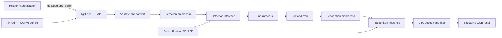

# light-ocr Core Requirements

Status: Normative Core requirements  
Project: `light-ocr`  
Milestone: Native C++ core  
Document type: Product and technical requirements  
Last updated: 2026-07-13

Implementation evidence and remaining release blockers are tracked in
[implementation-status.md](implementation-status.md). The acceptance list in section 19 remains
normative; configured automation is not counted as a passed platform run.

## 1. Purpose

`light-ocr` is an independent native OCR library. The current milestone delivers a complete, testable C++ OCR core using official PP-OCRv6 ONNX models and ONNX Runtime. It does not deliver a Node.js adapter.

The core owns input validation, preprocessing, inference, postprocessing, model loading, resource limits, and result contracts. Callers provide decoded pixel buffers and receive structured OCR results.

This document defines scope, observable behavior, model policy, platform expectations, quality gates, and completion criteria for the C++ core milestone. Detailed designs are authoritative in the companion documents listed in section 20.

The words **MUST**, **SHOULD**, and **MAY** are normative:

- **MUST**: required to complete the milestone.
- **SHOULD**: expected unless a documented reason prevents it.
- **MAY**: optional capability.

## 2. Delivery phases

### 2.1 Current milestone: native core

The current milestone includes:

- A C++17 OCR library target.
- A documented C++ API with no dependency on Node.js.
- Official PP-OCRv6 small detection and recognition ONNX models.
- A deterministic model-bundle contract.
- A development-only validation and benchmark executable.
- Unit, integration, differential, safety, and performance tests.
- Tier 1 build and test evidence.

### 2.2 Later milestone: language adapters

N-API implementation, npm publication, Electron support, and Bun support are not part of this Core milestone. The later Node.js adapter is now designed and source-implemented in [napi-design.md](napi-design.md); packaging remains pending and MUST NOT require rewriting OCR algorithms or changing the semantic result contract.

The current milestone does not promise a stable C ABI, a stable cross-release C++ ABI, or a separately supported end-user C++ SDK distribution.

## 3. Product goals

The C++ core MUST:

1. Run OCR in the caller's process without Python, a child process, a daemon, IPC, or a worker runtime.
2. Implement a modular detection-and-recognition pipeline aligned with a pinned official PaddleOCR Python oracle.
3. Use official PP-OCRv6 ONNX artifacts when official artifacts exist.
4. Accept decoded pixel buffers and never decode image or document formats.
5. Load models and create ONNX Runtime sessions once per engine.
6. Work offline at runtime and perform no network access.
7. Expose each pipeline stage through independently testable internal contracts.
8. Provide stage-level differential tests against the pinned oracle.
9. Fail safely on invalid input, invalid model bundles, unsupported capabilities, resource-limit violations, and inference failures.
10. Keep backend-specific types out of the public API.

## 4. Non-goals

The current milestone does not include:

- N-API, JavaScript, TypeScript, npm packages, or JavaScript workers.
- A stable binary ABI for third-party native consumers.
- PDF parsing or rendering.
- PNG, JPEG, WebP, GIF, HEIC, TIFF, or other encoded-image decoding.
- Filesystem traversal, camera capture, or screenshot capture.
- A production CLI, daemon, service, RPC protocol, or IPC layer.
- A Python runtime in production artifacts.
- Model training, fine-tuning, or runtime Paddle-to-ONNX conversion.
- Arbitrary untrusted model loading through a public consumer API.
- Document orientation correction, document unwarping, layout analysis, table recognition, formula recognition, or translation.
- Text-line orientation execution in the default Core bundle.
- Apple Vision or another operating-system OCR engine.

The architecture reserves a text-line-orientation capability slot. The Core bundle declares that capability unavailable, and a request that enables it returns `unsupported_capability`.

## 5. System boundary



| Concern | Owner |
| --- | --- |
| Encoded image decoding and PDF rendering | Caller |
| Pixel buffer validation | `light-ocr` public boundary |
| OCR algorithms and orchestration | `light-ocr` core |
| ONNX Runtime sessions | `light-ocr` core |
| Model bundle and normalized configuration | `light-ocr` distribution |
| Host commands, artifacts, scheduling, and UI | Caller or later adapter |

No module may read host configuration implicitly. Every behavior-changing value MUST come from a validated model bundle, engine options, or request options.

## 6. Deliverables

The milestone MUST produce:

1. C++ library headers and implementation.
2. CMake build targets for the library, tests, validation tool, and benchmark tool.
3. A pinned PP-OCRv6 small model bundle with licenses and integrity metadata.
4. A pinned Python oracle environment used only for tests and benchmarks.
5. A differential corpus, golden intermediate outputs, and machine-readable reports.
6. Unit, integration, safety, lifecycle, and performance tests.
7. Tier 1 CI build artifacts for internal validation.
8. Architecture, native API, model bundle, parity testing, and build/release documentation.

The validation executable is a development tool. It is not the primary production integration API.

## 7. OCR pipeline requirements

The pipeline MUST contain these modules:

1. Input validation and color conversion.
2. Detection resize and normalization.
3. Detection inference.
4. DB detection postprocessing.
5. Quadrilateral filtering and coordinate restoration.
6. Reading-order sorting.
7. Perspective crop and tall-line rotation.
8. Recognition resize, padding, sorting, and batching.
9. Recognition inference.
10. CTC decoding and confidence calculation.
11. Result filtering, diagnostics, and assembly.

Pipeline orchestration MUST NOT duplicate a stage algorithm.

### 7.1 Detection

The default bundle MUST use official `PP-OCRv6_small_det_onnx`.

Detection behavior MUST be driven by normalized bundle configuration covering:

- Input color mode.
- Side-length limit and limit strategy.
- Maximum side length.
- Resize rounding and interpolation.
- Normalization scale, mean, standard deviation, and channel order.
- Binary threshold.
- Box threshold.
- Maximum candidate count.
- Unclip ratio.
- Dilation setting.
- Score mode.
- Quadrilateral output mode.

Unsupported or unknown values return `invalid_model_bundle`; stage code MUST NOT invent fallback values.

The product runtime default MUST use the `bounded` strategy from [memory-optimization.md](memory-optimization.md): preserve aspect ratio, raise a short side below `64`, limit the longest detection side to `960`, then align both dimensions upward to a 32-pixel multiple. The official `64/min/4000` values remain source provenance and the explicit `upstream_exact` profile; `4,000` is a hard ceiling, not the product default.

### 7.2 Box processing and crop

The library MUST:

- Preserve four-point quadrilateral geometry.
- Restore coordinates using the same rounding and clamping rules as the oracle.
- Sort boxes into the same reading order as the oracle.
- Use oracle-compatible perspective transform, interpolation, border, and tall-line rotation behavior.
- Safely handle narrow, tall, partially out-of-bounds, and degenerate boxes.
- Reject polygons that cannot be processed safely.

### 7.3 Recognition

The default bundle MUST use official `PP-OCRv6_small_rec_onnx`.

Recognition MUST:

- Read image shape and the character dictionary from the matching official configuration.
- Treat the configuration dictionary, blank index, and appended-space rule as one immutable decode contract.
- Support dynamic crop widths up to the bundle limit.
- Sort crops for efficient batching without changing result order.
- Use an effective default batch size of `1` and support an explicit bounded batch size up to `8`.
- Construct, infer, decode, and release one recognition batch at a time; total crop count MUST NOT cause all crop tensors or all recognition inputs to remain live together.
- Match oracle padding, normalization, CTC blank removal, duplicate removal, and confidence calculation.
- Return valid UTF-8.
- Preserve all characters supported by the pinned dictionary.
- Treat an invalid tensor shape or out-of-range class index as an error.

### 7.4 Result filtering

The recognition score threshold MUST come from request options, engine options, or the bundle default using this precedence:

1. Explicit request value.
2. Explicit engine value.
3. Bundle default.

Lines below the threshold are omitted from `lines` and included in `diagnostics.rejectedLines` when diagnostics are requested.

An image with no text is successful and returns `lines: []`.

## 8. Model bundle requirements

The first bundle is `ppocrv6-small-onnx` and contains detection and recognition only.

The bundle MUST:

- Use the official PaddlePaddle model identities and artifacts defined in `model-bundle.md`.
- Contain `inference.onnx` and matching `inference.yml` for each model.
- Contain a normalized configuration consumed by the core.
- Pin upstream repository revisions and SHA-256 values.
- Contain license and attribution files.
- Declare supported stages, characters, limits, and minimum compatible core version.
- Be immutable after publication.

The official archive configuration is provenance input. The normalized configuration generated from the pinned oracle is the runtime authority. Mixing files from different revisions MUST fail validation.

The core MUST support loading bundle files from caller-provided byte views or an internal resource provider. Convenience file loading MAY exist in the development tool.

## 9. C++ public contract

The semantic operations are:

```text
Engine::create(bundle, engineOptions) -> Result<unique_ptr<Engine>>
Engine::recognize(imageView, recognizeOptions) -> Result<OcrResult>
Engine::info() -> const EngineInfo&
Engine::close() -> void
```

The exact declarations are defined in `native-api.md`.

### 9.1 Lifecycle

- `create` validates the complete bundle before making the engine available.
- `recognize` is synchronous and never mutates caller-owned image memory.
- `close` rejects new work, waits for an accepted synchronous call to finish, and releases sessions and buffers.
- Repeated `close` calls are safe.
- `recognize` on a closed engine returns `invalid_engine`; immutable creation metadata from `info` remains available until the engine object is destroyed.
- Destruction performs `close` as a safety net.

### 9.2 Image input

`ImageView` contains:

| Field | Requirement |
| --- | --- |
| `data` | Non-null byte pointer for a non-empty image |
| `size` | Accessible byte count |
| `width` | Positive integer |
| `height` | Positive integer |
| `stride` | Positive integer at least equal to the minimum row bytes |
| `pixelFormat` | Explicit enum |

The milestone supports packed `GRAY8`, `RGB8`, `BGR8`, and `RGBA8`. RGBA alpha is ignored; callers MUST provide straight channel bytes, and the core performs no alpha compositing or color-profile conversion.

Malformed dimensions, stride, or buffer length return `invalid_image`. A pixel-format value not supported by the current core returns `unsupported_pixel_format`. A structurally valid image that exceeds a configured resource limit returns `resource_limit_exceeded`.

All size, offset, row, and tensor calculations MUST use checked arithmetic.

### 9.3 Result

`OcrResult` contains:

- Ordered `lines`, always present.
- Original image width and height.
- Model bundle ID.
- Structured stage timings.
- Optional diagnostics.

Each line contains UTF-8 text, confidence in `[0, 1]`, and four points in original-image coordinates.

Coordinates use the top-left pixel as `(0, 0)`. Points are clockwise starting from the top-left point. Timing values are monotonic elapsed microseconds.

Required timing fields are:

- `total`
- `inputValidation`
- `detectionPreprocess`
- `detectionInference`
- `detectionPostprocess`
- `cropAndSort`
- `recognitionPreprocess`
- `recognitionInference`
- `recognitionPostprocess`

`total` covers the synchronous `recognize` operation after admission. It does not include caller-side waiting before entry.

### 9.4 Engine information

`EngineInfo` MUST report:

- Core semantic version.
- Model bundle ID and schema version.
- Backend and Execution Provider.
- Supported capabilities.
- Thread configuration.
- Concurrency mode and admission limit.
- Effective resource limits.
- Effective default recognition options.

## 10. Error model

The public API uses stable error codes and safe messages:

| Code | Meaning |
| --- | --- |
| `invalid_argument` | General contract violation |
| `invalid_image` | Malformed dimensions, stride, format, or buffer |
| `unsupported_pixel_format` | Recognized but unsupported pixel format |
| `unsupported_capability` | Requested capability is not loaded or implemented |
| `invalid_model_bundle` | Missing, inconsistent, malformed, or unsupported bundle content |
| `unsupported_model` | Model architecture or tensor contract is unsupported |
| `model_integrity_failed` | Hash or immutable identity validation failed |
| `runtime_initialization_failed` | ONNX Runtime or session creation failed |
| `inference_failed` | ONNX Runtime execution failed |
| `postprocess_failed` | Detection, geometry, crop, or decode failed |
| `resource_limit_exceeded` | A declared resource limit was exceeded |
| `invalid_engine` | Engine is closed or otherwise unusable |
| `internal_error` | Unexpected implementation failure |

C++ exceptions MUST be caught and mapped before crossing the public library boundary. Errors MUST NOT expose stack addresses, image contents, tensors, or model contents.

## 11. Concurrency and resources

- Different engines MAY be used concurrently.
- A single engine executes at most one recognition call at a time in the current milestone.
- Concurrent admission beyond the engine limit returns `resource_limit_exceeded`; the core owns no unbounded request queue.
- ONNX Runtime intra-op and inter-op thread counts are fixed at engine creation.
- Request memory is request-scoped or comes from a bounded reusable pool.
- No request changes process-global thread settings.

The default bundle declares product defaults and hard ceilings:

| Resource | Value | Role |
| --- | ---: | --- |
| Maximum width | 10,000 pixels | Hard ceiling |
| Maximum height | 10,000 pixels | Hard ceiling |
| Maximum total pixels | 40,000,000 | Hard ceiling |
| Default detection longest side | 960 pixels | Runtime default |
| Detection maximum side after resize | 4,000 pixels | Hard ceiling / `upstream_exact` |
| Detection candidates | 3,000 | Hard ceiling |
| Default recognition batch size | 1 | Runtime default |
| Maximum recognition batch size | 8 | Hard ceiling |
| Recognition tensor width | 3,200 pixels | Hard ceiling |
| Temporary Core-owned request memory | 512 MiB | Hard ceiling |
| Concurrent calls per engine | 1 | Hard ceiling |

Engine options MAY reduce hard ceilings. An engine MAY explicitly select a recognition batch from `1` through `8`, a bounded detection side up to the `4,000` hard ceiling, or `upstream_exact`; a request can only lower the engine's bounded side and cannot switch strategy. Changing an effective runtime default does not change the bundle hard ceiling. Increasing a bundle hard ceiling is rejected.

## 12. Runtime and dependencies

ONNX Runtime CPU Execution Provider is the required backend. Backend objects remain behind an internal inference interface.

OpenCV and a polygon clipping library MAY be used for oracle-compatible algorithms. All native dependencies MUST:

- Be pinned by version and SHA-256.
- Stay out of the public API.
- Be included in the license inventory and SBOM.
- Be built or packaged without relying on consumer-installed system packages.
- Be replaceable without changing the result contract.

The core MUST avoid network, shell, locale, current-directory, and environment-variable dependencies during engine creation and recognition.

## 13. Platform support

Tier 1 platforms are completion blockers:

| Platform | Architecture |
| --- | --- |
| macOS | arm64 |
| macOS | x64 |
| Windows | x64 |
| Linux | x64 |

Linux arm64 and Windows arm64 are deferred.

Each Tier 1 build MUST be compiled and tested on the target operating system. Cross-compilation alone is not release evidence.

## 14. Functional parity

The primary oracle is a pinned Python harness built from PaddleOCR v3.7.0/PaddleX stage behavior. It executes the same official ONNX bytes through the pinned ONNX Runtime and applies the explicit normalized configuration.

Reference priority is:

1. Pinned PaddleOCR/PaddleX Python behavior and generated golden outputs.
2. Official PaddleOCR Android ONNX Runtime implementation.
3. Official PaddleOCR.js ONNX Runtime implementation for supported detection and recognition stages.
4. Official PaddleOCR C++ implementation.

No upstream implementation is copied wholesale. Adopted behavior MUST have provenance and a differential test.

Required checkpoints include:

- Detection input tensor shape and sampled values.
- Detection output shape and sampled values.
- DB polygons before and after restoration.
- Box order.
- Crop dimensions and pixel hashes or bounded differences.
- Recognition input shapes, padding, and sampled values.
- Decoded indices, text, and confidence.
- Final ordered result.

Parity gates on the mandatory CPU reference environment are:

- Exact decoded text for mandatory fixtures unless a fixture-specific exception is approved.
- Exact line count and reading order.
- Corresponding box IoU at least `0.98`.
- Maximum corresponding-corner distance at most `2` pixels.
- Recognition-confidence absolute difference at most `0.001`.
- Exact empty-image and error behavior.

## 15. Corpus requirements

The corpus MUST include:

- Simplified Chinese, Traditional Chinese, English, Japanese, digits, punctuation, and mixed scripts.
- Horizontal and vertical text represented by the model.
- Dense pages and sparse single-line images.
- Small text, low contrast, uneven illumination, perspective distortion, and rotated boxes.
- Handwriting, display text, artistic text, and industrial text.
- Blank and no-text images.
- Minimum and maximum accepted dimensions.
- Invalid stride, truncated buffers, oversized images, malformed bundles, unsupported capabilities, and invalid tensors.

Every fixture MUST have an immutable ID and documented redistribution or generation rights.

## 16. Performance requirements

Benchmarks compare the core with the pinned Python ONNX Runtime oracle using the same machine, model bytes, thread settings, raw pixels, warmup count, and test order.

Benchmarks are explicit, on-demand qualification work. Push, pull-request, scheduled, and npm release-preflight workflows MUST NOT run them automatically; trigger them only for an initial baseline, a performance-relevant implementation/dependency/runner change, a new public performance claim, or investigation of a suspected regression.

Reports MUST include load time, engine initialization, every stage duration, total latency, peak resident memory, model size, and repeated-run memory behavior.

Initial gates are:

- Warm median, warm p95, and inference-only Core/Python ratios MUST be reported. They are hard gates (`1.10x`, `1.15x`, and `1.05x`) only when the Core and oracle use the same ONNX Runtime binary build identity.
- When official native and Python distributions require different ONNX Runtime binaries, all Core/Python latency ratios are non-blocking observations; they cannot isolate application overhead from binary build performance. Non-interleaved Node/Core samples from separate processes are observations for the same reason: process baselines and runner thermal state are not isolated. Initial qualification instead uses absolute timeout and memory gates plus reviewed per-implementation platform baselines; hard cross-runtime ratios require controlled interleaved sampling.
- Every measured call completes within the declared absolute timeout and produces stable, quality-equivalent output.
- Model and session initialization once per engine.
- No unbounded memory growth.

The absolute high-resolution RSS gates, measurement method, and per-platform regression policy in [memory-optimization.md](memory-optimization.md) are release requirements. Relative latency alone cannot pass an implementation whose absolute peak exceeds those gates.

These relative gates do not establish model accuracy. D002 fixes the first model selection, so its mandatory ground-truth report establishes the project baseline rather than applying an invented retrospective threshold. A later bundle must satisfy the no-regression policy in `parity-testing.md` or carry an approved product decision.

## 17. Testing and safety

Unit tests MUST cover configuration, checked arithmetic, preprocessing, DB postprocessing, geometry, crop, batching, CTC decoding, UTF-8 construction, limits, lifecycle, and error mapping.

Integration tests MUST load the real official ONNX models and run the complete pipeline.

CI MUST include:

- AddressSanitizer and UndefinedBehaviorSanitizer where supported.
- ThreadSanitizer for lifecycle and multi-engine concurrency where supported.
- Fuzzing of image contracts, bundle parsing, polygon processing, and engine lifecycle.
- Leak checks across repeated create, recognize, close, and destroy cycles.
- Malformed tensor and injected runtime-error tests.
- Offline runtime tests with network access disabled.

## 18. Observability and privacy

Logging is disabled by default. A caller-provided callback MAY receive severity, stable event ID, and a safe message.

The library MUST NOT:

- Write to stdout or stderr during normal use.
- Log recognized text or image contents.
- Include raw pixels, tensors, or model bytes in diagnostics.

Diagnostics MAY contain rejected lines, confidence, boxes, stable warnings, and stage counters.

## 19. Core milestone acceptance

The milestone is complete only when:

- [ ] The C++ core builds on every Tier 1 platform.
- [ ] The production core contains no Python and starts no subprocess.
- [ ] The public API accepts raw pixels and has documented ownership and lifecycle.
- [ ] Detection, geometry, crop, recognition, and decode stages are separate and tested.
- [ ] The PP-OCRv6 small bundle is pinned, mirrored, hashed, licensed, and usable offline.
- [ ] Stage-level and final-result parity gates pass.
- [ ] The ground-truth model-quality report is complete and establishes the first-bundle baseline.
- [ ] Performance gates pass on the declared reference environment.
- [ ] Default bounded detection, streaming recognition, and absolute high-resolution memory gates pass on every Tier 1 platform.
- [ ] Sanitizer, fuzz, leak, lifecycle, and malformed-input gates pass.
- [ ] Runtime operation has no network, shell, current-directory, or locale dependency.
- [ ] Build manifests, hashes, licenses, SBOM, parity report, and benchmark report are produced.
- [ ] No N-API or npm deliverable is required for this milestone.

## 20. Authoritative companion documents

1. [architecture.md](architecture.md): module boundaries, data flow, state, concurrency, and memory ownership.
2. [native-api.md](native-api.md): C++ declarations, ownership, lifecycle, errors, and compatibility.
3. [model-bundle.md](model-bundle.md): exact artifacts, schema, normalized configuration, integrity, and licensing.
4. [parity-testing.md](parity-testing.md): oracle, corpus, checkpoints, tolerances, and reports.
5. [build-and-release.md](build-and-release.md): build graph, platform matrix, dependencies, CI, and milestone artifacts.
6. [memory-optimization.md](memory-optimization.md): high-resolution resize policy, streaming recognition, absolute memory gates, and rollout plan.
7. [decisions.md](decisions.md): resolved choices and deliberately deferred decisions.

Each fact has one authoritative home. Companion documents reference this file and do not redefine product scope or acceptance gates.

## 21. Upstream references

- [PaddleOCR v3.7.0 release](https://github.com/PaddlePaddle/PaddleOCR/releases/tag/v3.7.0)
- [PP-OCRv6 algorithm documentation](https://github.com/PaddlePaddle/PaddleOCR/blob/v3.7.0/docs/version3.x/algorithm/PP-OCRv6/PP-OCRv6.en.md)
- [Official PP-OCRv6 Android ONNX Runtime SDK](https://github.com/PaddlePaddle/PaddleOCR/tree/v3.7.0/deploy/ppocr-android)
- [Official PaddleOCR.js implementation](https://github.com/PaddlePaddle/PaddleOCR/tree/v3.7.0/paddleocr-js)
- [PP-OCRv6 small detection ONNX](https://huggingface.co/PaddlePaddle/PP-OCRv6_small_det_onnx)
- [PP-OCRv6 small recognition ONNX](https://huggingface.co/PaddlePaddle/PP-OCRv6_small_rec_onnx)
- [ONNX Runtime C++ documentation](https://onnxruntime.ai/docs/get-started/with-cpp.html)
- [PaddleOCR Apache-2.0 license](https://github.com/PaddlePaddle/PaddleOCR/blob/v3.7.0/LICENSE)
