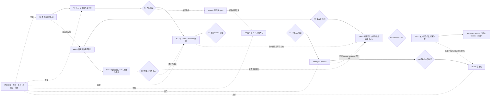

# light-ocr Roadmap


- 状态：Draft
- 更新时间：2026-07-16
- 适用范围：`0.2.x` 之后至 `1.0` 的产品与工程演进

## 1. 目标与定位

`light-ocr` 的目标不是复刻 PaddleOCR 的全部 Python pipeline，也不只是提供一个 Node.js OCR binding。它要成为面向 Node.js 应用与 Agent 的本地文档感知运行时：一次安装、默认离线、无需 Python，把图片和文档稳定转换为带坐标、可追溯、版本化的结构化结果。

主路径遵循以下顺序：

1. 先确认目标用户的宿主硬件覆盖，以及当前默认模型是否达到可用性能；
2. 再建立可以被人和 Agent 直接调用的入口；
3. 然后扩展模型档位，形成明确的体积、速度和精度选择；
4. 把输入边界从单张图片扩展到多页文档；
5. 最后加入 Layout 等文档结构能力，并在公共契约和真实集成得到验证后进入 `1.0`。

性能线是第一优先级，不是产品功能完成后的优化项。它先回答“用户实际拥有哪类宿主硬件”，再建立 CPU baseline、可观测性和 backend 抽象，最后按覆盖收益选择 GPU/ANE/NPU provider。若默认 small 在目标 workload 上未通过性能可用性 Gate，N2–N4 暂停扩面，资源优先投入 CPU 调优或覆盖率最高的加速路径。加速能力仍不作为 `1.0` 的形式化强制依赖，但产品不能以“CPU 能运行”代替“性能可用”。

这一路径保留现有 Core 的优势：本地执行、无运行时下载、确定性模型 bundle、显式资源上限、跨平台一致结果和严格发布门禁。

### 1.1 非协商原则

- **本地优先。** 默认运行不访问网络、不上传用户内容、不启动 Python sidecar。
- **开箱即用。** 用户安装一个明确的产品包后即可执行 OCR，不需要在首次运行时获取模型或编译 native addon。
- **同一语义契约。** CLI、Node.js 和未来文档入口共享相同的文字、坐标、错误和模型身份语义。
- **能力显式。** 缺少模型或不支持某项能力时稳定失败，不自动替换模型；仅 D112 版本化 Auto 可在创建期按公开候选序和封闭原因选择下一 backend，且完整记录尝试链。
- **边界分层。** OCR Core、文档解码、Layout 编排和 Agent 工作流是不同层，不把全部能力塞入一个 `recognize()` 实现。
- **证据驱动扩展。** 每个新模型、格式、平台和 Execution Provider 都需要独立的质量、资源与发布证据。

## 2. 节点与主路径

### 2.1 主路径



### 2.2 节点总表

版本号和周期是规划锚点，不是发布日期承诺。工作量按一名熟悉现有代码库的主要维护者估算，不包含外部平台排队、上游制品等待和社区反馈周期。若节点验证未通过，不因版本号计划而自动进入下一阶段。

本文中的 Tier 1 沿用当前项目定义：macOS arm64、macOS x64、Linux x64 glibc 和 Windows x64，Node.js 为 22/24。平台矩阵变更属于 D110，不在节点内隐式扩大。

| 节点 | 建议版本 | 预计工作量 | 核心结果 | 前置依赖 | 退出条件 |
| --- | --- | ---: | --- | --- | --- |
| N0 发布与需求基础 | `0.2.x` | 约 1 周 | 完整的开源发布入口和真实场景收集机制 | 当前 `0.2.0` | 发布、贡献、安全和反馈入口可用 |
| N1 CLI、结果契约与 ROI | `0.3.0` | 2–3 周 | 人和 Agent 无需写代码即可进行图片 OCR 与区域 OCR | N0 | Tier 1 CLI、schema 和 Agent eval 通过 |
| N2 多杯型模型 | `0.4.0` | 3–4 周 | tiny/small/medium 使用同一 API，形成可解释的取舍 | G1、PU | 单模型安装、三档同机 Pareto 报告通过 |
| S3 PDF 可行性 Spike | N3 前置 | 1–2 周 | renderer、许可、制品、隔离和资源策略结论 | G1 | 形成接受/缩减/拒绝 PDF 路径的决策记录 |
| N3 文档入口 | `0.5.0` | Spike 后 4–6 周 | 按 S3 结论交付 PDF Document，或缩减为调用方提供 page images 的多页 composer | 主路径经过 G2；技术上依赖 N1 与 S3 | 对应分支的 corpus、资源上限与隔离验证通过 |
| N4 Layout Preview | `0.6.0` | 4–6 周 | 版面区域、OCR line 关联与阅读顺序 | N3 | 独立 Layout/reading-order 验证通过 |
| N5 稳定化 | `1.0.0` | 由验证结果决定 | 稳定 API/schema、平台矩阵和支持政策 | PU、N1、small/runtime 稳定；按 G3 决定是否要求 N3；N4 可保持 Preview | 至少 3 个真实外部集成且无阻塞级契约缺口 |

### 2.3 性能优先线

性能线从 N0 开始并拥有最高投资优先级。CPU 始终是稳定基线；provider 选择必须先通过硬件覆盖审计，GPU/NPU 只有在端到端收益、质量、资源和分发成本都通过 Gate 后才进入产品包。

| 节点 | 建议时机 | 预计工作量 | 核心结果 | 退出条件 |
| --- | --- | ---: | --- | --- |
| Perf-0 宿主硬件覆盖审计 | N0 立即启动 | 1–2 周；随后持续更新 | 官方支持矩阵、无内容诊断命令、目标用户设备样本和 provider 覆盖/专用路线排序 | HC 记录通用主线的技术覆盖、用户加权覆盖、置信度和缺口，并判断专用后端启动条件 |
| HC 覆盖率 Gate | Perf-0 后；每季度复核 | 无固定版本 | 锁定通用主线设备资格范围，并用真实用户结构决定是否启动专用 backend | 锁定目标设备、可寻址覆盖假设和专用 Spike 顺序 |
| Perf-1 性能契约、CPU 基线与调优 | N0–N1 并行 | 2–3 周 | provider-neutral contract、分阶段 profiler、可重放 CPU baseline 与低成本调优 | PU 对默认 small 得出通过或未通过结论；质量/内存 gates 不回归 |
| PU 性能可用性 Gate | Perf-1 后 | 无固定版本 | 判断当前产品性能是否足以继续扩展模型和文档能力 | 通过后进入 N2；未通过则优先继续 Perf-1/Perf-2 |
| Perf-2 宿主加速器 Spike | HC 后立即启动；不等待 N2 | 每个 provider 2–4 周 | 复核 Apple，并资格验证 Windows/Linux WebGPU 通用主线；满足启动 Gate 后再验证专用后端 | 每个 provider 得出接受、缩减或拒绝结论；N2/N4 新 workload 加入后复核 |
| PG Provider Gate | 每个 Perf-2 候选之后 | 无固定版本 | 判断 provider 是否值得承担额外 package 和测试矩阵 | 达到端到端收益、质量、资源和分发阈值 |
| Perf-3 自包含加速分发 | PG 通过后 | 每个 provider 3–5 周 | 通过统一 facade 自动取得的 platform/provider payload、Auto 与显式选择 API | 单入口安装、干净 VM 禁网、Auto 创建尝试/CPU partition、质量和性能 release gates 全绿 |
| Perf-4 I/O Binding/宿主 Context | Perf-3 后按 profiler 证据 | 待定 | 降低 CPU↔GPU copy，必要时复用宿主 device/stream/context | 端到端收益能覆盖 ABI、生命周期和安全复杂度 |

### 2.4 关键决策门

| 决策门 | 要回答的问题 | 通过后动作 | 未通过时动作 |
| --- | --- | --- | --- |
| HC 覆盖率 Gate | 通用主线覆盖哪些目标用户设备，哪些缺口值得启动专用 backend？ | 锁定主线资格设备、覆盖假设和专用 Spike 顺序 | 继续收集无内容诊断；通用主线仅做低成本探针，专用 backend 不启动 |
| PU 性能可用性 Gate | 默认 small 在目标设备和核心 workload 上是否达到预注册的交互/吞吐预算？ | 允许 N2–N4 按各自 Gate 继续 | 暂停功能扩面，优先 CPU 调优或 HC 第一候选的 Perf-2 |
| G1 入口验证 | CLI、ROI 和 Skill 是否显著降低接入成本？ | 继续扩展模型与文档入口 | 优先修正命令、schema 和安装体验 |
| G2 模型 Pareto 验证 | tiny 的体积/速度收益和 medium 的质量收益是否值得？ | 发布通过验证的杯型 | 保持 small 为唯一 GA，候选模型继续实验 |
| G3 文档入口验证 | PDF 或多页 composer 是否有足够独立使用证据，并解决调用方难以自行处理的问题？ | 进入 Layout | 优先补格式、分页、稳定性，不扩大模型面 |
| G4 结构化价值验证 | Layout 是否真实改善 Markdown、RAG 或业务抽取？ | 稳定 Layout，并评估表格/公式 | 保持 Layout 为 preview，不追完整 PP-Structure |
| PG Provider Gate | 某个 EP 是否在目标硬件和 workload 上产生足够的端到端收益？ | 将对应 provider 作为自包含 payload 纳入匹配的 platform release set | 保持 CPU/现有广覆盖 backend，记录重启条件 |

### 2.5 Gate Scorecard

主路径表示默认投资顺序，不等同于编译依赖。S3 可以在 G1 之后与 N2 并行；N3 的正式交付排在 G2 之后，但不要求 tiny/medium 已经 GA，small 可以继续作为唯一稳定模型。所有 Gate 由维护者在公开 decision/release record 中记录证据和结论。

| Gate | 最低证据 | 观察窗口 | 通过标准 | Falsifier / 转向条件 |
| --- | --- | --- | --- | --- |
| HC 覆盖率 Gate | 官方 provider/OS/架构/芯片矩阵；`light-ocr doctor --json` 自愿诊断；外部集成的 workload 与设备；离线分发可行性 | 首次资格排序前收集，之后按季度与重大 runtime/OS 版本复核 | 对通用主线和每个专用候选报告技术可寻址覆盖、用户加权覆盖、样本量/置信度和平台缺口；D111 在看 Spike 结果前锁定评分与目标设备 | 只有上游“支持”列表、npm 总下载量或维护者自己的机器；无法说明目标用户设备结构时，不得宣称专用 provider 值得启动 |
| PU 性能可用性 Gate | 默认 small 的 cold/warm 端到端报告；simple、dense、large/tiled 与 batch 核心 workload；目标设备预算 | Perf-1 完成后；每个默认模型/runtime 重大变更复核 | D111 预注册的交互延迟或吞吐预算通过，且质量、峰值内存和安装成本不回归 | 只能证明 inference-only 变快，或多数目标场景仍因启动、decode、copy、pre/postprocess 不可用 |
| G1 入口验证 | Tier 1 contract 全绿；20 个 committed Agent tasks；公开反馈或集成记录 | `0.3.0` 发布后至少 30 天 | contract 100% 通过；Agent tasks 至少 18/20 且无伪造 OCR 原文；至少 3 名独立用户给出可复现场景，或 2 个外部集成使用 CLI/ROI | 用户仍需编写适配代码、坐标含义反复误解，或 CLI/ROI 没有独立使用证据 |
| G2 模型 Pareto 验证 | D107 预先锁定的 tier profile；同机安装大小、质量、延迟、RSS 报告 | 候选包至少两个 prerelease | 每个 GA 杯型通过预注册阈值，且拥有不能被 small 同时满足的清晰受众 | tiny 没有显著降低总部署成本，或 medium 没有在目标 corpus 上产生实际质量收益 |
| G3 文档入口验证 | S3 接受/缩减；至少 30 份、100 页、5 类文档的 corpus；公开反馈或集成记录 | preview 发布后 30–60 天 | 安全/资源 gates 全绿；接受分支有至少 3 名独立用户或 2 个外部集成使用 PDF，缩减分支达到同等数量的多页 page-image/Markdown 使用证据 | 接受分支的 renderer 成本不可接受，或任一分支的用户普遍更愿意自行完成文档编排 |
| G4 结构化价值验证 | D109 预注册 Layout/reading-order profile；至少 100 页独立标注；preview 集成反馈 | preview 发布后至少 60 天 | 质量 gates 全绿；至少 2 个外部集成证明 Layout 改善 Markdown、chunking 或字段定位 | Layout 结果没有优于 OCR-order，或模型/标注/安装成本超过使用价值 |
| PG Provider Gate | 同机 CPU/EP 对照；simple、dense、tiled、medium 和 Layout 候选 workload；provider payload/driver inventory | 至少 3 次独立冷启动与 30 次 warm run；每个公开性能数字对应至少一台真实目标设备 | contract 100% 通过；在至少两个目标 workload 上 `CPU P50 latency / EP P50 latency ≥ 1.5`，或吞吐 ≥2× CPU；质量通过预注册容差；无未披露 Auto 跳过或跨 backend fallback；cold-start、安装大小和设备内存不超过预注册 ceiling | 只有 inference microbenchmark 加速、端到端无收益，或初始化/copy/package/质量成本抵消收益 |

阈值不得在看到最终候选结果后调整。模型质量、Layout 指标的具体数值由对应 decision 在运行正式评测前锁定；Roadmap 只规定证据类别和决策纪律。

### 2.6 版本与稳定性

- N0–N5 是路线节点，不是强制 npm semver。节点跳过、并行或缩减时，使用下一个正常 minor，不为匹配表格制造空版本。
- npm package version、Core version、model bundle ID 和 Document `schemaVersion` 是四个独立版本维度。
- 面向用户的 meta package 精确锁定 runtime、native 和默认 model；安全补丁通过新的 meta patch release 更新组合。
- `schemaVersion` 是文档/CLI JSON 的整数主版本。兼容新增保持同一版本；删除、重命名或语义变化必须增加版本。
- `--schema-version 1` 表示请求精确的输出 schema；不支持的版本稳定失败。结果本身始终携带 `schemaVersion`。
- capability 标记为 `experimental`、`preview` 或 `stable`。Preview 不构成 `1.0` 稳定承诺。
- Execution Provider 是独立 capability 和 package 维度；CPU 保持 stable，未通过 PG 的 provider 不进入默认包，也不阻塞 `1.0`。
- `1.0` 必须通过 PU，但 PU 可以由 CPU 优化或任一通过 PG 的加速路径满足，不强制指定某种硬件。
- `1.0` 必须稳定 N1、small 默认模型和被产品定位保留的 N3 文档入口；tiny/medium 可以保持 prerelease，Layout 可以保持 Preview。若 G3 否定 PDF 路径，必须先把产品定位收窄为本地图片 OCR runtime，再决定 `1.0`。

## 3. 目标产品与架构路径

### 3.1 产品入口

Roadmap 结束时应形成以下入口，而不是一个不断膨胀的单包 API：

| 入口 | 面向用户 | 主要职责 |
| --- | --- | --- |
| `light_ocr` C++ Core | 仓库内适配器；未来原生 SDK 候选 | raw pixels、OCR stage、几何、资源限制、模型 session；N5 前不承诺稳定 ABI/安装面 |
| `@arcships/light-ocr-runtime` | 内部共享与高级集成 | Node adapter、调度、encoded decode、native 加载、模型 bundle 解析，不默认携带模型 |
| `@arcships/light-ocr` | 大多数 Node.js 用户 | small 默认模型、Node API；唯一拥有 `light-ocr` bin，保持开箱即用 |
| `@arcships/light-ocr-tiny` | Edge、体积/速度优先用户 | 与主包相同 API，默认 tiny；如提供 bin，只能命名为 `light-ocr-tiny` |
| `@arcships/light-ocr-medium` | 精度优先和服务端用户 | 与主包相同 API，默认 medium；如提供 bin，只能命名为 `light-ocr-medium` |
| `@arcships/light-ocr-document` | PDF、批量文档和 RAG 流程 | Document API、分页、格式转换、Layout 编排；Preview 期拥有独立 `light-ocr-document` bin |
| `@arcships/light-ocr-layout`（逻辑角色） | 显式选择 Layout 的用户 | Layout analyzer、公共 label 映射和 capability resolver；依赖 runtime 与一个精确 Layout model，不拥有 CLI bin |
| `@arcships/light-ocr-model-<layout-id>`（逻辑角色） | 由 Layout capability 间接安装 | 纯数据 Layout bundle、manifest、license 和模型 identity；不包含编排代码 |
| Agent Skill / Plugin | Codex 与其他可调用本地命令的 Agent | 选择正确命令、约束输出、处理错误，不实现 OCR |

具体包名可在 N2/N3 的设计决策中调整，但以下约束必须保持：

- `@arcships/light-ocr` 继续代表默认 small、开箱即用的产品入口；
- 三个杯型不能产生不同的 JS API 或结果 schema；
- 默认安装不能同时携带三个模型；
- model package 与 runtime 可以独立演进，但面向用户的 meta package 必须精确锁定兼容组合；
- runtime 不在安装期或首次调用时下载模型。

包和命令所有权还需满足：

- 多个杯型可以同时安装，不得争用同一个 bin 名；
- `light-ocr` 始终代表 small 默认入口，Skill 优先使用该命令；
- N1 的图片文件、stdin 和 EXIF 由 `light-ocr` image CLI 负责；N3 的 PDF、多页、Document JSON/Markdown 由 `light-ocr-document` 负责；
- Document Node API 接受调用方注入兼容的 engine factory，因此不强制 small；`light-ocr-document` CLI Preview 可以精确依赖 small 作为开箱即用默认值；
- Layout model 不成为 Document 包的默认依赖。`@arcships/light-ocr-layout` 精确锁定兼容 runtime 和 Layout model；Document 只接受注入的 versioned Layout analyzer interface，避免反向依赖和循环依赖；
- 上述 Layout 包名是待 D109 接受的逻辑角色，不在 Roadmap 中提前冻结最终 registry 名称。

### 3.2 结果模型演进

现有 `OcrResult` 继续作为单张已解码图片的底层语义契约。CLI 和 Document 层在其外部增加文档级 envelope：

```text
DocumentResult
├── schemaVersion
├── source
│   ├── kind / mediaType
│   ├── identity
│   └── appliedTransforms
└── pages[]
    ├── index
    ├── width / height
    ├── coordinateSpace
    ├── regions[]        # Layout，可选
    └── lines[]          # OCR
```

坐标契约至少明确：

- 原点和坐标轴方向；
- 单位是 pixel 还是 PDF point；
- 坐标对应原始输入、方向修正后的图片，还是 PDF raster page；
- crop、EXIF orientation 和 page rasterization 使用的 transform；
- ROI 返回值必须重新映射到完整页面坐标。

Layout region、OCR line 和未来的 table/formula result 是不同实体，不通过在 `OcrLine` 上无限增加 optional 字段来表达。

### 3.3 坐标与流式结果词汇表

N1 冻结以下术语，后续 PDF 和 Layout 只能扩展，不能重新解释：

| 术语 | 定义 |
| --- | --- |
| `sourceSpace` | encoded source 在方向修正前的固有坐标，仅用于记录输入 identity 与 transform，不作为 v1 OCR box 的输出空间 |
| `pageSpace` | 所有 v1 `line.box`、Layout box 和 `--region` 使用的 canonical space；左上角为原点，x 向右、y 向下，单位为方向修正或 PDF raster 后的 pixel |
| `pdfSpace` | PDF page user space，单位为 point；Document page 必须提供 `pageSpace` 与 `pdfSpace` 之间的可逆 affine transform |
| `appliedTransforms` | 从 source 到 page 的有序变换记录，包括 EXIF orientation、PDF page rotation、crop/media box 和 raster scale |

具体规则：

- v1 `--region` 只接受 `pageSpace`，并且必须完全位于页面内；部分相交也返回 `invalid_argument`，不隐式 clamp；
- encoded image 必须先完成受限解码和方向修正，CLI 才能解释 ROI；decode/file limits 作用于完整输入，OCR candidate/tensor limits 作用于 ROI，二者都计入临时内存预算；
- 单张图片表现为一个 `pages[0]`；JSONL 对图片输出一条 page record，对文档每完成一页输出一条 page record；
- JSONL page record 带 document identity、page index 和 `status`。中途取消或失败时，已完成记录保持有效，stderr 给出终态，进程返回非零 exit code；
- `structure: "ocr-order"` 表示只有 OCR 几何顺序；`structure: "layout"` 仅在 Layout compose 成功时出现，不表示结果达到人工真值。

## 4. N0 — 发布与需求基础

### 4.1 目标

把已经完成的工程能力转化为可发现、可反馈、可贡献的开源产品基础，并建立后续优先级所需的真实需求信号。

### 4.2 主要交付物

- 创建与 npm `0.2.0` 对应的 GitHub Release 和 tag 说明；
- 增加 `CONTRIBUTING.md`，包含本地构建、测试、模型缓存和 PR 验证入口；
- 增加 `SECURITY.md`，说明图片/PDF 解析风险、漏洞报告方式和支持版本；
- 增加 bug、model quality、platform support、feature request Issue 模板；
- 开启或整理 Discussions 分类：使用案例、模型质量、平台支持、Roadmap；
- 在 README 中链接本 Roadmap、Release、贡献和安全文档；
- 建立真实场景征集规范，不要求用户公开私有原图；
- 为后续 corpus 记录场景元数据：语言、来源类型、尺寸、旋转、密度、预期输出和授权状态。

### 4.3 初始场景集

目标不是立即建立大规模 benchmark，而是覆盖会改变产品决策的场景：

- 截图、剪贴板和 UI 小字；
- 票据、标签、表单、合同和书页；
- 扫描 PDF 与图片型 PDF；
- 多栏文档、标题、页眉页脚和图片混排；
- 低对比、旋转、透视、手写和工业字符；
- 中文、英文、日文及混合文本；
- 用户给定坐标区域的精确识别。

### 4.4 验收与退出条件

- GitHub Release 与 npm release identity 可互相追溯；
- 新贡献者能从文档完成一次本地测试；
- Issue 模板能够收集平台、输入类型、语言、模型和期望行为；
- 至少形成 12 个可合法使用的真实场景，覆盖前述 7 类中的至少 6 类；每项记录授权、来源、预期结果和是否可进入公开 corpus；
- 至少由一名非主要维护者按 `CONTRIBUTING.md` 完成一次干净环境构建或 package smoke，并留下可追溯记录；
- 后续节点不再只依据 stars 或上游 benchmark 排序。

### 4.5 本节点不做

- 不为了“社区完整度”引入复杂治理流程；
- 不收集默认遥测；
- 不要求用户上传敏感文档；
- 不在缺少证据时承诺所有平台、格式和模型。

## 5. N1 — CLI、结果契约与 ROI

### 5.1 目标

让普通用户和 Agent 无需编写 Node.js 集成代码，即可从本地图片获得稳定文本、置信度和坐标；同时建立 PDF、Layout 和多模型都能复用的版本化结果契约。

### 5.2 CLI 契约

第一版建议保持命令面小而稳定：

```bash
light-ocr image.png --format json
light-ocr image.png --region 100,80,640,320 --format json
light-ocr image.png --format text
cat image.png | light-ocr --stdin --type image/png --format json
```

必须支持：

- 文件路径与 stdin；
- `json`、`jsonl` 和 `text` 输出；
- `--region x,y,width,height` 矩形 ROI；
- `--model-info` 和 `--version`；
- `--schema-version 1`、`--no-color`、`--quiet`；
- detection strategy、score threshold 和资源上限的必要子集；
- stdout 只承载机器结果，日志、warnings 和诊断写 stderr；
- 稳定 exit code，并区分输入、能力、资源、模型和内部错误；
- 已安装后的离线执行，不依赖 cwd 或隐式环境配置。

目录递归、glob、watch mode 和交互式 UI 不进入第一版 CLI；批量调用先通过 shell 和 JSONL 组合完成。

### 5.3 ROI 语义

ROI 是业务入口能力，不是 Layout 的替代品。第一版只接受位于方向修正后完整有效页面 `pageSpace` 内的轴对齐矩形：

- 在进入完整 OCR pipeline 前限制检测区域；
- 保持现有 detection、crop 和 recognition 语义；
- 返回的 quad 坐标重新映射到完整有效页面的 `pageSpace`；
- 非法、空或越界区域返回稳定错误，不隐式 clamp 到不可见结果；
- ROI 仍受像素、临时内存、candidate 和 timeout 上限约束。

任意多边形、多个 ROI 合批和仅对已知 line crop 执行 recognition 可作为后续扩展，不阻塞本节点。

### 5.4 图片方向与坐标

v1 CLI 对 encoded JPEG 默认应用可验证的 EXIF orientation 修正，并把修正后的图片定义为 `pageSpace`；结果记录完整 `appliedTransforms`。raw-pixel API 继续由调用者负责方向，传入像素直接定义 `pageSpace`。底层 `OcrResult` 返回实际送入 Core 的 `pageSpace` 坐标，CLI envelope 记录它与 `sourceSpace` 的关系。

### 5.5 Agent Skill

仓库内增加 `.agents/skills/local-ocr/SKILL.md`，包含：

- 何时使用 OCR，而不是让多模态模型猜测小字；
- 如何选择全文、ROI、text、JSON 和 diagnostics；
- 如何处理低置信度、空结果、超限和 unsupported capability；
- 如何只读取必要页面或区域，避免无界批处理；
- 如何引用文字及坐标，避免把推断写成 OCR 原文；
- 可执行的 CLI 示例和小型验证脚本。

Skill 是 CLI 的薄工作流层。识别、坐标转换和 schema 逻辑必须留在产品代码中。验证稳定后，再把 Skill 打包为可安装 Plugin；本地文件 OCR 暂不需要 MCP server。

### 5.6 验收与退出条件

- Tier 1 平台的 Node.js 22/24 均通过 `npm install` 后 CLI smoke；
- CJS、ESM、Node API 和 CLI 对同一输入返回语义一致的结果；
- JSON/JSONL 使用 committed schema 和 snapshot 测试；
- stdin、文件路径、ROI、EXIF、退出码和 stderr/stdout 分离有测试；
- 禁网、sterile cwd、`--ignore-scripts` 安装继续通过；
- 至少 20 个 Agent task eval 覆盖全文、指定区域、低置信度和错误恢复；
- Agent eval 至少 18/20 通过，并且任何失败都不能把推断内容伪装成 OCR 原文；
- 一个不熟悉内部架构的读者能只凭 README/SKILL 完成首次 OCR。

### 5.7 G1 决策

进入 N2/N3 前检查：

- CLI 是否成为 issue、示例和 Agent 使用中的主要入口；
- ROI 是否解决了截图、表单字段和局部复核需求；
- 用户是否理解 schema 和坐标，而不是频繁询问其含义；
- 安装失败是否主要来自平台矩阵，而不是 OCR 逻辑。

若入口仍不清晰，优先修正 N1，不以增加更多模型掩盖接入问题。

## 6. N2 — tiny / small / medium 多杯型模型

### 6.1 目标

将 PP-OCRv6 的三档模型转化为同一产品的三个可解释部署选择，而不是三个行为逐渐分叉的 OCR 实现。

### 6.2 产品定位

下表中的大小和指标来自 PP-OCRv6 上游模型，用于形成初始假设；正式发布必须以本项目同机、同 corpus 的报告为准。

| 杯型 | 上游 det + rec 大小约 | 上游 Det Hmean / Rec Accuracy | 建议用途 |
| --- | ---: | ---: | --- |
| tiny | 6.3 MB | 80.6 / 73.5 | Edge、CLI、批量预扫描、体积和速度优先；不含日文 |
| small | 30.0 MB | 84.1 / 81.3 | 默认桌面、本地应用和通用 Node.js 集成 |
| medium | 132.7 MB | 86.2 / 83.2 | 精度优先、服务端和高价值文档 |

模型 payload 之外还有 native runtime，因此不能只用模型参数量宣传最终安装大小。每个 release report 必须展示用户实际安装后的总大小、冷启动、内存和延迟。

### 6.3 包路径

推荐将当前 facade 的共享实现提取为 model-free runtime：

```text
@arcships/light-ocr-runtime
├── required/optional: 当前平台 native runtime
└── no default model

@arcships/light-ocr
├── exact: runtime
├── exact: ppocrv6-small model
└── bin: light-ocr

@arcships/light-ocr-tiny
├── exact: runtime
├── exact: ppocrv6-tiny model
└── optional bin name: light-ocr-tiny

@arcships/light-ocr-medium
├── exact: runtime
├── exact: ppocrv6-medium model
└── optional bin name: light-ocr-medium
```

`@arcships/light-ocr` 继续保持当前 small 默认语义。tiny/medium meta package 导出相同的 `createEngine()`、types 和 CLI，只改变默认模型解析。高级用户仍可通过显式 `bundlePath` 使用受控自定义 bundle。

### 6.4 实施顺序

1. 先把 model identity、capabilities、language coverage 和 resource defaults 从单一 `BuiltInModel` 扩展为通用 bundle contract；
2. 提取共享 runtime，但保持现有主包调用方式不变；
3. 先接入 tiny，验证不同 tensor/model contract 和 release topology；
4. 建立三档同机 Pareto corpus 和报告；
5. medium 先发布到 prerelease tag，仅在独立 corpus 证明价值后 GA；
6. tiny 若定位为 edge，应同步评估 Linux arm64，而不是只在桌面 x64 上声明 edge。

### 6.5 验收与退出条件

- 三档模型使用同一个 public API、CLI、JSON schema 和 error model；
- 安装任一杯型只获得一个默认模型，不携带其他杯型；
- model package、native package 和 meta package 都有确定性 tarball、license、SBOM/integrity 证据；
- 每档独立记录模型 bundle ID、语言覆盖、能力、默认限制和最低兼容 runtime；
- 同机报告至少包含安装大小、bundle/session 初始化、P50/P95、峰值 RSS、CER、Detection P/R/Hmean；
- product quality corpus 在现有 parity corpus 之外至少增加 30 个真实场景 fixtures，并在评测前锁定 tiny/medium 的质量预算；
- tiny 的已知精度和语言损失在 README/CLI info 中显式展示；
- medium 若没有产生有意义的真实场景改善，保持 prerelease 而不是因上游命名自动 GA。

### 6.6 本节点不做

- 不在默认主包中同时安装三个模型；
- 不根据图片内容静默自动切换模型；
- 不在运行时下载、更新或替换模型；
- 不让每个杯型拥有独立实现和不同参数名；
- 不把 GPU/Execution Provider 与模型杯型绑定为同一个发布决策。

### 6.7 G2 决策

tiny 和 medium 不是因为上游已经提供就自动进入 GA：

- tiny 必须证明实际安装大小、延迟或内存收益足以覆盖质量和语言损失；
- medium 必须在独立真实场景 corpus 上证明质量提升足以覆盖约百兆级额外模型 payload 和更高资源成本；
- 任一杯型如果只在上游 benchmark 中占优、在项目 corpus 中没有清晰受众，则保持 prerelease；
- N3 不要求所有杯型 GA。small 仍可作为唯一稳定默认模型推进 Document 层。

## 7. Perf-0–Perf-4 — 性能与宿主加速线

### 7.1 当前判断与边界

可以利用宿主机器的 GPU、Apple Neural Engine 或 NPU，不必长期只靠 CPU。CPU 仍是所有平台的稳定最终候选；平台默认方向已经收敛为 macOS Direct Core ML、Windows/Linux Native WebGPU，跨平台实现优先复用 ONNX Runtime Execution Provider（EP），但 Core 拥有的 [`InferenceSession`](../src/inference/backend.hpp) 边界也允许 Direct Core ML、Direct OpenVINO 或其他受控 runtime 只替换 inference backend，而不复制 OCR pipeline。本文把项目级执行选择统称为 provider/backend；只有注册到 ONNX Runtime 的路径称为 EP，`apple` 是 Direct Core ML backend。Apple 路径已经证明“同一 ONNX 模型可以被 ORT 解析”不等于“某个 EP 能达到完整 placement、shape 和端到端收益”，因此每条路径仍需独立通过 Provider Gate。

当前实现与发布状态需要按平台区分：

- [`OnnxSession`](../src/inference/onnxruntime/backend.cpp) 可以创建 ONNX Runtime CPU session，并在 Linux x64/Vulkan、Windows x64/D3D12 注册锁定的 official Native WebGPU Plugin EP；当前 WebGPU profile 使用 FP32 和有界 `Concat/Gather/Slice` CPU partition；
- `0.3.0` 源码候选已经加入 `auto | cpu | apple | webgpu`。Direct Core ML 的 M4 Max 锁定质量、性能、缓存与生命周期 Gate 已通过；Native WebGPU 的 Linux RTX 5060 Ti 与 Windows Radeon 780M 报告均通过 164/164 Gate；
- 输入 tensor 仍从 CPU memory 开始，预处理、DB postprocess、裁剪、排序和图片/PDF decode 也主要在 CPU；I/O Binding 和 GPU preprocess 仍属于 Perf-4；
- 已发布的 `0.2.0` native packages 仍只携带 CPU runtime；`0.3.0` release set 将在现有四个 native platform packages 中自包含对应 Apple/WebGPU runtime，不新增用户安装入口；
- [`EngineInfo`](../src/core/engine.cpp) 已经按 detector/recognizer session 报告请求 provider、实际 provider chain、设备、precision、runtime、cache 和 qualification identity；D112 Auto policy 与 typed creation attempt trace 已实现。

加速线新增一条不可退让的产品约束：用户继续只安装 OS 无关入口 `@arcships/light-ocr`。facade 通过现有 optional dependency 机制自动取得匹配的 native platform package；模型、ORT/Windows ML、DirectML、Core ML bridge 或已接受的厂商 EP/runtime 必须随 release set 自包含交付。不得要求用户另装 CUDA、TensorRT、OpenVINO、Vitis AI、QNN SDK 或编译工具链，也不得通过 install/postinstall 按硬件下载二进制。正常操作系统组件（包括平台图形 loader）和硬件 driver 是唯一允许的系统前置条件。

已实现的 Direct Core ML FP16 Apple provider、ANE/GPU/CPU 分工和 M4 Max 资格证据记录在 [Apple Device 加速技术方案](apple-device-acceleration.md)。[Windows Device 加速技术方案](windows-device-acceleration.md) 和 [Linux Device 加速技术方案](linux-device-acceleration.md) 记录 Native WebGPU FP32 的实现、双平台真实设备报告和性能边界。三份方案中的源码与 Gate 完成状态不等于 npm 已发布，也不把未验证设备宣称为同等性能设备；production release 仍需绑定审阅后的报告/产物哈希并通过 package review。DirectML、CUDA、OpenVINO、MIGraphX 与厂商 NPU 继续作为需要独立 Gate 的专用备选。

因此需要区分两层“利用宿主 GPU”：

1. **Perf-2/Perf-3：使用宿主机器上的加速器。** `light-ocr` 自己创建 EP session、device queue 和相关资源，由 ORT 在 CPU 与设备间调度。这是近期可行目标。
2. **Perf-4：复用宿主应用已有的 GPU context。** 例如调用方已拥有 D3D12/CUDA device、stream 或显存，希望零拷贝传入。这涉及 provider-specific ABI、资源所有权、同步和生命周期，不作为第一阶段公共承诺。

GPU 不天然更快。tiny/small 单张简单图片可能因 session 初始化和 CPU↔GPU copy 变慢；medium、Layout、大图 tiled、批量或高文本密度 workload 更可能获益。所有结论以端到端报告为准，不以单个 ONNX op 或 inference-only microbenchmark 代替。

### 7.2 Perf-0 — 宿主硬件覆盖审计

在确定通用主线的设备资格范围、扩证投入和专用 backend 启动顺序前，先区分三种不能互相替代的“覆盖率”。Apple provider 已完成首个本地 Gate；Windows/Linux WebGPU 已完成当前两个记录设备的 PG。后续 HC 不撤销这些方向，而是决定兼容范围、扩证投入与专用候选的启动顺序：

1. **技术可寻址覆盖：** 官方 runtime 在哪些 OS、架构和芯片上提供 provider；
2. **用户加权覆盖：** `light-ocr` 的目标用户和真实集成中，有多少设备实际满足条件；
3. **有效加速覆盖：** 当前 PP-OCRv6 detector/recognizer 的算子、shape 和精度有多少真正落在设备上，并产生多少端到端收益。

上游文档只能回答第一层的一部分，不能证明第二、三层。当前没有足以推断用户设备结构的项目遥测，因此 Roadmap 不使用 npm 总下载量冒充 OS/硬件分布，也不以 HC 推翻已经接受的三平台通用方向；HC 用于锁定其资格范围、扩证投入与专用后端启动顺序。Perf-0 交付一个不读取图片、不上传数据的 `light-ocr doctor --json`：只报告 OS、架构、标准化 CPU/GPU/NPU vendor/family、可用内存等级、候选 provider、runtime/driver 兼容结果和命令版本；序列号、用户名、路径、原始文档和稳定设备标识不得进入结果。诊断只由用户主动执行并自行提交。

截至本文更新时间，官方矩阵给出的**技术覆盖轮廓**如下；它不是本项目用户份额排名：

| 候选路径 | 官方可寻址硬件 | 与当前 Tier 1 的交集 | 主要限制 | HC 前的暂定判断 |
| --- | --- | --- | --- | --- |
| ONNX Runtime Native WebGPU EP | 通过 Dawn 在 Windows 使用 D3D12/Vulkan、Linux 使用 Vulkan、macOS 使用 Metal；初始插件提供 Windows x64/arm64、Linux x64 与 macOS arm64 二进制 | Windows x64、Linux x64、macOS arm64 | 初始插件为 `v0.1.0` 且要求兼容的 ORT 1.24.4+；无 macOS x64、Linux arm64 和 NPU；当前动态 shape、CPU↔GPU copy、驱动差异、包体与端到端收益均待各平台验证 | 已选为 Windows/Linux 通用 GPU 主线；只有通过平台 Gate 并随包交付后才进入对应 D112 Auto 列表，不称为全平台 fallback |
| Windows ML / DirectML | DirectML 通过 DirectX 12 覆盖 NVIDIA、AMD、Intel 和 Qualcomm 的多代 GPU；Windows ML 2.x 还能通过 EP ABI 装载厂商 GPU/NPU EP，并支持 pinned self-contained runtime | Windows x64；未来可扩 Windows arm64 | DirectML 已进入 legacy/maintenance；动态 catalog 下载/更新与本项目离线、固定版本原则冲突；npm 不能按 GPU vendor 过滤 dependency | Windows 专用兼容性/厂商 EP 备选；不再作为默认广覆盖基线，只有独立收益和包体 Gate 通过后才启动或加入版本化平台策略 |
| Direct Core ML | macOS 上统一调度 CPU/GPU；Apple Silicon 可使用 Neural Engine | macOS arm64 与 macOS x64 | ANE 只存在于兼容 Apple Silicon；Intel Mac 不能计入 ANE 覆盖；当前真实性能证据只有 Apple M4 family，其他 Mac 为开放实验兼容 | M4 Max 的 FP16 混合路径已通过本地 PG 并进入 `0.3.0` 源码候选；下一步是 npm 分发与更多设备证据，不再是“是否实现” |
| OpenVINO | Intel CPU、集成/独立 GPU 与 NPU，覆盖 Windows/Linux | Windows x64、Linux x64 | 单一芯片生态；不同代际与 precision/operator 支持不同；额外 runtime 有体积成本 | Intel 密集的桌面/笔记本用户可能带来跨 OS 高覆盖 |
| CUDA | NVIDIA GPU | Windows x64、Linux x64 | NVIDIA-only，CUDA/cuDNN/driver 和包体矩阵成本高 | 硬件覆盖不如跨厂商路径，但可能最匹配服务端 batch、medium 与 Layout |
| QNN | Snapdragon/Qualcomm GPU 与 Hexagon HTP NPU，主要是 Windows arm64/Android | 当前无 Tier 1 交集 | 常需要 QDQ/量化模型和专用 SDK/driver 验证 | 除非 D110 扩平台且诊断显示可观用户群，否则不进入首批 |
| AMD Vitis AI / MIGraphX | Ryzen AI NPU 或 ROCm AMD GPU | 部分 Windows/Linux 目标 | OS、芯片代际、量化/编译与 runtime 约束分裂为两条路径 | 作为独立候选记录，不再笼统并入“Windows GPU” |

HC 使用两阶段决策，不制造未经观察的百分比：

```text
initialCoverage(p) = observedEligibleUserShare(p) × offlineDistributability(p)
expectedReturn(p)  = initialCoverage(p) × targetWorkloadShare(p)
                     × measuredEndToEndGain(p) / maintenanceCostIndex(p)
```

- 第一次排序只使用 `initialCoverage`，用于选择应该花 Spike 成本验证的候选；用户样本不足时必须标记低置信度，不能用全球 PC 市占率替代本项目人群；
- Perf-2 后使用 `expectedReturn` 决定是否发布。算子覆盖率、CPU partition、cold start 和 copy 成本都折算进实测端到端收益，不另行美化；
- D111 在查看候选 benchmark 结果前锁定样本窗口、归一化方法、成本等级和并列规则；D112 锁定平台 Auto 候选序与创建失败分类；
- 通用主线固定为 macOS Direct Core ML、Windows/Linux Native WebGPU，CPU 为最终候选。专用后端只有在通用路径对目标设备/workload 未通过覆盖、质量、性能或包体 Gate，或用户加权预期收益足以覆盖额外维护成本时才启动；OpenVINO、CUDA/TensorRT、DirectML、MIGraphX、Vitis AI 与 QNN 各自通过 PG 后，才可由后续决策加入版本化平台策略。

Perf-0 是通用主线资格范围和专用 backend 启动的前置 Gate，但不阻塞 CPU profiler 与低成本兼容性探针；它阻止的是在没有覆盖证据时冻结发布兼容范围或启动额外专用路线，不撤销已接受的三平台通用方向。

### 7.3 Perf-1A — 性能契约与 Backend 抽象

Perf-1A 已按 D111 建立可比较、可解释的性能契约，并保持当时的 CPU 默认行为不变；D112 的后续实现会把默认切换为 Auto，但在仅交付 CPU 的 release 中其候选仍只有 `[cpu]`：

- 将 provider/session 配置传入 `OnnxSession::create`，不在 engine 内硬编码具体 EP；
- provider 注册、可用性探测和 session 创建错误收敛到 backend 层；
- D112 实现后，成功 `EngineInfo` 记录 Auto policy/attempt trace，失败 creation error 携带同构 trace；`execution.sessions` 继续按 detector、recognizer 和可选 Layout session 分别报告实际 provider chain、device、precision、迁移期 fallback 字段和 ORT/provider 版本。release benchmark 另用 profiling 记录逐节点 placement，不能由配置链推断全部算子都在设备上；
- 在 capability 中区分“package 包含 provider”“当前设备可用”“session 实际采用”，不能只检测动态库存在；
- detector、recognizer 和未来 Layout session 可以在同一个已选 native backend 内独立采用设备 EP 或 CPU EP，并分别报告；首版不在同一进程为不同 session 加载不同 provider addon；
- CPU session、线程默认值、结果、错误和包拓扑保持现状，Perf-1A 本身不发布 GPU 能力。

公共配置保持稳定的小型枚举，而不是把任意 ORT provider options 直接穿透给用户。下列代码是规划候选全集，不是当前 npm 类型或已经承诺的发布列表：

```ts
interface CandidateExecutionOptions {
  provider?: 'cpu' | 'auto' | 'apple' | 'webgpu' | 'directml' | 'openvino' | 'cuda' | 'qnn';
  sessionFallback?: 'error' | 'cpu';
  cpuPartition?: 'allow' | 'forbid';
  deviceId?: number;
  performanceHint?: 'latency' | 'throughput';
  precision?: 'auto' | 'fp32' | 'fp16';
}
```

`apple` 与 `webgpu` 已进入 `0.3.0` 源码候选 union，但尚未进入已发布的 `0.2.0` packages；其余 accelerator 名称只是 Perf-2 候选。只有已经通过 PG、符合 D111 provider-local contract 与 D112 Auto policy、且实际随对应 release set 交付的名称，才进入该版本发布的 TypeScript union。Windows ML 在确定离线、固定版本的 bring-your-own EP 路径前不进入稳定枚举。

该配置由 `@arcships/light-ocr-runtime` 的 `createEngine({ execution })` 持有，tiny/small/medium facade 只透传同一契约；provider factory 在这些语义字段之外附加内部 typed descriptor，不扩张公共 provider option 字典。CLI 映射为 `--provider`、`--session-fallback`、`--cpu-partition` 等等价选项。某个 provider 不支持的 `deviceId`、precision 或 hint 必须稳定失败，不能静默忽略。

契约规则：

- `provider=auto` 已是当前源码候选的平台默认；已发布的 `0.2.0` 仍保持 D111 的显式 CPU 默认。新版本只把通过平台 Gate、由 runtime descriptor 声明且实际随包交付的 backend 放入版本化候选序；仅交付 CPU 时 Auto 列表就是 `[cpu]`；
- 只有 `auto` 可在 `Engine` 创建期间跨 backend 回退。目标策略为 macOS `apple → cpu`、Windows/Linux `webgpu → cpu`；精确状态机、封闭的可跳过/致命原因码和原子 session 创建由 D112 定义；
- 显式 `provider=cpu|apple|webgpu|…` 只尝试指定 backend，失败直接传播。`sessionFallback` 仅为迁移字段；Auto 和显式模式都只接受 `error`，任何 `sessionFallback=cpu` 都返回 `invalid_argument`；
- 首版 Auto 只接受 provider-neutral 默认值：`sessionFallback=error`、`cpuPartition=allow`、`performanceHint=latency`、`precision=auto` 且没有 `deviceId`。严格 partition、throughput、显式 precision 或设备 ID 要求显式 provider；与 Auto 组合时在任何 factory call 前返回 `invalid_argument`；
- `cpuPartition` 控制 accelerator session 内未覆盖节点是否允许由 CPU 执行；每个 provider 的 qualification 必须另跑 `forbid` 证明严格 coverage。允许 partition 时必须披露 placement 并通过同一端到端 PG；它不是跨 backend fallback，CPU 最终候选也不是 graph partition；
- `Run` 已开始后的 provider/device 错误一律返回 `inference_failed`，不自动在 CPU 重试；只有创建中的 Auto 可尝试下一候选；
- platform runtime descriptor 是 Auto 候选的 package-private 权威，记录 policy、ordered provider、artifact/hash、ABI、compatibility/qualification identity；release staging 必须从实际 staged payload 生成并验证它，模型 manifest 不承载 runtime capability；
- Auto 候选必须能够在失败后安全销毁，或以受控 worker/runtime 隔离。descriptor 声明的 payload 包损坏、hash 不符、ABI 不匹配或不可恢复加载错误立即失败，不能伪装成硬件不适配后继续 CPU；
- 创建成功时 `EngineInfo` 保存 requested provider、可选 Auto policy ID/version、候选顺序、`skipped` 尝试和唯一 `selected` 尝试；创建失败没有 `EngineInfo`，同构的结构化 `creationTrace` 由 C++ 创建错误和 Node `OcrError` 承载。请求/能力预验证失败没有 attempt；不得把内部 reason 塞进 message 字符串；
- ORT 可能只把部分 graph 放到设备。`cpuPartition: 'allow'` 时必须在 PG profiling 中披露 placement/coverage，产品不得把“EP session 成功”描述为“全程 GPU”；
- provider-specific 高级参数保留在实验性 native adapter，不进入 `1.0` 公共 Node schema。

### 7.4 统一 Benchmark Contract

同机 CPU/EP 对照必须固定模型、输入、资源限制、质量 profile 和测量脚本，并覆盖：

| Workload | 目的 | 预期倾向 |
| --- | --- | --- |
| simple/small 单图 | 观察初始化和 copy 是否抵消推理收益 | CPU 可能更优 |
| dense/small 单图 | 通用 OCR 端到端收益 | CPU 或加速器 |
| large tiled | 大图、多次 detector/recognizer 调用 | 加速器候选 |
| batch/throughput | engine pool 与设备饱和度 | 加速器候选 |
| medium | 较大 OCR 模型的质量优先场景 | 加速器候选 |
| Layout + OCR | 多 session 文档 pipeline | 加速器候选 |

每次报告至少拆分并同时汇总：

- package load、bundle verify、session 初始化、首个结果的 cold-start；
- decode、preprocess、det inference、DB postprocess、crop、rec inference、排序/serialize；
- warm P50/P95、吞吐、峰值 host RSS、设备内存和总安装大小；
- provider/device/driver/runtime、线程、并发、batch、precision 和电源模式；
- CER、Detection P/R/Hmean、空结果、重复行和 schema/坐标 contract。

正式候选至少进行 3 次独立 cold start、30 次 warm run。开放兼容可以先于设备证据，但每个公开宣称性能或标记 `deviceValidated=true` 的设备族必须至少有一台真实目标设备复核；新增社区设备结果可逐步提升证据状态。设备内存无法可靠读取时必须标为 unavailable，不能用 host RSS 代替。性能改动不得放宽 bounded/tiled 资源上限或质量阈值。

### 7.5 Perf-1B — CPU 基线与调优

CPU 是所有平台 Auto 的稳定最终候选、显式 backend，也是判断 GPU 是否值得的基准。Perf-1 优先处理无需扩大分发矩阵的收益：

1. 建立上述 stage timing 和 workload corpus，复现当前 cold/warm baseline；
2. 校准 detector/recognizer 的 intra-op、inter-op 线程和 execution mode，避免 Node worker/engine pool 与 ORT 线程过量竞争；
3. 评估 recognition batch、crop 调度、tensor/buffer 复用和 tiled 路径；
4. 分别给 tiny/small/medium 建议 latency 与 throughput profile，不让一个线程配置覆盖所有宿主；
5. 将确定性、质量、峰值内存、取消和关闭语义纳入每次优化 Gate。

Perf-1 的退出物不是一个“最快数字”，而是一份可重放 CPU baseline、默认配置依据，以及能指出瓶颈位于 decode、pre/postprocess、det、rec 还是调度的 profiler 记录。

### 7.6 上游加速现状与路线含义

官方上游已经证明“模型和运行时可以走硬件加速”，但没有替 `light-ocr` 完成目标平台、包拓扑和质量验收：

| 上游层 | 官方已有能力/证据 | 对本项目的含义 |
| --- | --- | --- |
| PP-OCRv6 | 官方端到端表同时覆盖 NVIDIA A100/V100 的 PaddlePaddle、ONNX Runtime、TensorRT，Intel Xeon 的 OpenVINO，以及 Apple M4 的 PaddlePaddle/ONNX Runtime | 证明三档模型存在多 backend 部署路径；上游数据不是本项目包、输入策略或硬件的 baseline，且 Apple M4 表没有证明使用 CoreML/ANE |
| PaddleOCR 3.5 | 统一 `engine`/`engine_config`，正式支持 Paddle、ONNX Runtime，并可配置 ORT providers；HPI 可在支持环境选择 Paddle Inference、OpenVINO、ONNX Runtime、TensorRT | API 设计可以借鉴“engine + device/provider + options”；HPI 当前重点仍是 Linux x86-64 CPU/NVIDIA GPU，不能据此承诺 macOS ANE 或通用 NPU |
| Paddle runtime 生态 | Paddle Inference 提供 NVIDIA GPU 原生 CUDA 与 TensorRT 子图加速；官方硬件矩阵在 Paddle framework/Paddle Inference 不同层级还列出昆仑 XPU、昇腾 NPU 等专用硬件，支持程度可能是完整、部分模型或仅源码构建 | 若未来切换 Paddle backend，可获得另一条加速路线；但必须按具体 framework/runtime 与芯片重新确认，不把整个 Paddle 硬件矩阵视为 PP-OCRv6 已验证矩阵；该路线会引入新的 runtime、模型/算子验证和包矩阵，不是当前 ONNX Core 的低成本开关 |
| ONNX Runtime | EP 架构直接覆盖 WebGPU、CoreML、CUDA/TensorRT、DirectML、OpenVINO、QNN 等；同一 API 可按能力分配 graph/subgraph，新的 plugin EP ABI 允许兼容 provider 独立交付 | 是当前代码最短路径。Native WebGPU 通过 Dawn 面向多 OS GPU，QNN 可使用 Qualcomm HTP NPU，OpenVINO 可使用 Intel GPU/NPU；“provider 存在”仍不保证 PP-OCRv6 全 graph、全部 shape 或最终质量可接受 |

因此尚未实现的跨平台候选仍先评估 ONNX Runtime EP，而不是为了 GPU/NPU 立即换回完整 Paddle Inference。Apple 已因 ORT CoreML 无法满足当前 graph placement/shape 要求而选择 Direct Core ML；其他候选若遇到同类限制，也可以只替换内部 inference backend，不能复制 OCR pipeline。PaddleOCR/Paddle Inference 的官方结果作为候选和 benchmark 设计参考；只有 light-ocr 自己的模型派生物在相同 preprocess/postprocess、资源限制和结果 schema 下通过 PG，才形成产品能力。

### 7.7 Perf-2 — 按覆盖收益排序的宿主加速器 Spike

每个 provider 都是独立 Spike，可以接受、缩减或拒绝；一个 provider 失败不阻塞其他 provider 和主路线。

通用主线已经固定：macOS 使用 Direct Core ML，Windows/Linux 使用 Native ORT WebGPU。Perf-0/HC 不再决定这三条主线谁先存在，而是决定设备资格范围、扩证投入，以及是否启动专用 backend。内部可以产生不同 platform/provider artifact，但用户可见安装入口保持 `@arcships/light-ocr`；不能把选择或安装 runtime/EP 的责任转交给用户。

| 候选路径 | 主要目标 | Spike 必须回答的问题 |
| --- | --- | --- |
| macOS + Direct Core ML（本地已接受） | Mac CPU/GPU/ANE 的统一加速路径 | 已完成 M4 Max placement、质量、性能、CPU-s、缓存、RSS 和生命周期 Gate；后续回答 npm 自包含分发、更多 Mac family 证据及系统/runtime 升级复核 |
| Native ORT WebGPU | Windows/Linux/macOS arm64 的跨厂商 GPU baseline | ORT core/plugin ABI 与包体是否可维护；当前 FP32 detector/recognizer 的算子、opset、dtype 和动态 shape 能否完整执行；Intel/AMD/NVIDIA 驱动、CPU partition、cold/warm、CPU-s、RSS/VRAM 和最终质量是否通过 PG；平台缺口是否允许清晰缩减 |
| Windows + bundled Windows ML bring-your-own EP / DirectML | WebGPU 未覆盖的 Windows 设备/workload，以及可验证的厂商 NPU EP | 作为专用后端 Gate 后的备选；只评估随 npm release set 自带、不在首次运行下载的路径，并在无厂商 SDK 的干净 VM 验证 |
| Intel + OpenVINO | Intel CPU/GPU/NPU 的跨 Windows/Linux 路径 | 支持的 OS/硬件代际、额外 runtime 体积、device policy、operator/precision 质量和并发行为 |
| NVIDIA + CUDA | medium/Layout 与服务端吞吐 | driver、CUDA、cuDNN 兼容矩阵，runtime 体积、stream/并发、部署复杂度和实际吞吐受众 |
| Windows arm64/Android + QNN | Qualcomm Snapdragon GPU/HTP NPU | QDQ/量化模型要求、operator coverage、context binary、QNN/driver 兼容和质量预算；当前平台不属于 Tier 1，只在 D110 接受平台需求后推进 |
| AMD Vitis AI / MIGraphX | Ryzen AI NPU 或 Linux AMD GPU | 分开验证两条 runtime 的硬件代际、模型量化/编译、operator coverage、额外依赖和可维护分发范围 |

Windows 通用方向先资格验证 Native WebGPU。Windows ML bundled bring-your-own EP、DirectML、CUDA/TensorRT 等只在专用后端启动 Gate 满足后进入独立 Spike；任何会在首次运行下载或系统级自动更新 EP 的 catalog 路径均不接受。专用 runtime 若进入桌面能力，所需 redistributable 必须由 Windows release set 自带并通过安装大小 Gate；否则只能属于另一个明确立项的产品，不能把安装责任交给 `@arcships/light-ocr` 用户。

模型或 provider 缺口按所属层处理，不把“ONNX 模型可以解析”与“WebGPU/某个 EP 已完整支持”混为一谈：

1. 先确认缺口属于 ONNX 表达、ORT Core、具体 EP kernel、Dawn/native API 还是设备 driver；
2. 语义和质量完全等价时，可以在派生模型中把算子分解或改写为已支持的标准 ONNX 图，并为派生物固定 ID、hash 和 provenance；
3. 少量、通用且适合上游维护的标准算子缺失，优先向 ONNX Runtime 对应 EP 贡献，而不是长期保留私有补丁；
4. provider-specific custom op 只在范围有界、可随包固定且通过完整 Gate 时接受；不建立项目自有的通用 GPU kernel 集；
5. 如果缺口涉及大量算子、动态 shape、精度或架构限制，候选应转向 CUDA/OpenVINO/MIGraphX/Direct backend，或得到可解释的拒绝结论，而不是维护大规模 ORT fork。

Spike 可以得到“拒绝”结论，例如：关键节点大量 partition 到 CPU、dynamic shape 不可用、质量漂移超预算、冷启动过高，或 provider payload/driver matrix 的维护成本超过实际受众。拒绝记录必须给出可测量的重启条件。Perf-2 首轮使用当前默认 small 的 OCR workload，不等待 N2；N2/N4 引入新模型或 Layout 后，对计划支持相应 workload 的 provider 重新运行 PG。

### 7.8 PG — Provider Gate

每个候选按 2.5 的 PG Scorecard 独立放行。通过标准作用于**端到端 OCR/Document 结果**：至少两个预先指定目标 workload 达到 `speedup = CPU P50 latency / EP P50 latency ≥ 1.5`，或吞吐 ≥2× CPU，同时 contract 100% 通过、质量在预注册容差内、无未披露 Auto 跳过或跨 backend fallback，并满足评测前锁定的 cold-start、安装大小和设备内存 ceiling。

Gate 还需要确认：

- cold start 与 session 编译成本没有让目标交互场景退化；
- 运行时信息能证明实际配置的 provider/device，release profiling 能证明关键节点 placement，而不是仅证明 package 可加载；
- CPU partition、Auto 创建失败分类、显式 provider failure、Run failure 和不支持的模型/shape 都有稳定行为；
- provider 版本、驱动最低要求和支持硬件可以形成可维护矩阵；
- native 制品具备与 CPU 包相同等级的 provenance、license、SBOM、签名和禁网安装证据。

D111 必须在查看候选最终结果前，为每个 provider/workload 锁定 cold-start、provider payload 增量大小和设备内存 ceiling；无法可靠读取 device memory 时，先定义可验证的替代资源约束或拒绝该项 stable，而不是在结果出来后豁免。D111 可以细化或提高 Roadmap 的 `1.5×/2×` 地板，不能下调。

PG 中“无隐式 fallback”指绕过 D112 把整个 candidate/session 切换到 CPU；预先声明并经 profiling 量化的 CPU graph partition 可以接受，但必须计入端到端收益。正式 accelerator qualification 使用显式 provider，不能让 Auto 的 CPU 候选掩盖失败；Auto 行为另做状态机与集成验证。PG 未通过时继续发布 CPU 包，不把实验 EP 塞入默认包。simple/tiny 继续推荐 CPU、medium/Layout 推荐加速器也是合法结果，不要求单一 backend 赢得所有 workload。

### 7.9 Perf-3 — 单入口自包含加速分发

通过 PG 的 provider 按平台/架构形成内部 payload，但用户可见入口始终是 `@arcships/light-ocr`。facade 继续自动取得当前 OS/CPU 的 native platform package；runtime、EP、provider metadata、license 和 compatibility manifest 随 exact-version release set 一次安装完成。

```text
@arcships/light-ocr
├── exact model package
└── npm-selected native platform package
    ├── baseline addon/runtime and CPU final candidate
    ├── accepted accelerator payloads for this platform
    ├── provider metadata / licenses / compatibility manifest
    └── provider-specific model/context when required
```

provider payload 可以物理位于 platform tarball，也可以由 platform package 依赖内部、同版本、同平台 shard；内部 shard 不作为用户安装入口。模型杯型与执行后端继续正交，不创建 `tiny-coreml`、`medium-cuda` 等 facade 笛卡尔积，也不要求应用 import provider factory：

```ts
import { createEngine } from '@arcships/light-ocr';

const engine = await createEngine({
  execution: {
    provider: 'webgpu',
    sessionFallback: 'error',
  },
});
```

CLI 只暴露与 Node API 等价的 `--provider`、迁移期 fallback 字段和 precision 语义；不提供要求用户定位 runtime 的 `--provider-package`、SDK path 或 DLL path。`auto` 只能在 release runtime descriptor 明确声明且当前 platform package 实际携带的 provider 中选择；`--session-fallback cpu` 在 Auto 和显式模式下都稳定失败。

native 加载所有权必须遵守：

1. JS facade 保持 backend-neutral 和 lazy，在 D112 Auto 候选解析完成前不加载无关 runtime；
2. 优先使用同一份兼容 ORT runtime 的 EP ABI plugin；候选失败后必须能完整销毁其部分状态；
3. 显式 provider 的任何创建失败直接返回；Auto 仅对 D112 列举的四类可跳过原因继续，包损坏、hash/ABI 问题和不可恢复加载失败立即终止；
4. 厂商最优路径如果只能使用独立或不可卸载 runtime，必须封装成 package 内部 worker/backend，并通过 IPC、关闭、崩溃、资源和供应链 Gate，之后才有资格进入同一 Auto 列表；
5. 若同一应用必须同时使用不同不兼容 provider，首版通过内部独立进程隔离，直到独立决策能证明多 runtime 共存安全。

约束如下：

- 不以“全都支持”为目标把所有 EP 无条件塞入默认 native tarball；每个 payload 都要通过用户加权收益和 package-size Gate；
- 不在 install/postinstall 或首次运行时下载 provider、驱动或模型，不扫描 PATH、注册表和全局 SDK 安装；
- 显式 provider 与 release manifest/package 能力不匹配时稳定失败；Auto 按 D112 候选构建和失败分类处理，manifest 声明存在但 payload 缺失属于致命包损坏；
- facade、runtime、native、provider 和 model 使用精确兼容关系，release report 展示用户一次安装实际取得的全部 payload；
- 每个 provider 独立做 Tier/platform、模型杯型、质量、资源和供应链验证，并在未安装厂商 SDK/runtime 的干净系统上执行禁网测试；
- provider 可以保持 `preview`，不因 payload 已进入 package 就自动成为 stable capability。

Perf-3 的目标是让用户只安装一个 OS 无关 package，同时可以显式选择或由受控 `auto` 选择当前 package 已自带的 accelerator，并从 Node `engine.info`/CLI `info` 验证实际执行路径。

### 7.10 Perf-4 — I/O Binding 与宿主 Context（可选）

Perf-2/Perf-3 仍可从 CPU tensor 开始，由 ORT 将数据复制到设备；decode、OCR preprocess、DB postprocess 和 crop 也仍主要在 CPU。只有 profiler 证明 CPU↔device copy 或中间 tensor 往返已经成为主要瓶颈时，才进入 Perf-4：

- 先评估 ORT I/O Binding、固定 shape buffer 和设备侧 tensor 复用；
- 再评估 GPU preprocess/postprocess，且必须证明收益覆盖额外 kernel 与跨平台实现；
- 最后才评估接收宿主已有 device/stream/context 或外部 device buffer；
- 外部资源必须定义 ownership、同步、线程、关闭顺序、device lost 和进程退出语义；
- provider-specific native surface 优先保持 experimental，不强迫跨平台 Node API 伪装成统一零拷贝抽象。

对 Electron、WebGPU 或其他宿主而言，“同一台机器有 GPU”不等于“可以共享同一个 GPU context”。若上游 provider 不支持安全注入外部 context，就保持 `light-ocr` 自己拥有资源，不以未验证的句柄转换实现零拷贝。

### 7.11 本线不做

- 不移除 CPU 作为所有平台 Auto 的稳定最终候选和显式 backend；
- 不发布包含所有 EP 的全平台巨型包；
- 不在 `Engine::Run` 期间自动换 backend，不把致命创建错误静默伪装成正常 Auto 跳过；
- 不把原始 provider option 字典暴露为长期公共 API；
- 不长期维护大规模 ONNX Runtime fork，也不把补齐通用跨平台 GPU kernels 变成项目职责；
- 不宣称 EP session 中所有算子、decode 和后处理都在 GPU；
- 不仅凭模型可以 load、单次 inference 更快或上游 benchmark 就通过 PG；
- 不在没有 profiler 证据时提前建设 GPU preprocess 或宿主 context 共享。

## 8. N3 — 图片与 PDF 文档入口

### 8.1 目标

把输入边界从“调用者已经提供单张图片 bytes”扩展为“产品可以安全、流式地处理本地图片文件和多页 PDF”，并输出 Agent、RAG 和业务系统可直接消费的 JSON/Markdown。

### 8.2 分层边界

- C++ Core 继续只接收 decoded pixels；
- Node adapter 继续负责受限的 encoded image decode；
- Document 层负责文件类型、PDF renderer、分页、page limits、结果 envelope 和 Markdown；
- PDF renderer 作为独立依赖和安全边界，不把其对象暴露到 Core API；
- 文档批处理不改变单个 Engine 的有界同步执行模型。

### 8.3 S3 PDF 可行性 Spike

正式实现 Document package 前，先用 1–2 周回答以下问题：

- 候选 renderer 的许可证、维护状态和安全更新机制是否可接受；
- macOS arm64/x64、Linux x64 glibc、Windows x64 是否都有可重现的 native 制品路径；
- renderer、字体和附属数据对安装大小的影响；
- PDF page rotation、media/crop box、DPI 与 `pdfSpace` transform 能否稳定表达；
- malformed/encrypted PDF、外部资源、JavaScript、附件和临时文件的默认行为；
- 进程内渲染的 crash/OOM 风险，以及何时必须使用 helper process；
- queued/running cancel、soft deadline、hard deadline 和部分页面结果如何跨进程传播。

Spike 必须输出 D108 的接受、缩减或拒绝结论，并保留最小 Tier 1 PoC、包体积和风险报告。若 renderer 不能满足许可、可分发性或隔离要求，N3 缩减为调用方提供 page images 的 Document composer，不以调用外部系统 PDF 工具作为隐藏 fallback。

| S3 结论 | N3 范围 | G3 证据 | 对后续路径的影响 |
| --- | --- | --- | --- |
| 接受 | 内置受控 PDF renderer、page images、Document JSON/Markdown | PDF corpus、renderer 安全/资源 gates、PDF 外部使用证据 | 按主路径进入 G3 |
| 缩减 | 不携带 renderer；调用方提供有序 page images，Document 负责多页 envelope、流式与 Markdown | page-image corpus、流式/资源 gates、多页 composer 外部使用证据 | G3 验证多页价值，不对外宣称 PDF 支持 |
| 拒绝 | N3/G3 延后或移出 `1.0`；只保留 N1 image surface | D108 记录拒绝原因和重启条件 | 产品定位收窄；N4 若处理单页图片 Layout，必须通过独立 D109 和需求证据重新接入 |

### 8.4 输入与 API

建议 Document 层暴露异步分页接口：

```ts
for await (const page of recognizeDocument(source, options)) {
  // consume or persist one page at a time
}
```

S3 接受分支的第一阶段支持：

- JPEG、PNG 文件和 bytes；
- PDF 文件和 bytes；
- page range；
- PDF raster DPI 或目标长边；
- JSON、JSONL、text 和 Markdown 输出；
- 每页模型 identity、timing、warnings 和 coordinate space；
- `maxFileBytes`、`maxPages`、`maxPagePixels`、`maxTotalPixels` 和临时目录策略；
- 对加密、损坏、超限或不支持 PDF 的稳定错误。

缩减分支不包含 PDF 文件/bytes、DPI 或 renderer 选项，只接受调用方提供的有序 page images，并保留相同的 page result、JSONL、取消和资源语义。后续图片格式顺序建议为 WebP、TIFF，再根据真实需求评估 HEIC。GIF 动画、Office 文件、网页抓取和远程 URL 不属于本节点。

### 8.5 PDF 安全与资源策略（S3 接受分支）

PDF 是复杂的不可信输入，不能只以“能渲染”为完成标准。设计必须覆盖：

- renderer 依赖的许可证、补丁和发布来源；
- 单页流式渲染，禁止默认将全部页面解码到内存；
- page count、对象复杂度、图片尺寸和总像素上限；
- 密码 PDF、嵌入附件、JavaScript、外部资源和字体的行为；
- 临时文件是否使用及其清理策略；
- 严格 deadline 需要独立进程时的隔离模式；
- crash、OOM 和 malformed document corpus。

### 8.6 Markdown 语义

没有 Layout 时，Markdown 只承诺按当前 OCR reading order 输出文本段落，不假装恢复标题、表格或多栏结构。结果必须标记 `structure: "ocr-order"` 或等价能力信息。

Layout 可用后再提供 `structure: "layout"` 的 Markdown。两种输出必须可区分，避免用户把启发式文本顺序当成文档结构真值。

### 8.7 验收与退出条件

- 接受分支的 PDF 或缩减分支的 page-image sequence 按页流式处理，内存不随总页数线性增长；
- 以同一份至少 100 页的受控输入比较处理前 10 页与全部页面：预热后的峰值 RSS 不得随累计页数持续上升，具体绝对 ceiling 在 D108 中于正式实现前锁定；
- 接受分支为 image、单页 PDF 和多页 PDF 的坐标转换建立 golden tests；缩减分支为单页和多页 page-image sequence 建立同等 page/result goldens；
- 接受分支的 malformed、encrypted、oversized 和 page-bomb corpus 有稳定失败结果；缩减分支覆盖 malformed image、超限页和超限页数；
- JSONL 可在中途取消，并保留已完成页面；
- Markdown 与 page JSON 可追溯到同一 line/region ID；
- 接受分支的 Tier 1 package 不依赖消费者预装 PDF 工具；若做不到，必须转为缩减分支，不把外部工具作为隐藏依赖；
- 满足 G3 的分支化外部证据：接受分支验证 PDF，缩减分支验证 page-image/Markdown 多页输出；都必须记录相对调用方自行处理所解决的问题；
- Document corpus 至少包含 30 份、100 页和 5 类文档；训练/调参样本与 release eval 样本分离，授权和 ground truth 可追溯；

### 8.8 G3 决策

按 2.5 的 G3 Scorecard 放行：接受分支评估 PDF 使用证据，缩减分支评估 page-image/Markdown 多页证据。若未达到对应数量，优先完善图片 CLI、格式、Electron 和平台支持；单页图片 Layout 只有在独立 D109 和真实需求证据成立时才可绕过 G3 重新进入规划。

## 9. N4 — Layout Preview

### 9.1 目标

为文档页增加版面区域、OCR line 关联和阅读顺序，使输出从“按 OCR 几何排序的文字”升级为“可解释的页面结构”，但不一次性承担完整表格、公式、图表和文档理解。

### 9.2 首个能力范围

- 独立 Layout model bundle，首选评估轻量的 `PP-DocLayout-S`；
- 输出标题、正文、页眉页脚、图片、表格、公式等 region label、score 和 rectangle；
- 将 OCR line 通过几何关系关联到 region；
- 生成稳定 region ID、line ID 和 reading order；
- 支持 Layout JSON 和基于 Layout 的 Markdown；
- Layout unavailable 时显式返回 capability 信息，不回退为伪 Layout；
- 所有 Layout box 使用 `pageSpace`；模型原始 label 映射到版本化公共词表，无法映射的类别保留为 `unknown` 并记录原始 label，不静默丢弃。

`PP-DocLayout-S` 的上游模型约 4.834 MB，覆盖 23 类区域，适合作为本地 preview 的初始候选；其上游 mAP 不是本项目验收结论。

### 9.3 API 边界

Layout 是独立能力，不扩张现有 `OcrLine`：

```ts
interface LayoutRegion {
  id: string;
  type: LayoutRegionType;
  confidence: number;
  box: Rect;
  readingOrder?: number;
  lineIds: readonly string[];
}
```

推荐保持三个可组合步骤：

```text
analyzeLayout(page) -> regions
recognize(page) -> lines
composePage(regions, lines) -> structured page
```

实现可以共享 decode、tensor 和调度基础设施，但结果和能力版本独立。

### 9.4 Reading order 与关联

Layout 模型只给区域不等于完成文档解析。必须单独定义和验证：

- region overlap、nested region 和冲突 label 的处理；
- line 中心、交集面积或包含关系的关联规则；
- 未归属 line 和空 region 的保留策略；
- 多栏、sidebar、caption、header/footer 和跨栏标题的排序；
- region 的全局顺序、region 内 line 顺序和最终 page line 顺序之间的确定性映射；
- 横排、竖排和旋转页的适用边界；
- 结果顺序的确定性与跨平台一致性。

### 9.5 验收与退出条件

- 独立、合法授权的 Layout corpus，不能只复用上游 demo；
- release eval 至少覆盖 100 页、5 类版面和核心 region labels；用于调参的页面不得进入最终 release eval；
- region detection 记录 per-class precision/recall 或 mAP；
- reading order 使用独立的顺序准确率指标；
- OCR line 到 region 的关联有人工标注或规则 goldens；
- Layout/Markdown 在多栏、标题、页眉页脚、图片和表格占位场景下有端到端测试；
- 模型 bundle、资源上限、内存、性能和 release evidence 与 OCR bundle 同等级；
- Preview 用户证明 Layout 对 Markdown、RAG chunking 或业务字段定位产生实际改善。

### 9.6 本节点不做

- 不直接实现表格单元格结构恢复；
- 不实现公式识别、图表理解、印章或 VLM 文档问答；
- 不把上游 PP-StructureV3 的全部模块一次移植进 Core；
- 不承诺字符级或词级坐标；当前 recognition contract 仍以文字行为单位；
- 不把 Layout 上游 mAP 当作 light-ocr 独立质量证明。

### 9.7 G4 决策

只有同时满足以下三类条件，才建立后续表格/公式节点：

- **需求价值：**真实集成反复要求结构化表格/公式，并且 Layout + OCR 无法满足明确的高价值场景；
- **验证可行：**能够建立独立 corpus、模型 bundle、质量阈值和资源政策；
- **产品边界：**新能力不会迫使默认 small 安装携带大模型，失败和 capability 语义可以独立版本化。

否则保持 Layout 为结构上限，将表格、公式交给专用库或宿主应用。

## 10. N5 — 1.0 稳定化

### 10.1 目标

在真实使用证明产品边界后，冻结用户真正依赖的契约，而不是仅因功能列表足够长就发布 `1.0`。

### 10.2 1.0 门槛

- “外部真实集成”指非主要维护者控制、在实际工作流中持续使用至少 30 天，并能提供版本、入口、平台和失败反馈的应用或自动化；至少需要三个，覆盖两种以上使用入口；
- 所有被纳入 `1.0 stable surface` 的 Node.js API、CLI flags、exit code 和 JSON schema 经历至少两个 minor release 验证；被 S3/G3 拒绝或延后的 Document/PDF，以及保持 Preview 的 Layout 不阻塞 `1.0`；
- small 默认包保持一条命令安装和离线运行；
- tiny/small/medium 的 GA 状态、语言、性能和质量差异清晰；
- Tier 1 平台、Node 版本、Electron/Bun 支持状态和 EOL 政策明确；
- C++ source contract、是否提供 C ABI/SDK、安装布局有正式决策；
- 安全报告、依赖更新、模型保留、npm package retention 和撤回政策明确；
- release notes、migration guide 和 deprecation policy 可执行；
- 所有纳入 `1.0 stable surface` 的坐标、模型选择、资源和 schema 均无阻塞级歧义；已排除的 PDF 路径或仍为 Preview 的 Layout 不计入该门槛；
- 稳定 surface 没有未解决的 Sev-0/Sev-1 correctness、安全、数据损坏或无界资源问题；Preview 能力的问题不得破坏 stable surface。

### 10.3 平台与加速决策

平台扩展按真实需求排序，建议候选顺序：

1. Linux arm64，与 tiny/edge 场景共同验证；
2. Electron 正式安装和 ASAR/worker matrix；
3. Windows arm64；
4. Bun，前提是 Node-API 和生命周期语义可完整验证。

Execution Provider 不等待 N5 才启动，按 Perf-0–Perf-4 性能优先线和 PG 独立推进。`1.0` 不要求任何加速器 GA，但必须通过 PU；已经通过 PG 的 provider 可以作为独立 stable/preview capability 纳入支持矩阵，未通过的 provider 不阻塞 CPU stable surface。

Execution Provider 不能只以“模型能运行”为完成标准。每个 provider 都需要：

- 独立 native package 或明确依赖策略；
- operator coverage、CPU partition、D112 Auto 创建失败与运行期冻结行为；
- 数值/最终 OCR 质量对齐；
- session、并发、内存和设备选择策略；
- Tier 1 runner 和制品签名/许可证据；
- 相比 CPU 有足够收益，能够覆盖新增发布矩阵成本。

## 11. 持续轨道

以下工作贯穿全部节点，不属于某个版本完成后即可关闭的一次性任务。

### 11.1 质量与 corpus

- 保持 upstream parity corpus，证明实现没有无意偏离；
- 独立维护 product corpus，衡量真实场景质量，而不是只验证与上游一致；
- 每个模型杯型、输入类型和 Layout 能力使用独立 profile；
- 记录 CER、Detection P/R/Hmean、reading order、duplicate、empty 和 timeout；
- 公开报告必须写清硬件、模型、策略、输入和测量方法；
- 每个 release profile 在运行候选评测前锁定样本、指标、阈值和回归预算；最终 eval 结果不能反向参与阈值制定；
- corpus 记录 owner、授权、来源、场景标签和 ground-truth 变更历史；训练/调参、回归测试和 release eval 的用途分离。

### 11.2 性能与资源

- 保持 bounded 和 tiled 的绝对内存门禁；
- CLI、Document 和 Layout 增加各自的峰值内存与取消测试；
- benchmark 继续显式触发并人工 review baseline，不放入普通 release preflight；
- 以用户可见的冷启动、端到端延迟和总安装大小为主，不只报告 inference time；
- CPU 与已发布 provider 的固定设备 baseline 分开维护；驱动/系统升级触发差异复核，不无条件覆盖历史结果；
- 每个 provider 监控 Auto attempt trace、各 session 配置链、profiling placement、CPU partition、host RSS、可获取的 device memory，以及 warm-up 后资源是否持续增长。

### 11.3 安全与供应链

- 继续锁定依赖、模型、license、SBOM、tarball hash 和 registry integrity；
- encoded image、PDF、bundle 和路径加载持续 fuzz；
- 不引入 install/postinstall 下载和源码编译 fallback；
- 新 decoder/renderer 必须有明确 patch/update 流程；
- 对严格 deadline 或不可信文档提供进程隔离建议。

### 11.4 社区与需求信号

- 按月归纳 Issues/Discussions 中的输入类型、语言、平台和失败原因；
- 用可复现实例替代单纯 feature vote；
- 为外部贡献准备小而明确的任务，避免把 release 关键路径交给无 owner 工作；
- 不启用默认内容遥测；使用 npm 下载、公开反馈和自愿诊断报告判断采用情况。

## 12. 优先级规则与调整机制

Roadmap 允许调整，但调整必须说明证据和受影响节点。

### 12.1 优先级顺序

错误结果、崩溃、资源失控和供应链风险拥有发布否决权，出现时立即处理；在没有这类 blocker 时，投资顺序是：

1. 证明并改善默认 workload 的端到端性能，包括宿主硬件覆盖、CPU baseline 和通过 HC 选出的加速路径；
2. 降低首次安装与首次识别成本；
3. 完善 CLI、坐标和结果契约；
4. 扩展真实高频输入类型；
5. 扩展模型与平台；
6. 增加 Layout、表格、公式等高级能力；
7. 没有 profiler/benchmark 证据的局部优化不进入计划。

### 12.2 可以改变主路径的证据

- 多个独立用户提供相同的阻塞场景；
- 新能力能解锁明确的真实集成；
- 质量或安全问题使后续节点不负责任；
- 上游模型/制品许可或兼容性发生变化；
- 安装大小、平台缺口或性能使当前入口不可用；
- 节点的 falsifier 已被观察到。

单次 feature request、stars 数量、上游新增模型或“实现起来比较顺手”不足以单独改变主路径。

## 13. 明确不做清单

在本 Roadmap 范围内，以下事项不作为默认方向：

- 完整重写或复刻 PaddleOCR/PP-StructureV3；
- 云端 OCR、托管 API、账号系统或默认遥测；
- 默认安装全部模型或运行时自动下载模型；
- 让 tiny/small/medium 形成不同 API；
- 将 PDF renderer、Layout、表格和公式全部并入 C++ OCR Core；
- 在 CLI 稳定前优先建设 MCP server；
- 没有独立验证就承诺字符级坐标、任意模型兼容或 GPU 全平台；
- 将 GPU 作为默认必需依赖，或把 provider 不可用静默伪装成 GPU 成功；
- 为内部实现名称保留长期兼容 shim；
- 用上游 benchmark 代替 light-ocr 自己的产品验收。

## 14. 配套设计决策

每个节点开始实施前，应在 [decisions.md](decisions.md) 中接受或拒绝对应决策，而不是让 Roadmap 代替技术设计：

- D106：CLI、stdout/stderr、exit code 与 JSON schema；
- D107：runtime/model/meta package 的多杯型拓扑；
- D108：图片文件、PDF renderer 和 Document 层安全边界；
- D109：Layout capability、region schema、line association 和 reading order；
- D110：`1.0` API/ABI、平台与支持政策；
- D111：HC/PU 的用户样本窗口、覆盖与成本评分、目标设备和性能预算；Execution Provider 公共选项、CPU partition、provider-local typed descriptor、设备资源政策，以及在不降低 Roadmap 地板前提下预注册各 PG ceiling；
- D112：platform-aware Auto 候选序、创建期原子回退状态机、可跳过/致命失败分类、显式 provider 与迁移字段语义、运行期冻结，以及成功 `EngineInfo`/失败 `creationTrace` 的同构尝试链。

节点的详细设计文档应引用本 Roadmap 的目标和退出条件，并定义实现、兼容、迁移和测试方案。

## 15. 参考资料

- [当前实施状态](implementation-status.md)
- [Apple Device 加速技术方案](apple-device-acceleration.md)
- [Windows Device 加速技术方案](windows-device-acceleration.md)
- [Linux Device 加速技术方案](linux-device-acceleration.md)
- [Core requirements](requirements.md)
- [Architecture](architecture.md)
- [Accepted and deferred decisions](decisions.md)
- [npm package design](npm-packaging.md)
- [Model bundle contract](model-bundle.md)
- [PP-OCRv6 官方说明](https://www.paddleocr.ai/latest/en/version3.x/algorithm/PP-OCRv6/PP-OCRv6.html)
- [PaddleOCR inference engine configuration](https://www.paddleocr.ai/latest/en/version3.x/inference_deployment/local_inference/inference_engine.html)
- [PaddleOCR high-performance inference](https://www.paddleocr.ai/main/en/version3.x/inference_deployment/local_inference/high_performance_inference.html)
- [Paddle Inference NVIDIA GPU deployment](https://www.paddlepaddle.org.cn/inference/guides/nv_gpu_infer/index_nv_gpu_infer.html)
- [PaddlePaddle/Paddle Inference hardware support matrix](https://www.paddlepaddle.org.cn/documentation/docs/zh/hardware_support/hardware_info_cn.html)
- [PaddleOCR Layout Detection](https://paddlepaddle.github.io/PaddleOCR/main/en/version3.x/module_usage/layout_detection.html)
- [PP-StructureV3 pipeline](https://www.paddleocr.ai/main/en/version3.x/pipeline_usage/PP-StructureV3.html)
- [Codex Skills customization](https://developers.openai.com/codex/concepts/customization/#skills)
- [ONNX Runtime Execution Providers](https://onnxruntime.ai/docs/execution-providers/)
- [ONNX Runtime Native WebGPU Execution Provider](https://onnxruntime.ai/docs/execution-providers/WebGPU-ExecutionProvider.html)
- [ONNX Runtime WebGPU Plugin EP v0.1.0](https://github.com/microsoft/onnxruntime/releases/tag/plugin-ep-webgpu%2Fv0.1.0)
- [Dawn native WebGPU implementation](https://dawn.googlesource.com/dawn/+/refs/heads/main/README.md)
- [W3C WebGPU publication history](https://www.w3.org/standards/history/webgpu/)
- [ONNX Runtime architecture and graph partitioning](https://onnxruntime.ai/docs/reference/high-level-design.html)
- [ONNX Runtime package matrix](https://onnxruntime.ai/docs/install/)
- [ONNX Runtime CoreML Execution Provider](https://onnxruntime.ai/docs/execution-providers/CoreML-ExecutionProvider.html)
- [Apple Core ML](https://developer.apple.com/documentation/coreml)
- [ONNX Runtime DirectML Execution Provider](https://onnxruntime.ai/docs/execution-providers/DirectML-ExecutionProvider.html)
- [Windows ML overview](https://learn.microsoft.com/en-us/windows/ai/new-windows-ml/overview)
- [Windows ML supported Execution Providers](https://learn.microsoft.com/en-us/windows/ai/new-windows-ml/supported-execution-providers)
- [Windows ML bring-your-own Execution Providers](https://learn.microsoft.com/en-us/windows/ai/new-windows-ml/bring-your-own-eps)
- [ONNX Runtime OpenVINO Execution Provider](https://onnxruntime.ai/docs/execution-providers/OpenVINO-ExecutionProvider.html)
- [ONNX Runtime CUDA Execution Provider](https://onnxruntime.ai/docs/execution-providers/CUDA-ExecutionProvider.html)
- [ONNX Runtime QNN Execution Provider](https://onnxruntime.ai/docs/execution-providers/QNN-ExecutionProvider.html)
- [ONNX Runtime MIGraphX Execution Provider](https://onnxruntime.ai/docs/execution-providers/MIGraphX-ExecutionProvider.html)
- [ONNX Runtime Vitis AI Execution Provider](https://onnxruntime.ai/docs/execution-providers/Vitis-AI-ExecutionProvider.html)
- [Windows ML execution provider installation modes](https://learn.microsoft.com/en-us/windows/ai/new-windows-ml/initialize-execution-providers)
