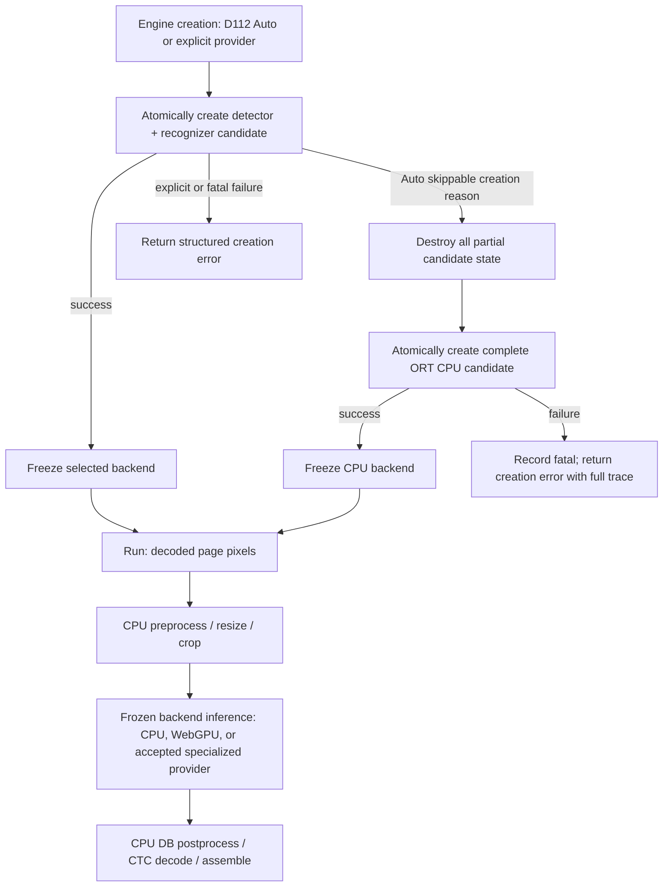

# Windows Device 加速技术方案

状态：产品实现与硬件无关验证已完成，Windows x64 真实 D3D12 GPU Provider Gate 待执行；production lock 与 released Auto 仍保持关闭

更新时间：2026-07-18

范围：当前交付目标是 Windows x64；Windows arm64 及 Qualcomm NPU 属于后续平台决策

关联 Roadmap：[Perf-0–Perf-4](roadmap.md#7-perf-0perf-4--性能与宿主加速线)

## 1. 结论

Windows 没有一个可以等同于 Apple ANE 的统一硬件和统一精度路径，但这不能转化成用户安装多个厂商 runtime 的负担。Windows 方案新增以下一级约束：

> 用户始终只安装 `@arcships/light-ocr`。模型、native addon、ONNX Runtime/Windows ML、DirectML 或已发布的厂商 EP 必须由 npm release set 自带；不得要求用户另装 CUDA、TensorRT、OpenVINO、VitisAI、QNN SDK 或编译工具链。正常 GPU/NPU driver 是唯一允许的系统前置条件。

“OS 无关 package”指一个稳定的 facade、API 和安装入口；native payload 继续由 npm 按 `os`/`cpu` 自动选择。Windows x64 的通用加速主线确定为 **Native ONNX Runtime WebGPU EP**，通过 Dawn 优先使用 D3D12，并把固定 runtime/plugin 隐藏在 Windows native package 内：

- **WebGPU 是 Windows x64 的通用 GPU 默认方向。** 第一轮使用当前锁定的 FP32 ONNX，严格验证算子、shape、placement、CPU 释放、驱动和端到端收益；通过 Windows Gate 并随包交付后，D112 Auto 顺序为 `webgpu → cpu`。
- **DirectML 降为 Windows 专用兼容性备选。** 它仍可覆盖多代 DX12 GPU，但已进入 maintenance/legacy；只有 WebGPU 对目标设备/workload 不成立且 DirectML 的独立收益足够时才启动 Spike。
- **Intel/OpenVINO、NVIDIA/TensorRT RTX、AMD/MIGraphX/VitisAI 是专用后端。** 只有通用 WebGPU 路径未覆盖目标范围，或用户加权收益足以覆盖额外包体和维护成本时才启动，并各自通过 PG。
- **Qualcomm QNN 暂不进入当前实现。** HTP NPU 路径主要面向 Windows arm64 Snapdragon X，而该平台仍是 deferred target。
- **CPU 是 Auto 的稳定最终候选，也是可显式选择的 backend。** 显式 `provider=webgpu|cpu|…` 只尝试指定 backend；跨 backend 回退只发生于 D112 定义的 Auto 创建期。

稳定默认产品不使用 Windows ML 在首次运行时自动下载 EP，也不搜索用户机器上偶然安装的 SDK。推荐的用户可见和内部拓扑是：

```text
user: npm install @arcships/light-ocr
  └── npm automatically selects @arcships/light-ocr-win32-x64
      ├── light_ocr_node.node
      ├── pinned self-contained ORT + Native WebGPU/Dawn runtime
      ├── bundled CPU final candidate
      ├── accepted Windows-specific EPs, only after their launch/package Gates
      ├── provider-specific model/profile/cache artifacts
      └── explicit device selection and observable D112 selection
```

npm 只能按 OS、CPU 和 libc 选择 optional dependency，不能按 Intel/NVIDIA/AMD GPU vendor 选择。因此通用 release set 先自带 WebGPU + CPU，而不是把所有厂商 runtime 塞入默认包。DirectML 和厂商 EP 只有通过专用后端启动 Gate、独立 PG 与包体审查后，才可进入同一个 Windows platform package 或受控内部 shard。Windows ML 动态 catalog 只保留为未来宿主显式授权的联网增强，不是稳定运行前提。



只有 `provider=auto` 可以沿创建期的 skippable 边进入 CPU 候选。显式 `provider=webgpu|directml|…` 创建失败直接返回；任一候选的 detector/recognizer 必须原子创建。图不表示所有专用 provider 已获准进入 Auto，它们仍需独立 Gate 和版本化策略决策。

## 2. 目标与非目标

### 2.1 目标

1. **保持一个 OS 无关安装入口。** 用户只依赖 `@arcships/light-ocr`；facade 自动解析匹配的 native platform package 和固定模型。
2. **实现零外部 runtime 安装。** 每个 native package 必须携带运行所需的 runtime、EP、动态库、许可、SBOM 和 compatibility manifest；不能要求用户配置 PATH、CUDA_HOME 或 SDK 目录。
3. **释放 CPU 给用户前台负载。** 与 Apple 路径相同，交互式 profile 首先看 OCR process CPU-s，而不是只看 GPU/NPU 利用率。
4. **覆盖当前 Windows x64 用户。** 先资格验证 WebGPU 跨厂商 GPU 主线，再依据专用后端启动 Gate 投资 DirectML 或厂商 NPU/GPU provider。
5. **保持一套 OCR 语义。** Provider 只替换 inference backend，不能复制 preprocess、postprocess、几何、decode 和结果契约。
6. **保持离线、固定版本和可复现。** 稳定包不在首次运行时下载 Windows ML runtime、EP、模型或编译器。
7. **显式选择并证明实际 placement。** Provider 名称、device、precision、graph partition、cache 和 D112 selection trace 都必须可诊断。
8. **限制包体积、冷编译和驱动矩阵。** 厂商 EP 的收益必须覆盖约数十到数百 MB 的额外分发成本和持续维护成本；未通过 Gate 就不进入默认 package。

### 2.2 非目标

- 不把 DirectML 称为统一 NPU API 或统一 INT8 加速方案。
- 不把 Windows ML 的 `MAX_PERFORMANCE`、`MAX_EFFICIENCY` 等自动策略直接作为稳定默认。
- 不承诺默认 Windows native package 同时携带全部厂商 EP；只携带通过用户加权收益与包体积 Gate 的 provider。
- 不默认调用 `EnsureReadyAsync()` 或 `EnsureAndRegisterCertifiedAsync()` 下载 EP。
- 不要求最终用户安装、升级或配置任何厂商 runtime/SDK，也不读取系统 SDK 安装目录拼装运行环境。
- 不使用 install/postinstall 脚本按 GPU vendor 下载二进制；硬件探测发生在本地 engine 创建阶段，只能选择 package 已包含的能力。
- 不因 Task Manager 显示 GPU/NPU 活动就宣称完整 graph placement。
- 不让不同 ORT runtime 或不同 provider addon 在同一进程中无约束共存。
- 不在第一阶段实现 GPU preprocess/postprocess、外部 D3D12/CUDA context 共享或零拷贝公共 API。
- 不用无界 page、crop 或 multi-engine 并发换取吞吐数字。

## 3. 当前官方能力与项目边界

### 3.1 Windows ML 2.x

截至 2026-07，Windows ML 是 Windows 维护的 ONNX Runtime 分发，支持 x64/arm64、相同的 ORT API、CPU/DirectML 内置 backend，以及通过 EP ABI 注册厂商 provider。

与 light-ocr 直接相关的事实：

- Windows ML 2.x 当前稳定包 `2.1.74` 对应 ORT 1.24.6；`2.3.10-preview` 对应 ORT 1.27.0，但不能作为稳定依赖。
- C/C++ 可以使用 self-contained 部署，runtime、ORT 和 DirectML 总增量约 41 MB，不自动更新，符合严格版本控制方向。
- Self-contained 并不统一要求 Windows 11：`Microsoft.Windows.AI.MachineLearning` 可面向 Windows 10 Build 18362+；需要 RegFree WinRT 时，`Microsoft.WindowsAppSDK.ML` 可面向 Build 17763+。
- Framework-dependent runtime 会由 Windows App SDK servicing 更新，不适合作为第一版可复现 provider 包。
- Vendor EP 不包含在约 41 MB runtime 内，需要通过 Windows Update catalog 获取或由应用自行携带。
- 通过 `ExecutionProviderCatalog` 动态取得 vendor EP 需要 Windows 11 24H2 Build 26100+；DirectML 和 CPU 是内置例外。BYO EP 不继承这条统一门槛，而是遵守对应厂商 EP、driver 和 OS 要求。
- Windows ML 官方建议先显式选择 EP/device，再考虑自动 Device Policy；动态更新和 driver 变化会使设备列表发生变化。

官方依据：

- [Windows ML overview](https://learn.microsoft.com/en-us/windows/ai/new-windows-ml/overview)
- [Install and deploy Windows ML](https://learn.microsoft.com/en-us/windows/ai/new-windows-ml/distributing-your-app)
- [ONNX Runtime versions shipped in Windows ML](https://learn.microsoft.com/en-us/windows/ai/new-windows-ml/onnx-versions)
- [Windows ML execution providers](https://learn.microsoft.com/en-us/windows/ai/new-windows-ml/supported-execution-providers)
- [Windows ML EPs vs. bring-your-own](https://learn.microsoft.com/en-us/windows/ai/new-windows-ml/windows-ml-eps-vs-bring-your-own)
- [Select execution providers](https://learn.microsoft.com/en-us/windows/ai/new-windows-ml/select-execution-providers)

Windows ML 的 C++ 文档要求 C++20，而 light-ocr Core 当前保持 C++17。第一阶段必须验证能否通过 C API 或独立 Windows provider bridge 隔离这一要求，不能为一个 provider 静默提高全部 Core 的语言版本。

### 3.2 Dynamic catalog 与 Bring Your Own

Windows ML 官方提供两种 vendor EP 获取方式：

| 方式 | 优点 | 与 light-ocr 的冲突/代价 | 当前定位 |
| --- | --- | --- | --- |
| Windows ML EP catalog | 系统共享、包体积小、自动更新、Windows 认证 | 首次可能联网下载；受 Windows Update/IT 策略影响；版本和设备列表会动态变化 | 未来宿主显式授权功能，不作为稳定默认 |
| Bring Your Own EP | 精确版本、可离线、企业环境可控 | 每个 EP 约增加 80 MB 或更多；light-ocr release set 负责升级、许可和兼容 | 稳定 provider 首选候选，必须随 npm package 交付 |
| 使用系统已安装的厂商 SDK/runtime | 不增加 npm payload | 环境不可复现；用户需要安装和配置依赖；不同 SDK 可能污染进程 DLL 搜索 | 明确禁止作为产品路径，只可用于开发 benchmark |

官方说明 `EnsureReadyAsync()`/`EnsureAndRegisterCertifiedAsync()` 会在 EP 不存在时触发下载，首次可能耗时数秒到数分钟。因此 stable runtime 不调用这些 API；可选 catalog 集成必须由宿主在 OCR engine 创建前显式授权，并且不能改变默认离线行为。

依据：

- [Install Windows ML execution providers](https://learn.microsoft.com/en-us/windows/ai/new-windows-ml/initialize-execution-providers)
- [Bring your own EPs](https://learn.microsoft.com/en-us/windows/ai/new-windows-ml/bring-your-own-eps)
- [Windows ML EPs vs. bring-your-own](https://learn.microsoft.com/en-us/windows/ai/new-windows-ml/windows-ml-eps-vs-bring-your-own)

### 3.3 DirectML

DirectML/ORT DML EP 的优势是 DirectX 12 GPU 广覆盖；它可以覆盖 Intel、AMD、NVIDIA 和 Qualcomm GPU，并可使用系统组件或固定 DirectML redistributable。

限制同样明确：

- DirectML 已进入 maintenance mode，Windows ML 文档将它标记为 legacy；没有计划继续增加新功能。
- ORT DML EP 要求关闭 memory pattern，并使用 `ORT_SEQUENTIAL`。
- 同一个 DirectML session 不允许多线程并发调用 `Run`；不同 session 才能并发。
- 输入 shape 在 session 创建时已知时表现最好，固定维度或 free-dimension override 有利于减少 copy/stall 和提高 graph 优化。

因此 DirectML 只保留为 Windows 专用兼容性备选：若专用后端启动 Gate 满足，先用当前 FP32 ONNX 验证兼容性和 offload，再决定是否研究 FP16；它不再承担通用默认基线。

依据：[ONNX Runtime DirectML EP](https://onnxruntime.ai/docs/execution-providers/DirectML-ExecutionProvider.html)、[DirectML repository status](https://github.com/microsoft/DirectML)。

### 3.4 上游现成实现审计

这里必须区分四层“支持”：模型存在、runtime/EP 能加载、OCR 上游已有接入、以及 light-ocr 当前锁定模型已经通过产品资格审查。前面三层中的任意一层成立，都不能自动推出第四层。

| 上游 | 已经存在 | 不能直接视为可交付的原因 | 可复用部分 |
| --- | --- | --- | --- |
| PaddleOCR | 官方 PP-OCRv6 ONNX、Paddle/ONNX Runtime/TensorRT/OpenVINO 路线；新统一 ONNX Runtime engine 可以传 `providers` 和 provider options；Windows 有 Paddle Inference C++ 部署 | 官方 HPI 依赖当前只列 Linux x86-64，Windows 建议 Docker/WSL；公开 PP-OCRv6 表没有 Windows DirectML/NPU 数据；C++ Windows 路线不是当前 light-ocr 的 ORT backend | 官方模型、算子/shape、质量指标、通用 engine 配置设计 |
| RapidOCR Python 主线 | PP-OCRv6 Tiny/Small/Medium；`onnxruntime-directml` 开关和 Build 18362 检查；OpenVINO；原生 TensorRT FP16/profile/cache builder | 是 Python runtime；DirectML 测试只验证 provider 配置，未发现 Windows PP-OCRv6 端到端 CI/benchmark；session 未显式关闭 DML 要求关闭的 memory pattern；OpenVINO 当前硬编码 `CPU`；TensorRT 的 `use_int8` 只设置 builder flag，没有校准器或 QDQ 生成流程 | DirectML provider 选择、Windows build 检查、TensorRT dynamic profiles/cache、PP-OCRv6 pipeline 参数 |
| RapidOcrOnnx C++ | Windows C++/ORT、CUDA 和 DirectML 示例 | 旧仓库停留在 ORT 1.12/旧模型；DirectML 只注册到 recognition/classification，detection session 没有注册，不能作为完整 OCR 加速实现 | CMake/Windows native 接线参考，不复用其 runtime/model contract |
| Windows ML / ORT vendor EP | DirectML、OpenVINO、NvTensorRtRtx、MIGraphX、VitisAI、QNN 的通用 EP 与分发机制 | Microsoft 明确说明 Windows ML 负责 EP 分发，不负责替应用优化模型；没有 PP-OCRv6 Small 的统一 Windows 优化包 | EP ABI、provider 获取/注册、profiling、fallback 和 context/cache 机制 |
| 芯片厂商模型库 | Intel 有 PaddleOCR/OpenVINO 示例和通用 `pp-ocr` 验证；AMD 有 Ryzen AI OCR 示例；Qualcomm AI Hub 有 EasyOCR/TroCR | Intel 公开 notebook 使用 PP-OCRv3，RapidOCR OpenVINO 当前只走 CPU；AMD 当前 OCR 示例是 Nemotron OCR；Qualcomm 模型库未发现 PP-OCR/PP-OCRv6。都不是当前 PP-OCRv6 Small detector/recognizer 的 Windows NPU 产物 | 转换、量化、固定 shape、context/compiled-cache 工具链 |

锁定模型也不同：RapidOCR `v3.9.1` 的 PP-OCRv6 Small ONNX 声明 SHA-256 为 detector `090f04…`、recognizer `6f3272…`；light-ocr 当前官方 ONNX 分别是 `d73e00…`、`5435fd…`。即使网络语义接近，也必须按不同 bytes 重新验证 graph coverage、数值和性能。

审计依据：

- [PaddleOCR high-performance inference](https://github.com/PaddlePaddle/PaddleOCR/blob/211989f046cc1878460f9e65574690c00a127a1a/docs/version3.x/inference_deployment/local_inference/high_performance_inference.en.md)
- [PaddleOCR unified inference engine](https://github.com/PaddlePaddle/PaddleOCR/blob/211989f046cc1878460f9e65574690c00a127a1a/docs/version3.x/inference_deployment/local_inference/inference_engine.en.md)
- [RapidOCR PP-OCRv6 model map](https://github.com/RapidAI/RapidOCR/blob/44e2e900eccf2ad0702030dce9e20f5c5941be39/python/rapidocr/default_models.yaml)
- [RapidOCR DirectML provider config](https://github.com/RapidAI/RapidOCR/blob/44e2e900eccf2ad0702030dce9e20f5c5941be39/python/rapidocr/inference_engine/onnxruntime/provider_config.py)
- [RapidOCR ONNX Runtime session options](https://github.com/RapidAI/RapidOCR/blob/44e2e900eccf2ad0702030dce9e20f5c5941be39/python/rapidocr/inference_engine/onnxruntime/main.py)
- [RapidOCR OpenVINO CPU implementation](https://github.com/RapidAI/RapidOCR/blob/44e2e900eccf2ad0702030dce9e20f5c5941be39/python/rapidocr/inference_engine/openvino/main.py)
- [RapidOCR TensorRT builder](https://github.com/RapidAI/RapidOCR/blob/44e2e900eccf2ad0702030dce9e20f5c5941be39/python/rapidocr/inference_engine/tensorrt/engine_builder.py)
- [RapidOcrOnnx detection session](https://github.com/RapidAI/RapidOcrOnnx/blob/abd498c13a6dbe5f3b3c0d421d72e01bb3e6ee6d/src/DbNet.cpp) and [recognition DirectML registration](https://github.com/RapidAI/RapidOcrOnnx/blob/abd498c13a6dbe5f3b3c0d421d72e01bb3e6ee6d/src/CrnnNet.cpp)
- [OpenVINO PaddleOCR notebook](https://docs.openvino.ai/2024/notebooks/paddle-ocr-webcam-with-output.html)
- [AMD RyzenAI-SW](https://github.com/amd/RyzenAI-SW) and [Qualcomm AI Hub Models](https://github.com/quic/ai-hub-models)

### 3.5 可复用边界与最小自研量

当前源码已经把 official WebGPU provider package 转为完整自包含 Windows qualification payload：ORT Core 1.24.4、WebGPU plugin 0.1.0、`dxcompiler.dll`、`dxil.dll`、addon、schema 2 descriptor、licenses、SPDX SBOM 和 artifact hashes 全部随包。它只替换 inference backend，继续复用现有 preprocess、DB postprocess、crop/sort、CTC decode、资源限制和结果契约。其他厂商路径仍可在开发环境做对照，但发布时同样必须转为固定、自包含 payload。

已实现与待验证边界：

1. **Native WebGPU FP32 实现完成：** ORT/plugin 与 Dawn/D3D12 companion 已精确锁定，C++/Node allow/strict、profiling、descriptor、npm staging 与 offline verifier 已接线；真机必须验证 placement、动态 shape、质量、CPU-s、driver、内存和收益。
2. **Windows Auto 实现完成：** D112 `webgpu → cpu`、固定路径 plugin load、typed adapter absence、fatal package/hash/load、完整 trace 与运行期冻结已实现；真机 Auto 必须实际选择 WebGPU，不能把 CPU fallback 当作成功。
3. **专用后端启动 Gate：** 仅当 WebGPU 在预注册设备/workload 上失败或专用路径的用户加权收益足够时，才启动 DirectML、OpenVINO、TensorRT RTX、MIGraphX 或 VitisAI Spike。
4. **厂商模型派生：** 需要 FP16/QDQ/BF16 时使用独立 model ID/hash、calibration、shape profile、quality Gate 与 context-cache 生命周期，不重写 OCR 算法。

任何 benchmark 成功只有在干净 Windows VM 上卸载厂商开发 SDK 后，仍能仅凭 npm release set 离线运行，才算完成分发验证。

## 4. 当前设备与 Provider 矩阵

| Windows 设备 | 候选 provider | 首选初始精度 | 当前项目状态 | 主要约束 |
| --- | --- | --- | --- | --- |
| 具备合格 D3D12 adapter 的 x64 GPU | Native WebGPU | 当前 FP32 原样验证 | 产品实现、qualification package 与 CI 已完成；尚待 Windows 真机 PG | WebGPU kernel/shape、Dawn、driver、copy、包体 |
| 任意兼容 DirectX 12 的 x64 GPU | DirectML | 当前 FP32 原样验证；FP16 后续 | 专用兼容性备选，等待启动 Gate | legacy；固定 shape；同 session 串行 |
| Intel 12th Gen+ GPU | OpenVINO GPU | FP16 | x64 候选 | 需要对应 runtime/driver；验证完整 graph |
| Intel Core Ultra NPU | OpenVINO NPU | FP16；INT8/QDQ 后续 | x64 交互式 NPU 候选 | NPU operator/shape coverage；不能接受隐藏 CPU fallback |
| NVIDIA RTX 30xx+ | TensorRT RTX EP | FP16 | x64 高性能客户端候选 | 接近 200 MB 级插件；driver/CUDA；JIT/context cache |
| AMD GPU | MIGraphX | 先以 provider 支持精度资格审查 | x64 候选 | Windows ML 当前要求严格 driver 组合；BYO 分发路径待确认 |
| AMD Ryzen AI NPU | VitisAI | INT8 或 BF16 | x64 NPU 候选 | provider-specific quantization；首次编译可能很长；cache 必需 |
| Snapdragon X HTP NPU | QNN | QDQ quantized | Windows arm64 后续 | 当前不是 Tier 1；需要 context binary 和 arm64 发布矩阵 |
| 所有 Windows x64 | ORT CPU | FP32 | Auto 稳定最终候选、显式 backend | CPU 占用高；保留质量与性能基线 |

Windows ML 当前公开的 vendor EP 包括 MIGraphX、NvTensorRtRtx、OpenVINO、QNN 和 VitisAI；但“可从 catalog 获取”不等于 light-ocr 已经获得离线分发权、固定兼容矩阵或 PP-OCRv6 完整 graph 支持。

### 4.1 Intel OpenVINO

OpenVINO EP 可以显式选择 Intel CPU、GPU 或 NPU。官方当前建议 GPU/NPU 使用 FP16，NPU 也支持经 NNCF 等工具生成的 INT8 模型；动态 shape 可以通过 provider 配置变成 static/bounded shape，并支持 model cache。

第一阶段只评估：

- Intel GPU FP16；
- Intel Core Ultra NPU FP16；
- `session.disable_cpu_ep_fallback=1` 或等价严格模式下的 operator coverage；
- static/bounded shape、cache、cold start 和 CPU-s。

只有 FP16 完整通过后才建立 OpenVINO-specific QDQ/INT8 模型，不能直接复用 Apple W8A8 产物或质量结论。

依据：[ONNX Runtime OpenVINO EP](https://onnxruntime.ai/docs/execution-providers/OpenVINO-ExecutionProvider.html)。

### 4.2 NVIDIA TensorRT RTX

Windows 客户端优先研究 TensorRT RTX EP ABI plugin，而不是已经 deprecated 的内置 TensorRT RTX EP。官方当前要求 RTX 30xx 及更新架构，支持 shape profiles、CUDA Graph、EP context 和 runtime cache。

PP-OCRv6 Small 包含大量短小 recognition inference，CUDA Graph 和固定 profile 理论上可能减少 CPU launch overhead，但这是待验证假设。第一阶段保持 FP16；INT8 或其他低精度只有在插件版本明确支持、校准质量通过且端到端收益足够时才进入。

依据：[ONNX Runtime TensorRT RTX EP](https://onnxruntime.ai/docs/execution-providers/TensorRTRTX-ExecutionProvider.html)。

### 4.3 AMD MIGraphX 与 VitisAI

AMD 路径不能合并为一个 provider：

- **MIGraphX** 是 AMD GPU provider。Windows ML 已提供对应 EP，但当前公开矩阵有严格 driver 要求，稳定 BYO package、模型精度和 PP-OCRv6 graph coverage 均需单独确认。
- **VitisAI** 是 Ryzen AI NPU provider。官方 ORT 文档支持 INT8/BF16 量化模型，并在 session 创建时编译为设备执行文件；首次编译可能达到分钟级，必须依赖按模型/设备正确失效的 cache。

VitisAI 的量化模型是 AMD-specific 派生物，不能把 Apple W8A8、OpenVINO INT8 或 QNN QDQ 当作同一份可互换模型。

依据：[Windows ML provider matrix](https://learn.microsoft.com/en-us/windows/ai/new-windows-ml/supported-execution-providers)、[ONNX Runtime VitisAI EP](https://onnxruntime.ai/docs/execution-providers/Vitis-AI-ExecutionProvider.html)。

### 4.4 Qualcomm QNN

QNN HTP 路径需要适配 QNN 的 QDQ 模型和 context binary。官方示例在 Windows arm64 上使用量化模型，并提供禁用 CPU fallback、context cache 和 HTP profiling 能力。

QNN GPU backend 可以运行 FP16/FP32，但 Snapdragon X 的主要产品价值是 HTP NPU。由于 Windows arm64 仍是 deferred target，本方案只保留模型和 backend 接口兼容性，不为当前 Windows x64 包携带 QNN。

依据：[ONNX Runtime QNN EP](https://onnxruntime.ai/docs/execution-providers/QNN-ExecutionProvider.html)。

## 5. 推荐运行时架构

### 5.1 保持一套 OCR Core

现有 C++ preprocess、detection postprocess、geometry、crop、CTC decode、资源限制和结果组装保持权威。Windows provider 只实现内部 inference session：

```text
DetectionSession
  run(float tensor, exact shape) -> float probability map

RecognitionSession
  run(float tensor, exact shape) -> float logits
```

Provider-specific 量化模型如果改变输入/输出 dtype、scale 或 zero-point，转换只允许发生在 backend/bundle contract 中，不能泄漏成另一套公共 OCR 结果语义。

### 5.2 推荐 runtime 选择

当前产品 runtime 已选择 **pinned ORT Core 1.24.4 + Native WebGPU plugin 0.1.0 + Dawn/D3D12 companions**，以 Windows x64 私有目录自包含交付。Windows ML 2.x / DirectML 保留为专用备选对照：

- WebGPU 与 Linux 共享 provider API 和 ONNX 模型资格方法，在 Windows 由 Dawn 映射 D3D12/Vulkan；
- NuGet URL/catalog、bytes/SHA-512、plugin upstream tag/commit、headers、DLL paths、licenses 与 session options 已精确锁定，不依赖系统安装的 ORT、SDK 或动态 catalog；
- Windows ML 的 EP ABI 仍可承载通过专用 Gate 的 vendor plugin，但不决定通用默认；
- 所有方案都与现有 ONNX model 和 backend-neutral session 边界保持一致。

这里的 self-contained 是 package 内自包含，不是让用户安装 Windows App SDK runtime。`@arcships/light-ocr-win32-x64` 必须把实际需要的 DLL 放进固定私有目录并使用受控加载路径；engine 创建不得依赖系统 PATH、Python site-packages、CUDA toolkit、OpenVINO 安装目录或全局 Windows ML framework package。

WebGPU qualification 不以 DirectML 对照为前置条件。只有专用后端启动 Gate 接受 Windows ML/DirectML 后，才在 self-contained Windows ML 与 standalone DML-enabled ORT 之间做同条件选择；届时至少比较固定版本与更新策略、C++20/bridge 边界、EP ABI、CPU package 共存、placement、性能、CPU-s、冷启动和包体积。未启动该 Gate 时，不为维持旧路线提前引入 Windows ML runtime。

### 5.3 一个公共入口与内部 provider 隔离

用户可见拓扑保持当前 npm packaging contract：

```text
@arcships/light-ocr
├── required: @arcships/light-ocr-model-ppocrv6-small
└── optional, npm selects exactly one by os/cpu
    ├── @arcships/light-ocr-darwin-arm64
    ├── @arcships/light-ocr-darwin-x64
    ├── @arcships/light-ocr-linux-x64-gnu
    └── @arcships/light-ocr-win32-x64
        ├── baseline native addon + pinned runtime
        ├── Native WebGPU + CPU
        └── zero or more accepted specialized EP payloads
```

厂商 payload 是否物理放在同一个 tarball，或由 `@arcships/light-ocr-win32-x64` 依赖内部、同版本、Windows-only shard，是 release staging 的实现细节；二者都会在一次 `npm install @arcships/light-ocr` 中完成，不能要求用户再安装 provider package。

运行时隔离规则：

- WebGPU 主线优先让 CPU 与 WebGPU plugin 共享一份兼容 ORT Core；Windows ML/DirectML/vendor EP 只有专用 Gate 通过后才进入共存设计。
- D112 Auto 只尝试 runtime descriptor 声明且 package 实际携带的候选；失败候选必须完整销毁部分状态。不能安全卸载或与后续候选 ABI 不兼容的 runtime 必须先放入受控 worker 隔离，否则无资格进入同一候选链。
- 显式 provider 不跨 backend 回退；Auto 只对 D112 的四类可跳过创建原因继续，致命包/ABI/load 错误立即返回。首版 Auto 仅接受 provider-neutral 默认值，strict placement、显式 precision、device ID 和 throughput 资格测试使用显式 provider。
- 如果某个厂商最优路线只能使用独立 runtime，它必须作为 package 内部 backend/worker 隔离，仍由同一个 facade 自动选择和管理；其进程、IPC、关闭、崩溃和包体积必须单独通过 Gate。
- 禁止扫描系统 SDK、注册表或 PATH 猜测可用 runtime。
- npm 不按 GPU vendor 过滤依赖。每增加一个默认 vendor payload，所有 Windows x64 安装都会承担其下载和磁盘成本，因此 provider 接受决策必须使用用户加权收益，而不是单机最快数字。

## 6. Shape 与模型派生物

### 6.1 公共 shape contract

Windows provider 共享一份版本化的逻辑 shape policy，但不强迫所有 EP 使用相同编译格式：

- Detector 保持 bounded/960 语义，使用经过资格审查的 exact shape 或 padding bucket。
- Recognition 继续限制最大宽度 3200，使用少量质量通过的 width bucket 或 provider profile。
- 额外 padding、round-up、输出裁剪和坐标恢复必须通过现有 parity/quality corpus。
- 未覆盖 shape 必须使用已声明的 provider 路由或稳定失败，不能临时生成无界 session/cache。

### 6.2 Provider-specific 形式

| Provider | 推荐 shape 形式 | 风险 |
| --- | --- | --- |
| DirectML | fixed model 或 session free-dimension override；少量 bucket session | session 数和显存/RSS；不支持同 session 并发 Run |
| OpenVINO | bounded/static reshape + model cache | NPU operator coverage；dynamic→static 行为 |
| TensorRT RTX | min/opt/max profile；必要时 multi-profile + EP context | JIT、profile 选择、cache 与具体 GPU |
| VitisAI | 量化 fixed/bounded 模型 + compiled cache | 首次分钟级编译；cache 正确失效 |
| QNN | QDQ fixed shape + context binary | arm64/device/SDK 绑定；量化质量 |

Apple 的 `EnumeratedShapes` 不能照搬到 Windows。Windows 需要一个逻辑 bucket 集，随后为不同 EP 生成各自的 profile/context/model 派生物。

## 7. 精度与量化策略

| Provider/硬件 | 第一阶段 | 第二阶段 | 不应假设 |
| --- | --- | --- | --- |
| DirectML GPU | 当前 FP32 ONNX 原样验证 | 保持 FP32 I/O 的 FP16 派生模型 | DirectML 会自动把 FP32 模型变成最优 FP16，或 INT8 一定跨厂商更快 |
| OpenVINO Intel GPU | FP16 | provider-specific INT8/QDQ | 与 Intel NPU 结果相同 |
| OpenVINO Intel NPU | FP16 | NNCF/QDQ INT8 | 所有算子会自动留在 NPU |
| TensorRT RTX GPU | FP16 | provider 明确支持且质量通过的低精度 | 复用 Apple Core ML 量化模型 |
| VitisAI AMD NPU | INT8 或 BF16 | QAT/混合精度 | FP16 ONNX 可以不经处理获得 NPU 最优路径 |
| QNN HTP NPU | QNN-compatible QDQ | 按硬件支持选择量化 dtype | 统一等同于 W8A8 |
| CPU | 当前 FP32 | 独立 CPU INT8 研究 | 用 NPU/GPU 模型替换稳定 CPU oracle |

Windows 上的“INT8”不是一种通用产物。至少需要区分 OpenVINO INT8、VitisAI INT8、QNN QDQ 和未来 NVIDIA 低精度模型；它们的校准规则、支持算子、context 和质量证据都不同。

量化流程统一遵守：

1. 先让 FP16/FP32 provider 完整 placement 并建立质量基线；
2. 锁定 provider-specific calibration corpus 和指标；
3. PTQ 不通过则 QAT 或保留敏感层高精度；
4. 质量先过 Gate，再跑正式性能数字；
5. 每个 provider-specific 量化模型拥有独立 model ID、hash 和 compatibility manifest。

## 8. 调度、并发与 CPU 预算

Windows interactive profile 初始仍保持一个 engine 一个 active call：

- DirectML session 明确禁止多线程并发 `Run`，必须串行；
- OpenVINO stream、TensorRT CUDA Graph、多 session 和厂商 throughput option 只在独立 throughput profile 中研究；
- PDF renderer 最多有界预取下一页，是否与 OCR 重叠取决于总 CPU-s、RSS 和 UI 响应；
- recognition batch 默认 1，扩大 batch 必须同时报告 latency、throughput 和质量；
- GPU/NPU queue、device lost、driver reset、close 和进程退出必须有稳定错误与资源释放语义。

交互式模式的目标是 CPU 不与用户前台任务争抢。把 iGPU/NPU 跑满也可能影响 UI、视频或其他系统 AI workload，因此需要报告 device contention，而不是只报告吞吐。

## 9. 分发、缓存与供应链

稳定 Windows platform package 的产物至少包括：

```text
@arcships/light-ocr-win32-x64 release payload
├── native addon and pinned self-contained runtime
├── Native WebGPU + CPU baseline
├── accepted vendor EP/runtime payloads
├── provider-specific model/profile/context artifacts
├── platform runtime descriptor（D112 policy/artifacts/ABI）
├── capability, OS and driver manifest
├── licenses / SBOM / provenance / artifact hashes
└── cache version and invalidation contract
```

规则：

- 当前 WebGPU qualification package 精确包含 `light_ocr_node.node`、`onnxruntime.dll`、`onnxruntime_providers_webgpu.dll`、`dxcompiler.dll` 与 `dxil.dll`；descriptor 的 exact inventory、bytes 和 SHA-256 在 addon 加载前复核，provider DLL 在注册前再复核。
- Self-contained runtime 和 EP plugin 精确锁定版本；升级必须重新跑全部 Gate。
- Vendor EP 的 driver minimum/maximum、GPU/NPU family、Windows build 和 ORT ABI 写入 manifest。
- Cache key 至少包含 model hash、provider/ORT version、precision、shape policy、device/driver compatibility key。
- Cache 路径不能使用不安全的全局临时目录；必须有大小上限、权限检查、原子写入和损坏恢复。
- 显式 provider 的首次编译/创建失败直接返回。只有 `provider=auto` 且 typed reason 属于 D112 可跳过集合时，才销毁候选状态并尝试 CPU；包损坏、hash/ABI 不匹配或不可恢复加载失败立即终止，不得解析异常消息猜测分类。
- 用户安装入口固定为 `@arcships/light-ocr`。内部 native/provider shard 如果存在，必须由 facade/native package 的 exact-version dependency 自动取得，不能成为用户操作步骤。
- 默认 Windows package 不以“支持越多越好”为目标。每个 vendor payload 必须分别披露压缩下载、解包大小、DLL 数、license 和 CVE/升级责任；未通过 package-size Gate 就不进入默认 release set。
- 禁止 install/postinstall 下载 runtime、根据本机 GPU 现场编译 provider、访问厂商安装器，或从全局 DLL 搜索路径借用未锁定组件。
- Release qualification 必须在没有 Paddle、Python、CUDA toolkit、TensorRT SDK、OpenVINO SDK、Ryzen AI SDK 和 QNN SDK 的干净 VM 上，从 npm tarball 离线安装并运行。目标机只允许预装操作系统和正常硬件 driver。
- Official Windows binaries 依赖 Microsoft Visual C++ 2015-2022 x64 runtime；这是与 D3D12 driver 同级的明确系统前置条件，不从 PATH 借用项目 runtime。
- Dynamic catalog、Windows Update 和 framework-dependent runtime 如未来开放，必须是宿主明确选择的另一种分发 profile，不能改变稳定 self-contained 语义。

## 10. 公共策略与可观测性

正式资格工具先使用显式 provider，用户默认方向使用 D112 Auto：

```text
auto: webgpu → cpu
explicit: cpu | webgpu
specialized after independent Gate: directml | openvino | nvtensorrtrtx | vitisai | migraphx
future Windows arm64: qnn
```

只有已经通过 Provider Gate、由 Windows runtime descriptor 声明且实际随 package 交付的名称才进入正式 union 和 Auto policy。显式 provider 失败不转 CPU；Auto 只按 D112 的 typed 创建失败分类继续，并仅接受 provider-neutral 默认选项。任何 `sessionFallback=cpu` 都返回 `invalid_argument`。它不能下载 provider、扫描系统安装或接受任意 DLL 路径。Windows ML 的 `MAX_EFFICIENCY` 等 Device Policy 继续保持实验性，不能替代项目的版本化候选序。

诊断至少报告：

| 字段 | 含义 |
| --- | --- |
| requested provider/profile | 用户请求值 |
| runtime / ORT / EP version | 实际加载的固定版本 |
| OS build / architecture | Windows build、x64/arm64 |
| hardware device | CPU/GPU/NPU、vendor、adapter/device ID；不上传稳定设备标识 |
| driver version | 实际资格审查输入 |
| detector/recognizer model ID | precision、shape policy、hash |
| actual provider chain | 每个 session 的真实链 |
| graph placement | qualification profiling 的 node/subgraph coverage |
| selection trace | 成功 `EngineInfo` 含 policy ID/version、候选顺序、零或多个 `skipped` 与唯一 `selected`；创建失败 trace 由结构化 creation error 承载 |
| compile/cache | cold compile、cache hit/miss、context ID |
| effective concurrency | session、stream、batch、engine admission |

Release qualification 必须开启 ORT/provider profiling，并在可用时禁用 CPU EP fallback。`GetProviders()`、`GetEpDevices()` 和 Task Manager 只能证明 provider/device 可见，不能单独证明 PP-OCRv6 全 graph 执行位置。

## 11. 最简 Benchmark Contract

Windows 与 Apple 使用同一份用户可读 scoreboard：

| 模式 | 15 页总耗时 | PDF render | OCR-only | OCR CPU-s / 平均 CPU core | Peak RSS/VRAM | 质量 |
| --- | ---: | ---: | ---: | ---: | ---: | --- |
| Windows CPU low-impact | 待测 | 单列 | 待测 | 待测 | 待测 | CPU oracle |
| Windows CPU fast | 待测 | 单列 | 待测 | 待测 | 待测 | CPU oracle |
| Native WebGPU FP32 原模型 | 待测 | 单列 | 待测 | 待测 | 待测 | 待测 |
| DirectML FP32/FP16 备选 | 启动 Gate 后 | 单列 | 待测 | 待测 | 待测 | 待测 |
| OpenVINO NPU/GPU FP16 | 待测 | 单列 | 待测 | 待测 | 待测 | 待测 |
| TensorRT RTX FP16 | 待测 | 单列 | 待测 | 待测 | 待测 | 待测 |
| AMD provider | 待测 | 单列 | 待测 | 待测 | 待测 | 待测 |
| QNN HTP | Windows arm64 接受后 | 单列 | 待测 | 待测 | 待测 | 待测 |

正式报告另外保存 cold runtime load、provider registration、model compile、first inference、cache hit/miss、warm P50/P95、driver、电源模式、device placement、CPU partition 和 D112 selection trace。

同一个数字不能代表“Windows”：至少要区分 iGPU、dGPU、NPU、vendor 和设备代际。每个 provider 的首次 Gate 至少需要两台预注册设备；WebGPU Windows Preview 至少跨两个 GPU vendor。

### 11.1 Provider Gate

Windows provider 继承 Roadmap PG，并增加以下要求：

- 默认 one-command suite 覆盖锁定 14-fixture corpus，每个正常 case 执行 3 次独立 engine cold start、每次 2 次 warmup + 10 次测量（合计 30 次）；至少两个 fixture P50 speedup ≥1.5，P50 总和 speedup ≥1.1，任一 fixture WebGPU P95 ≤CPU 3×；
- OCR process CPU-s/average cores 进入报告和发布范围审查，不使用 runner 未强制的目标冒充自动 Gate；
- qualification 中禁止未声明 CPU EP fallback，关键 graph placement 达到预注册要求；
- 公共 contract 100% 通过，FP16/INT8/BF16 的质量容差在查看最终性能前锁定；
- canary initialization + first result ≤30 s、resident maximum ≤2 GiB、20 次 lifecycle retained growth 绝对值 ≤128 MiB；device memory/driver 范围由真机报告补充；
- device unavailable、driver 不兼容、cache 损坏、device lost 和 session failure 都有稳定行为；
- Windows platform/provider payload 保持完全离线且解包后的自包含 native payload ≤256 MiB，dynamic catalog profile 除外且必须由宿主显式授权。

## 12. 分阶段落地

### Phase A — Native WebGPU Windows qualification

- 已固定 ORT Core 1.24.4、WebGPU plugin 0.1.0、Dawn/D3D12 companion、artifact hashes 与 qualification identity。
- 已实现当前 FP32 detector/recognizer 的 allow/strict、Auto、C++/Node diagnostics、profiling 和 14-fixture one-command runner。
- 已实现从实际 payload 生成的 npm descriptor、license/SBOM、sterile cwd load 和离线 runtime/package cache 复装。
- 待用户在真实 Windows GPU 上运行 Gate；显式 allow/strict 证明 placement，Auto 必须实际选择 WebGPU。

退出条件：WebGPU 得到接受、缩减或拒绝结论；未通过前 released Auto policy 仍只包含实际已交付候选。

### Phase B — D112 Auto 与自包含 Preview

- Windows `webgpu → cpu` 创建期原子候选链、typed 失败分类和同构 selection trace 已实现。
- hardware-independent tests 已验证致命 descriptor/artifact 错误停止、显式 provider 不回退、旧 `sessionFallback=cpu` 被拒绝；真机继续验证 adapter、session close 与运行期冻结。
- Gate 通过后才把 report/artifact hashes 和 compatibility range 写入 production lock；否则保持 qualification-only 或拒绝。

退出条件：WebGPU 被接受为 Windows 通用 Preview，且 Auto 行为可审计；否则记录缩减范围或拒绝证据。

### Phase C — DirectML 与当前 x64 厂商 provider

只有专用后端启动 Gate 满足时才进入，顺序由 Perf-0 用户覆盖决定：

- WebGPU 未覆盖的 DX12 设备占比足够高：DirectML FP32，再决定是否研究 FP16；
- Intel 用户权重高：OpenVINO GPU/NPU FP16，然后 INT8；
- NVIDIA RTX 用户权重高：TensorRT RTX FP16、profile、CUDA Graph 和 context cache；
- AMD Ryzen AI 用户权重高：分别验证 MIGraphX GPU 与 VitisAI NPU。

每个 provider 独立通过 Gate 和 package review，不因另一个 provider 成功而自动发布。厂商开发环境中的 benchmark 只决定技术候选；最终还必须证明 runtime/EP 能被合法、固定、离线地装入 `@arcships/light-ocr` 的 Windows release set。不能满足这一点时，结论是“不进入默认 package”，而不是把安装 runtime 的责任交给用户。

### Phase D — Windows arm64/QNN

- 只有 D110 接受 Windows arm64 后才建立 arm64 native、Node、模型和 CI 矩阵。
- 为 QNN HTP 生成独立 QDQ/context 模型并验证 Snapdragon X。
- 不从 x64 DirectML/OpenVINO/VitisAI 结果推断 arm64 性能或质量。

## 13. 仍需真机 Gate 决定的问题

1. 用户的 Windows GPU/driver 是否通过 strict 与 allow placement、质量、冷启动、性能、RSS 和 lifecycle Gate？
2. 最低 Windows build、D3D12 driver、feature/limit 与设备族如何写入 compatibility range？
3. Recognition 若需要有限 CPU partition，是否接受 allow Preview，最低 placement coverage 与产品文案如何锁定？
4. 单一 Windows platform package 的压缩下载、解包大小和实际用户收益是否值得默认携带 WebGPU？
5. 哪些设备/workload 失败足以启动 DirectML 或厂商 backend，而不是缩减 WebGPU 范围？
6. Stable 是否完全禁止 Windows ML catalog 下载，还是未来提供宿主显式授权、与自包含路径分开的 profile？
7. Windows arm64 何时进入 Tier 1，从而允许 QNN 成为实际产品路径？

## 14. 与 Apple 方案的关键差异

| 维度 | Apple Device | Windows Device |
| --- | --- | --- |
| 统一硬件 | Apple GPU/ANE，由 Core ML 管理 | 无统一 NPU；GPU/NPU provider 按厂商分裂 |
| 主要 INT8 路径 | 新硬件 ANE W8A8 | OpenVINO/VitisAI/QNN/NVIDIA 各自定义，不能共用一种 INT8 模型 |
| 广覆盖 GPU | Core ML GPU | Native WebGPU；DirectML 是 legacy/maintenance 专用备选 |
| Runtime 选择 | Direct Core ML 已选 | 固定 ORT Core + WebGPU plugin + Dawn；Windows ML/厂商 EP 需独立 Gate |
| Shape | Core ML enumerated shapes | DML fixed override、OpenVINO bounds、TensorRT profiles、NPU context |
| 分发 | facade 自动选择 Apple native package；runtime/model 随包交付 | facade 自动选择 Windows native package；runtime/EP/model 随包交付，用户不安装厂商 SDK |
| 当前平台缺口 | iOS/iPadOS 不在 Tier 1 | Windows arm64 不在 Tier 1，QNN 延后 |

## 15. 关联工作

- [Hardware acceleration roadmap](roadmap.md#7-perf-0perf-4--性能与宿主加速线)
- [Apple Device 加速技术方案](apple-device-acceleration.md)
- [npm package design](npm-packaging.md)
- [#4 Execution profiles and observable accelerator fallback](https://github.com/arcships/light-ocr/issues/4)
- [#6 Hardware acceleration roadmap and qualification matrix](https://github.com/arcships/light-ocr/issues/6)

本方案的跨 backend 选择受 [D112](decisions.md#d112--use-platform-aware-auto-with-creation-time-ordered-fallback) 约束；每个 Windows provider 的硬件、driver 和模型证据继续保留在独立 issue 与 qualification report 中，只有通过 Gate 的范围才能进入 runtime descriptor。
